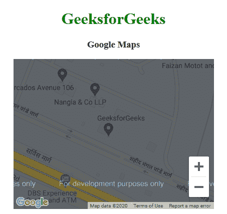
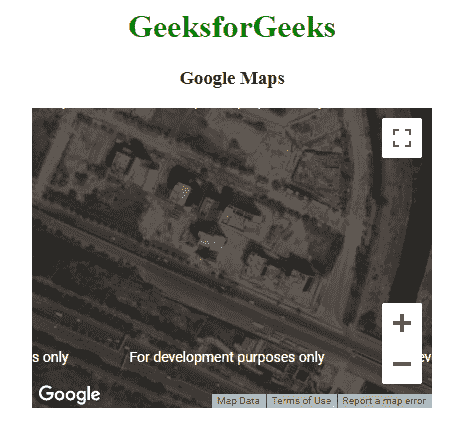
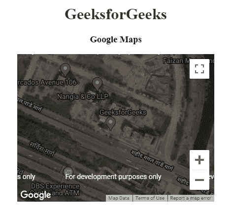
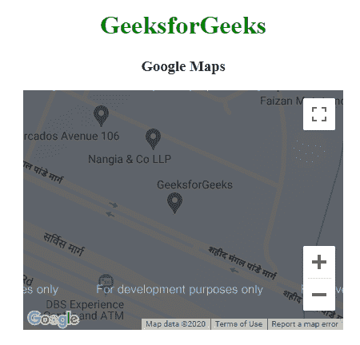

# 如何使用 jQuery 创建简单地图？

> 原文:[https://www . geeksforgeeks . org/如何使用-jquery/](https://www.geeksforgeeks.org/how-to-create-a-simple-map-using-jquery/) 创建简单地图

jQuery 是一个开源的 JavaScript 库，它简化了 HTML/CSS 文档，或者更准确地说是文档对象模型(DOM)和 JavaScript 之间的交互。

**什么是谷歌地图？**

谷歌地图是谷歌提供的免费网络地图服务应用和技术。该应用程序提供了关于地理区域、街道地图和路线规划的综合信息，可用于汽车、步行或全球各国的公共交通卫星视图。

**进场:**

*   谷歌地图可以用来在网页上显示地图。人们可以简单地添加一个地图网页。

    **语法:**

    ```html
    <!DOCTYPE html>  
    <html>  
    <body>  
    <h1Map Example</h1>  
    <div id="map">Enter text</div>  
    </body>  

    ```

*   设置地图大小

    语法:

    ```html
    <div id="map" 
    style="width:400px;height:400px;background:grey">
    </div>
    ```

*   创建一个函数来设置地图属性

    可以通过创建函数来设置地图属性。我们必须使用位于谷歌的 JavaScript 库提供的谷歌地图应用编程接口的功能。

    ```html
    <script src=
    "https://maps.googleapis.com/maps/api/js?callback=myMap">
        </script>
    ```

**创建地图**

*   In the above example, we will use Google API to load google map.

    ```html
    <script src = "https://maps.googleapis.com/maps/api/js"></script>
    ```

    **获取 API 密钥所需的步骤如下:**

    *   **前往下述链接**
        [https://console.developers.google.com/flows/enableapi?apiid =地图 _ 后端、地理编码 _ 后端、方向 _ 后端、距离 _ 矩阵 _ 后端、高程 _ 后端、地点 _ 后端& reusekey=true](https://console.developers.google.com/flows/enableapi?apiid=maps_backend,geocoding_backend,directions_backend,distance_matrix_backend,elevation_backend,places_backend&reusekey=true)
    *   创建新项目或从现有项目中进行选择。
    *   单击继续启用应用编程接口。
    *   在“凭据”页面上，获取一个应用编程接口密钥(并设置应用编程接口密钥限制)。
    *   用您自己的 API 密钥替换 URL 中的密钥参数值
*   To custmize the maps:

    ```html
    var CustomOp = {
        center:new google.maps.LatLng(28.502212, 77.405603), 
        zoom:17, 
        mapTypeId:google.maps.MapTypeId.ROADMAP
    };
    ```

    在这种情况下， **CustomOp** 是一个包含 3 个选项的对象，**中心**、**缩放**和 **maptypeid** 。

    *   **中心:**该属性用于设置地图中的特定点。
    *   **缩放:**此属性用于指定特定点上的缩放级别。
    *   **maptypeid:** 该属性用于指定地图的类型。(路线图、卫星、混合、地形)
**To create a map object we will use the following code:**

```html
var map = new google.maps.Map(document.getElementById("DivID"), CustomOp);
```

为了定制谷歌地图，提供了四种类型的地图。

*   **路线图:**这种类型的地图显示特定区域的街景。这是默认的类型映射。
*   **卫星:**这种类型的地图显示了特定区域的卫星图像。
*   **HYBRID:** 这种类型的地图显示了特定区域的主要街道。
*   **TERRAIN:** 这种类型的地图显示地形和植被。

**示例 1:路线图**

```html
<!DOCTYPE html>
<html>

<head>
    <title>
        Google Maps | Types
    </title>

    <!-- Add Google map API source -->
    <script src = 
        "https://maps.googleapis.com/maps/api/js">
    </script>

    <script>
        function GFG() {
            var CustomOp = {
                center:new google.maps.LatLng(
                        28.502212, 77.405603), 
                zoom:17, 
                mapTypeId:google.maps.MapTypeId.ROADMAP
            };

            // Map object
            var map = new google.maps.Map(
                document.getElementById("DivID"),
                CustomOp
            );
        }
    </script>
</head>

<!-- Function that execute when page load -->
<body onload = "GFG()">
    <center>
        <h1 style="color:green">
            GeeksforGeeks
        </h1>

        <h3>Google Maps</h3>

        <!-- Basic Container -->
        <div id = "DivID" style = 
            "width:400px; height:300px;">
        </div>
    </center>
</body>

</html>
```

**输出:**


**例 2:卫星**

```html
<!DOCTYPE html>
<html>

<head>
    <title>
        Google Maps | Types
    </title>

    <!-- Add Google map API source -->
    <script src = 
        "https://maps.googleapis.com/maps/api/js">
    </script>

    <script>
        function GFG() {
            var CustomOp = {
                center:new google.maps.LatLng(
                        28.502212, 77.405603), 
                zoom:17, 
                mapTypeId:google.maps.MapTypeId.SATELLITE
            };

            // Map object
            var map = new google.maps.Map(
                document.getElementById("DivID"),
                CustomOp
            );
        }
    </script>
</head>

<!-- Function that execute when page load -->
<body onload = "GFG()">
    <center>
        <h1 style="color:green">
            GeeksforGeeks
        </h1>

        <h3>Google Maps</h3>

        <!-- Basic Container -->
        <div id = "DivID" style = 
            "width:400px; height:300px;">
        </div>
    </center>
</body>

</html>
```

**输出:**


**例 3:混合动力**

```html
<!DOCTYPE html>
<html>

<head>
    <title>
        Google Maps | Types
    </title>

    <!-- Add Google map API source -->
    <script src = 
        "https://maps.googleapis.com/maps/api/js">
    </script>

    <script>
        function GFG() {
            var CustomOp = {
                center:new google.maps.LatLng(
                        28.502212, 77.405603), 
                zoom:17, 
                mapTypeId:google.maps.MapTypeId.HYBRID
            };

            // Map object
            var map = new google.maps.Map(
                document.getElementById("DivID"),
                CustomOp
            );
        }
    </script>
</head>

<!-- Function that execute when page load -->
<body onload = "GFG()">
    <center>
        <h1 style="color:green">
            GeeksforGeeks
        </h1>

        <h3>Google Maps</h3>

        <!-- Basic Container -->
        <div id = "DivID" style = 
            "width:400px; height:300px;">
        </div>
    </center>
</body>

</html>
```

**输出:**


**示例 4:地形**

```html
<!DOCTYPE html>
<html>

<head>
    <title>
        Google Maps | Types
    </title>

    <!-- Add Google map API source -->
    <script src = 
        "https://maps.googleapis.com/maps/api/js">
    </script>

    <script>
        function GFG() {
            var CustomOp = {
                center:new google.maps.LatLng(
                        28.502212, 77.405603), 
                zoom:17, 
                mapTypeId:google.maps.MapTypeId.TERRAIN
            };

            // Map object
            var map = new google.maps.Map(
                document.getElementById("DivID"),
                CustomOp
            );
        }
    </script>
</head>

<!-- Function that execute when page load -->
<body onload = "GFG()">
    <center>
        <h1 style="color:green">
            GeeksforGeeks
        </h1>

        <h3>Google Maps</h3>

        <!-- Basic Container -->
        <div id = "DivID" style = 
            "width:400px; height:300px;">
        </div>
    </center>
</body>

</html>
```

**输出:**
