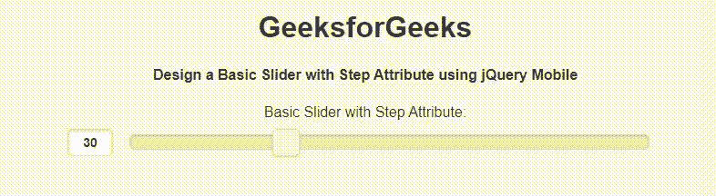

# 如何使用 jQuery Mobile 创建带有 Step 属性的滑块？

> 原文:[https://www . geeksforgeeks . org/如何使用-jquery-mobile/](https://www.geeksforgeeks.org/how-to-create-a-slider-with-step-attribute-using-jquery-mobile/) 创建带步进属性的滑块

jQuery Mobile 是一种基于网络的技术，用于制作可在所有智能手机、平板电脑和台式机上访问的响应内容。在本文中，我们将使用 jQuery Mobile 创建一个带有步长属性的滑块。

**方法:**添加项目所需的 jQuery Mobile 脚本。

> <link rel="”stylesheet”" href="”http://code.jquery.com/mobile/1.4.5/jquery.mobile-1.4.5.min.css”">
> <脚本 src = " http://code . jquery . com/jquery-1 . 11 . 1 . min . js "></脚本>
> <脚本 src = " http://code . jquery . com/mobile/1 . 4 . 5/jquery . mobile-1 . 4 . 5 . min . js "></脚本>

**示例:**我们将使用 jQuery Mobile 创建一个具有 Step 属性的基本滑块。滑块是一种使用滑块插入数据的输入类型。我们用 type="range "属性配合<输入>元素创建一个 Slider，用 *step="value"* 属性设置 step。

## 超文本标记语言

```
<!DOCTYPE html>
<html>

<head>
    <link rel="stylesheet" href=
"http://code.jquery.com/mobile/1.4.5/jquery.mobile-1.4.5.min.css" />

    <script src=
        "http://code.jquery.com/jquery-1.11.1.min.js">
    </script>

    <script src=
"http://code.jquery.com/mobile/1.4.5/jquery.mobile-1.4.5.min.js">
    </script>
</head>

<body>
    <center>
        <h1>GeeksforGeeks</h1>

        <h4>
            Design a Basic Slider with Step 
            Attribute using jQuery Mobile
        </h4>

        <form style="width: 50%;">
            <label for="slider">
                Basic Slider with Step Attribute:
            </label>

            <input type="range" name="slider" id="slider"
                min="0" max="100" step="5" value="30">
        </form>
    </center>
</body>

</html>
```

**输出:**

