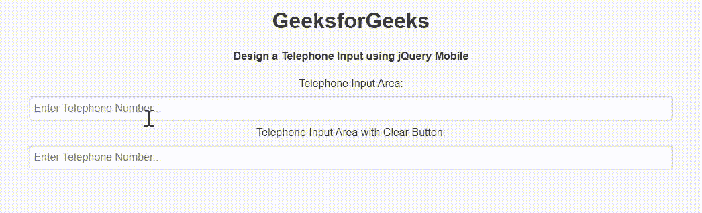

# 如何使用 jQuery Mobile 创建电话输入？

> 原文:[https://www . geeksforgeeks . org/如何创建电话-输入-使用-jquery-mobile/](https://www.geeksforgeeks.org/how-to-create-a-telephone-input-using-jquery-mobile/)

jQuery Mobile 是一种基于网络的技术，用于制作可在所有智能手机、平板电脑和台式机上访问的响应内容。在本文中，我们将使用 jQuery Mobile 创建一个电话输入区。

**方法:**添加项目所需的 jQuery Mobile 脚本。

> <link rel="”stylesheet”" href="”http://code.jquery.com/mobile/1.4.5/jquery.mobile-1.4.5.min.css”">

**示例:**我们将使用 jQuery Mobile 创建一个电话输入。我们使用 *type="tel"* 属性将输入作为电话号码。

## 超文本标记语言

```
<!DOCTYPE html>
<html>

<head>
    <link rel="stylesheet" href=
"http://code.jquery.com/mobile/1.4.5/jquery.mobile-1.4.5.min.css" />

    <script src="http://code.jquery.com/jquery-1.11.1.min.js">
    </script>

    <script src=
"http://code.jquery.com/mobile/1.4.5/jquery.mobile-1.4.5.min.js">
    </script>
</head>

<body>
    <center>
        <h1>GeeksforGeeks</h1>

        <h4>
            Design a Telephone Input using jQuery Mobile
        </h4>

        <form style="width: 50%;">
            <label for="telInput1">Telephone Input Area:</label>
            <input type="tel" data-clear-btn="false" 
                name="telInput1" id="telInput1" value=""
                placeholder="Enter Telephone Number...">

            <label for="telInput2">
                Telephone Input Area with Clear Button:
            </label>
            <input type="tel" data-clear-btn="true" 
                name="telInput2" id="telInput2" value=""
                placeholder="Enter Telephone Number...">
        </form>
    </center>
</body>

</html>
```

**输出:**

