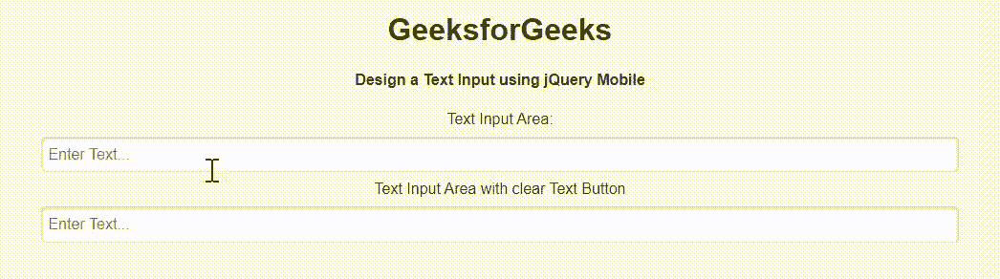

# 如何使用 jQuery Mobile 创建文本输入？

> 原文:[https://www . geeksforgeeks . org/如何使用-jquery-mobile/](https://www.geeksforgeeks.org/how-to-create-a-text-input-using-jquery-mobile/) 创建文本输入

jQuery Mobile 是一种基于网络的技术，用于制作可在所有智能手机、平板电脑和台式机上访问的响应内容。在本文中，我们将使用 jQuery Mobile 进行文本输入。

**进场:**

*   首先，我们添加项目所需的 jQuery Mobile 脚本。

> <link rel="”stylesheet”" href="”http://code.jquery.com/mobile/1.4.5/jquery.mobile-1.4.5.min.css”">
> <脚本 src = " http://code . jquery . com/jquery-1 . 11 . 1 . min . js "></脚本>
> <脚本 src = " http://code . jquery . com/mobile/1 . 4 . 5/jquery . mobile-1 . 4 . 5 . min . js "></脚本>

*   我们现在可以开始创建基于 jQuery Mobile 的文本输入。

**示例:**在本例中，我们将使用 jQuery Mobile 创建一个文本输入区域。*数据-清除-btn* 属性设置为*“真”*，增加一个清除输入区文本的按钮。

## 超文本标记语言

```html
<!DOCTYPE html>
<html>
<head>
    <link rel="stylesheet"
          href=
"http://code.jquery.com/mobile/1.4.5/jquery.mobile-1.4.5.min.css" />
    <script src=
"http://code.jquery.com/jquery-1.11.1.min.js">
    </script>
    <script src=
"http://code.jquery.com/mobile/1.4.5/jquery.mobile-1.4.5.min.js">
    </script>
</head>

<body>
    <center>
        <h1>GeeksforGeeks</h1>
        <h4>
            Design a Text Input using jQuery Mobile
        </h4>
        <form style="width: 50%;">
            <label for="textInput1">
              Text Input Area:
            </label>
            <input type="text" name="textInput1" 
                   id="textInput1" value=""
                   placeholder="Enter Text...">
            <label for="textInput2">
                Text Input Area with clear Text Button
            </label>
            <input type="text" data-clear-btn="true"
                   name="textInput2" id="textInput2"
                   value=""
                placeholder="Enter Text...">
        </form>
    </center>
</body>

</html>
```

**输出:**

