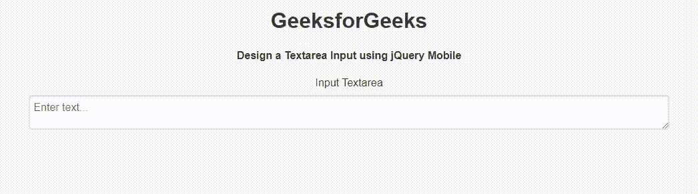

# 如何使用 jQuery Mobile 创建文本区输入框？

> 原文:[https://www . geesforgeks . org/how-create-a-textarea-input-box-use-jquery-mobile/](https://www.geeksforgeeks.org/how-to-create-a-textarea-input-box-using-jquery-mobile/)

jQuery Mobile 是一种基于网络的技术，用于制作可在所有智能手机、平板电脑和台式机上访问的响应内容。在本文中，我们将是一个使用 jQuery Mobile 的文本区域输入框。

**进场:**

*   添加项目所需的 jQuery 移动脚本。

> <link rel="”stylesheet”" href="”http://code.jquery.com/mobile/1.4.5/jquery.mobile-1.4.5.min.css”">
> <脚本 src = " http://code . jquery . com/jquery-1 . 11 . 1 . min . js "></脚本>
> <脚本 src = " http://code . jquery . com/mobile/1 . 4 . 5/jquery . mobile-1 . 4 . 5 . min . js "></脚本>

*   我们现在可以开始创建基于 jQuery Mobile 的文本区了。

**示例:**在本例中，我们将使用 jQuery Mobile 创建一个 textarea 输入字段。

## 超文本标记语言

```html
<!DOCTYPE html>
<html>

<head>
    <link rel="stylesheet" href=
"http://code.jquery.com/mobile/1.4.5/jquery.mobile-1.4.5.min.css" />

    <script src=
        "http://code.jquery.com/jquery-1.11.1.min.js">
    </script>

    <script src=
"http://code.jquery.com/mobile/1.4.5/jquery.mobile-1.4.5.min.js">
    </script>
</head>

<body>
    <center>
        <h1>GeeksforGeeks</h1>

        <h4>
            Design a Textarea Input 
            using jQuery Mobile
        </h4>

        <form style="width: 50%;">
            <label for="InputTextarea">
                Input Textarea
            </label>

            <textarea name="textarea" 
                id="InputTextarea" 
                placeholder="Enter text...">
            </textarea>
        </form>
    </center>
</body>

</html>
```

**输出:**

