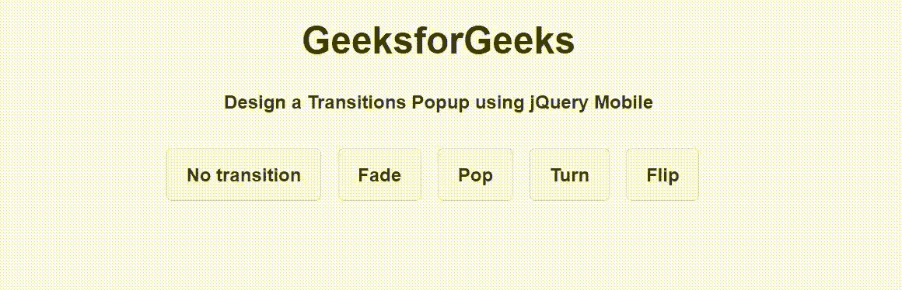
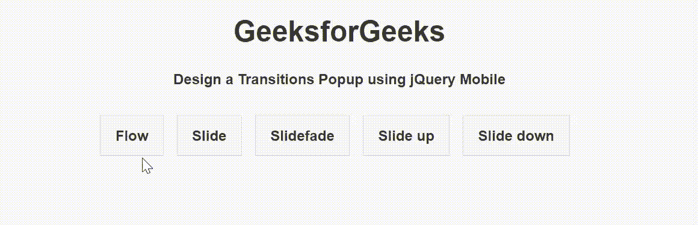

# 如何使用 jQuery Mobile 创建转场弹出窗口？

> 原文:[https://www . geesforgeks . org/how-create-a-transitions-popup-use-jquery-mobile/](https://www.geeksforgeeks.org/how-to-create-a-transitions-popup-using-jquery-mobile/)

**jQuery Mobile** 是一种基于网络的技术，用于制作可在所有智能手机、平板电脑和台式机上访问的响应内容。在本文中，我们将使用 **jQuery Mobile** 创建一个过渡弹出按钮。

**方法:**添加项目所需的 jQuery 移动脚本。

> <link rel="”stylesheet”" href="”http://code.jquery.com/mobile/1.4.5/jquery.mobile-1.4.5.min.css”">
> <脚本 src = " http://code . jquery . com/jquery-1 . 11 . 1 . min . js "></脚本>
> <脚本 src = " http://code . jquery . com/mobile/1 . 4 . 5/jquery . mobile-1 . 4 . 5 . min . js "></脚本>

popup 元素不包含任何类型的转换。通过向引用弹出窗口的链接添加*数据转换*属性，可以将转换添加到弹出窗口元素中。反向转换用于关闭弹出窗口。

**例 1:**

## 超文本标记语言

```
<!DOCTYPE html>
<html>

<head>
    <link rel="stylesheet" href=
"http://code.jquery.com/mobile/1.4.5/jquery.mobile-1.4.5.min.css" />

    <script src=
        "http://code.jquery.com/jquery-1.11.1.min.js">
    </script>

    <script src=
"http://code.jquery.com/mobile/1.4.5/jquery.mobile-1.4.5.min.js">
    </script>
</head>

<body>
    <center>
        <h1>GeeksforGeeks</h1>
        <h4>
            Design a Transitions Popup using jQuery Mobile
        </h4>

        <a href="#GFGTransition" data-transition="none" 
            class="ui-btn ui-corner-all ui-btn-inline" 
            data-rel="popup">
            No transition
        </a>

        <a href="#GFGTransition" data-transition="fade" 
            class="ui-btn ui-corner-all ui-btn-inline"
            data-rel="popup">Fade</a>

        <a href="#GFGTransition" data-transition="pop" 
            class="ui-btn ui-corner-all ui-btn-inline" 
            data-rel="popup">Pop</a>

        <a href="#GFGTransition" data-transition="turn" 
            class="ui-btn ui-corner-all ui-btn-inline"
            data-rel="popup">Turn</a>
        <a href="#GFGTransition" data-transition="flip" 
            class="ui-btn ui-corner-all ui-btn-inline"
            data-rel="popup">Flip</a>

        <div data-role="popup" id="GFGTransition" 
            class="ui-content" data-theme="a">
            <p>It is an example of popup transition.</p>
        </div>
    </center>
</body>

</html>
```

**输出:**



**例 2:**

## 超文本标记语言

```
<!DOCTYPE html>
<html>

<head>
    <link rel="stylesheet" href=
"http://code.jquery.com/mobile/1.4.5/jquery.mobile-1.4.5.min.css" />

    <script src=
        "http://code.jquery.com/jquery-1.11.1.min.js">
    </script>

    <script src=
"http://code.jquery.com/mobile/1.4.5/jquery.mobile-1.4.5.min.js">
    </script>
</head>

<body>
    <center>
        <h1>GeeksforGeeks</h1>
        <h4>
            Design a Transitions Popup using jQuery Mobile
        </h4>

        <a href="#GFGTransition" data-transition="flow" 
            class="ui-btn ui-btn-inline"
            data-rel="popup">Flow</a>

        <a href="#GFGTransition" data-transition="slide" 
            class="ui-btn ui-btn-inline"
            data-rel="popup">Slide</a>

        <a href="#GFGTransition" data-transition="slidefade" 
            class="ui-btn ui-btn-inline"
            data-rel="popup">Slidefade</a>

        <a href="#GFGTransition" data-transition="slideup" 
            class="ui-btn ui-btn-inline"
            data-rel="popup">Slide up</a>

        <a href="#GFGTransition" data-transition="slidedown" 
            class="ui-btn ui-btn-inline"
            data-rel="popup">Slide down</a>

        <div data-role="popup" id="GFGTransition" 
            class="ui-content" data-theme="a">
            <p>It is an example of popup transition.</p>
        </div>
    </center>
</body>

</html>
```

**输出:**

