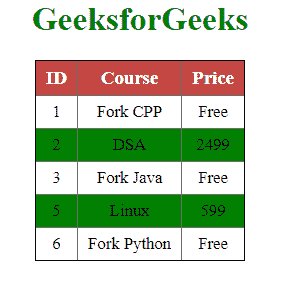

# 如何使用 jQuery 创建斑马纹表效果？

> 原文:[https://www . geeksforgeeks . org/如何创建斑马条纹-表格-效果-使用-jquery/](https://www.geeksforgeeks.org/how-to-create-a-zebra-stripes-table-effect-using-jquery/)

给定一个带有表格的 HTML 文档，任务是使用 jQuery 在表格上创建斑马纹表格效果。

**方法:**要实现斑马纹表格效果，请使用以下代码片段:

```html
$(function() {
    $("table tr:nth-child(odd)").addClass("zebrastripe");
});
```

在上面的函数中，**zebrastride**是使用的类名， **odd** 描述奇数行将有彩色条纹。

要更改**甚至**行条纹，只需使用:

```html
$(function() {
    $("table tr:nth-child(even)").addClass("zebrastripe");
})
```

在下面演示的上述方法中， **jQuery-3.5.1.js** 包含源代码。

**示例:**下面是上述方法的演示。

## 超文本标记语言

```html
<html>

<head>
    <title>jQuery Zebra Stripes Demonstration</title>

    <script type="text/javascript" src=
        "https://code.jquery.com/jquery-3.5.1.js">
    </script>

    <script type="text/javascript">
        $(function() {
            $("table tr:nth-child(odd)")
                .addClass("zebrastripe");
        });
    </script>

    <style type="text/css">
        body,
        td {
            font-size: 10pt;
            text-align: center;
        }

        h1 {
            color: green;
        }

        table {
            background-color: black;
            border: 1px black solid;
            border-collapse: collapse;
        }

        th {
            font-size: 15px;
            padding: 5px 8px;
            border: 1px outset silver;
            background-color: rgb(197, 69, 69);
            color: white;
        }

        tr {
            border: 1px outset silver;
            padding: 5px 8px;
            background-color: white;
            margin: 1px;
        }

        tr.zebrastripe {
            background-color: green;
        }

        td {
            border: 0.5px outset silver;
            border-collapse: collapse;
            padding: 5px 8px;
        }

        .center {
            margin-left: auto;
            margin-right: auto;
        }
    </style>
</head>

<body>
    <h1>
        GeeksforGeeks
    </h1>
    <table class="center">
        <tr>
            <th>ID</th>
            <th>Course</th>
            <th>Price</th>
        </tr>
        <tr>
            <td>1</td>
            <td>Fork CPP</td>
            <td>Free</td>
        </tr>
        <tr>
            <td>2</td>
            <td>DSA</td>
            <td>2499</td>
        </tr>
        <tr>
            <td>3</td>
            <td>Fork Java</td>
            <td>Free</td>
        </tr>
        <tr>
            <td>5</td>
            <td>Linux</td>
            <td>599</td>
        </tr>
        <tr>
            <td>6</td>
            <td>Fork Python</td>
            <td>Free</td>
        </tr>
    </table>
</body>

</html>
```

**输出:**



上述演示的输出