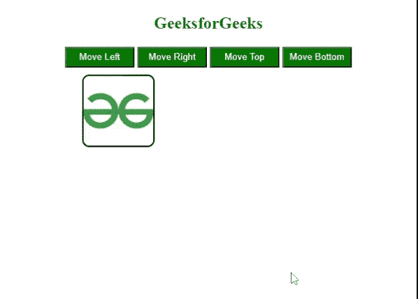

# 如何在 jQuery 中使用相对值创建动画？

> 原文:[https://www . geeksforgeeks . org/如何使用 jquery 中的相对值创建动画/](https://www.geeksforgeeks.org/how-to-create-animations-using-relative-value-in-jquery/)

使用 jQuery 的 [animate()](https://www.geeksforgeeks.org/jquery-animate-with-examples/) 方法，我们可以给元素添加不同的 CSS 动画。这是用于在 jQuery 中操作 HTML 元素和添加动画功能的强大方法之一。动画效果是在我们改变**动画()**方法中的 CSS 样式时创建的。

要用相对值更改元素的左或右或顶部或底部，我们在 CSS 属性中使用+=value 或-=value，这样它就可以用 CSS 属性中给定的值将当前位置的值更改为相对于当前位置的相对增量或减量。

**语法:**使用 animate()方法

```html
$('selector').animate('direction'+='relative_value', other_parameters);
```

或者

```html
$('selector').animate('direction'-='relative_value', other_parameters);
```

也可以使用以下语法直接使用 [CSS()](https://www.geeksforgeeks.org/jquery-css-method/) 方法:

**语法:**

```html
$('selector').css('direction'+='relative_value', 'property':'value');
```

或者

```html
$('selector').css('direction'-='relative_value', 'property':'value');
```

**示例:**

## 超文本标记语言

```html
<!DOCTYPE html>
<html lang="en">

<head>
    <meta charset="UTF-8">
    <meta http-equiv="X-UA-Compatible" content="IE=edge">
    <meta name="viewport" 
          content="width=device-width, initial-scale=1.0">

    <!-- Including jQuery  -->
    <script src=
"https://code.jquery.com/jquery-3.6.0.min.js"
            integrity=
"sha256-/xUj+3OJU5yExlq6GSYGSHk7tPXikynS7ogEvDej/m4=" 
            crossorigin="anonymous">
   </script>
    <style>
        h2 {
            color: #006600;
        }

        button {
            color: white;
            background-color: #006600;
            width: 100px;
            height: 30px;
        }

        body {
            text-align: center;
        }

        div {
            border: 2px solid black;
            border-radius: 10px;
            margin: 10px;
            height: 100px;
            width: 100px;
            position: relative;
            left: 0;
            text-align: center;
        }
    </style>
</head>

<body>

    <h2>GeeksforGeeks</h2>

    <button id="btn-left"> Move Left</button>
    <button id="btn-right"> Move Right</button>
    <button id="btn-top"> Move Top</button>
    <button id="btn-bottom"> Move Bottom</button>

    <div id="GFG_IMAGE">

        <!-- Image added using img tag with src attribute -->
        
        
    </div>

    <script>
        $('#btn-right').click(function () {
            $('div').animate({ 'left': '+=100px' });
        });
        $('#btn-left').click(function () {
            $('div').animate({ 'left': '-=100px' }, "fast");
        });
        $('#btn-top').click(function () {
            $('div').animate({ 'top': '-=100px' }, "fast");
        });
        $('#btn-bottom').click(function () {
            $('div').animate({ 'top': '+=100px' }, "fast");
        });
    </script>

</body>

</html>
```

**输出:**



有生命的