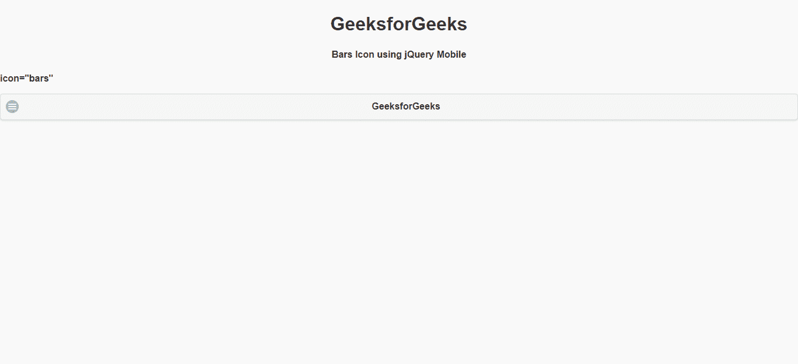
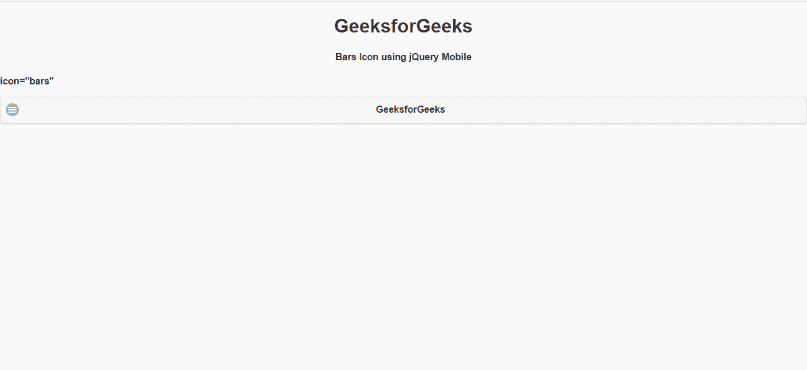

# 如何使用 jQuery Mobile 创建 bar 图标？

> 原文:[https://www . geesforgeks . org/how-create-bar-icon-using-jquery-mobile/](https://www.geeksforgeeks.org/how-to-create-bars-icon-using-jquery-mobile/)

jQuery Mobile 是一种基于网络的技术，用于制作可在所有智能手机、平板电脑和台式机上访问的响应内容。在本文中，我们将使用 jQuery Mobile 制作条形图标。

**方法:**首先，添加项目所需的 jQuery Mobile 脚本。

> <link rel="”stylesheet”" href="”http://code.jquery.com/mobile/1.4.5/jquery.mobile-1.4.5.min.css”">
> <脚本 src = " http://code . jquery . com/jquery-1 . 11 . 1 . min . js "></脚本>
> <脚本 src = " http://code . jquery . com/mobile/1 . 4 . 5/jquery . mobile-1 . 4 . 5 . min . js "></脚本>

**示例:**

## 超文本标记语言

```html
<!DOCTYPE html> 
<html> 

<head>
    <link rel="stylesheet" href=
 "http://code.jquery.com/mobile/1.4.5/jquery.mobile-1.4.5.min.css" />
    <script src=
 "http://code.jquery.com/jquery-1.11.1.min.js">
    </script>
    <script src=
 "http://code.jquery.com/mobile/1.4.5/jquery.mobile-1.4.5.min.js">
    </script>
</head>

<body> 
    <center>
        <h1>GeeksforGeeks</h1>
        <h4>Bars Icon using jQuery Mobile</h4>
    </center>

    <p><strong>icon="bars"</strong></p>

    <a href="https://www.geeksforgeeks.org/" 
       data-role="button" data-icon="bars">
       GeeksforGeeks
    </a>
</body> 

</html>
```

**输出:**



**例 2:**

## 超文本标记语言

```html
<!DOCTYPE html> 
<html> 

<head>
    <link rel="stylesheet" href=
 "http://code.jquery.com/mobile/1.4.5/jquery.mobile-1.4.5.min.css" />

    <script src=
 "http://code.jquery.com/jquery-1.11.1.min.js">
    </script>

    <script src=
 "http://code.jquery.com/mobile/1.4.5/jquery.mobile-1.4.5.min.js">
    </script>
</head>

<body> 
    <center>
        <h1>GeeksforGeeks</h1>
        <h4>Bars Icon using jQuery Mobile</h4>
    </center>

    <p><strong>icon="bars"</strong></p>

    <button id="gfg" data-role="button" 
            data-icon="bars">
            GeeksforGeeks
    </button>
</body>

</html>
```

**输出:**

