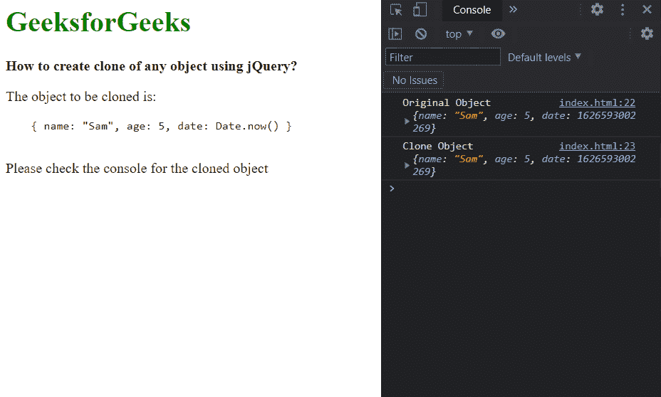
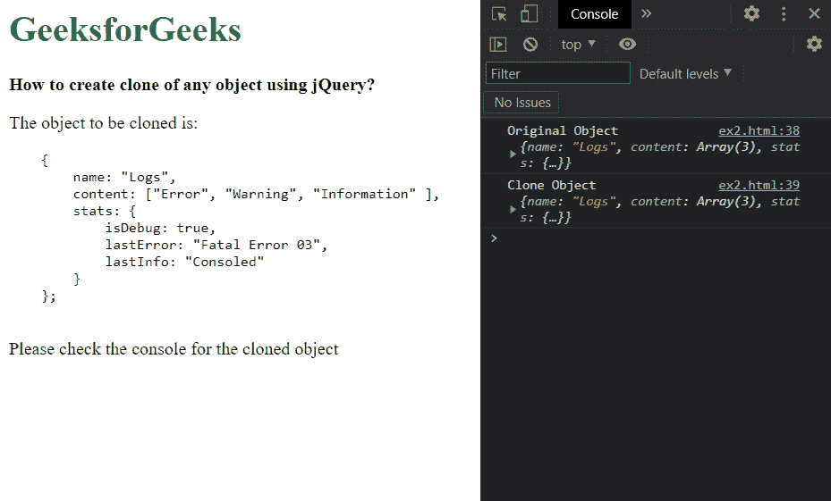

# 如何使用 jQuery 创建任意对象的克隆？

> 原文:[https://www . geeksforgeeks . org/如何使用-jquery/](https://www.geeksforgeeks.org/how-to-create-clone-of-any-object-using-jquery/) 创建任何对象的克隆

在本文中，我们将学习使用 jQuery 创建对象的克隆。这可以使用 jQuery 的 **extend()** 方法来实现。**扩展()** **方法**用于将多个对象的内容合并到作为第一个参数传递的对象中。这可以用来克隆一个数组，因为我们可以传递一个空对象作为第一个参数。

一个额外的参数*深度*可以用来制作对象的深度副本。这将使该方法递归复制对象，并且在必须克隆复杂的嵌套对象时很有帮助。当需要深度复制时，必须将此参数作为第一个参数传递。要了解 jquery 中的克隆概念，请参考 [jQuery 克隆()附带示例](https://www.geeksforgeeks.org/jquery-clone-with-examples/)一文。

**语法:**

```
// Create a clone of the object using the extend() method 
let newObj = jQuery.extend({}, obj);

// Create a deep clone of the object using the deep parameter
let newDeepObj = jQuery.extend(true, {}, obj);
```

以下示例说明了上述方法:

**示例 1:** 在本例中，我们将使用此方法创建对象的克隆。

## 超文本标记语言

```
<!DOCTYPE html>
<html>

<head>
    <script src=
        "https://code.jquery.com/jquery-3.6.0.min.js">
    </script>
</head>

<body>
    <h1 style="color: green">GeeksforGeeks</h1>
    <b>How to create clone of any object using jQuery?</b>

    <p>The object to be cloned is:</p>

    <pre>
    { name: "Sam", age: 5, date: Date.now() }
    </pre>

    <p>Please check the console for the cloned object</p>

    <script>
        let obj = { name: "Sam", age: 5, date: Date.now() };

        // Clone the object using
        // the extend() method
        let newObj = jQuery.extend({}, obj);

        // Print both the objects
        console.log("Original Object", obj);
        console.log("Clone Object", newObj);
    </script>
</body>

</html>
```

**输出:**



**示例 2:** 在此方法中，我们将使用*深度*参数创建对象的深度克隆。

## 超文本标记语言

```
<!DOCTYPE html>
<html>

<head>
    <script src=
        "https://code.jquery.com/jquery-3.6.0.min.js">
    </script>
</head>

<body>
    <h1 style="color: green">GeeksforGeeks</h1>
    <b>How to create clone of any object using jQuery?</b>

    <p>The object to be cloned is:</p>

    <pre>
    {
        name: "Logs",
        content: ["Error", "Warning", "Information" ],
        stats: {
            isDebug: true,
            lastError: "Fatal Error 03",
            lastInfo: "Consoled"
        }
    };
    </pre>

    <p>Please check the console for the cloned object</p>

    <script>
        let obj = {
            name: "Logs",
            content: ["Error", "Warning", "Information"],
            stats: {
                isDebug: true,
                lastError: "Fatal Error 03",
                lastInfo: "Consoled",
            },
        };

        // Create a deep clone of the object
        // by using the deep parameter
        let newObj = jQuery.extend(true, {}, obj);

        // Print both the objects
        console.log("Original Object", obj);
        console.log("Clone Object", newObj);
    </script>
</body>

</html>
```

**输出:**

