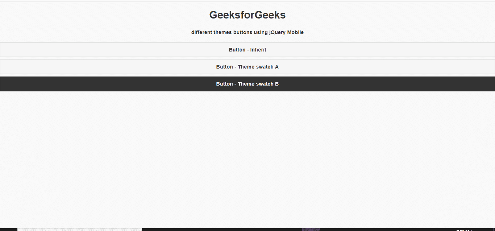

# 如何使用 jQuery Mobile 创建不同的主题按钮？

> 原文:[https://www . geeksforgeeks . org/如何创建不同主题-按钮-使用-jquery-mobile/](https://www.geeksforgeeks.org/how-to-create-different-themes-buttons-using-jquery-mobile/)

jQuery Mobile 是一种基于网络的技术，用于制作可在所有智能手机、平板电脑和台式机上访问的响应内容。

在本文中，我们将使用 jQuery Mobile 使用不同的主题制作不同的按钮。

**方法:**首先，添加项目所需的 jQuery Mobile 脚本。

> <link rel="”stylesheet”" href="”http://code.jquery.com/mobile/1.4.5/jquery.mobile-1.4.5.min.css”">
> <脚本 src = " http://code . jquery . com/jquery-1 . 11 . 1 . min . js "></脚本>
> <脚本 src = " http://code . jquery . com/mobile/1 . 4 . 5/jquery . mobile-1 . 4 . 5 . min . js "></脚本>

我们将使用不同类型的 ui 类和类型来组成标记按钮。

**示例 1:** 我们将使用<按钮>标签制作不同的按钮。

```html
<!DOCTYPE html>
<html>

<head>
    <link rel="stylesheet" href=
"http://code.jquery.com/mobile/1.4.5/jquery.mobile-1.4.5.min.css" />

    <script src=
        "http://code.jquery.com/jquery-1.11.1.min.js">
    </script>

    <script src=
"http://code.jquery.com/mobile/1.4.5/jquery.mobile-1.4.5.min.js">
    </script>
</head>

<body>
    <center>
        <h1>GeeksforGeeks</h1>

        <h4>
            different themes buttons 
            using jQuery Mobile
        </h4>
    </center>

    <button class="ui-btn" id="gfg">
        Button - Inherit
    </button>

    <button class="ui-btn ui-btn-a" id="gfg">
        Button - Theme swatch A
    </button>

    <button class="ui-btn ui-btn-b" id="gfg">
        Button - Theme swatch B
    </button>
</body>

</html> 
```

**输出:**



**示例 2:** 我们将使用锚点标签制作不同的按钮。

```html
<!DOCTYPE html>
<html>

<head>
    <link rel="stylesheet" href=
"http://code.jquery.com/mobile/1.4.5/jquery.mobile-1.4.5.min.css" />

    <script src=
        "http://code.jquery.com/jquery-1.11.1.min.js">
    </script>

    <script src=
"http://code.jquery.com/mobile/1.4.5/jquery.mobile-1.4.5.min.js">
    </script>
</head>

<body>
    <center>
        <h1>GeeksforGeeks</h1>

        <h4>
            different themes Anchor 
            using jQuery Mobile
        </h4>
    </center>

    <a href="https://www.geeksforgeeks.org/" 
        class="ui-btn">
        Anchor - Inherit
    </a>

    <a href="https://www.geeksforgeeks.org/" 
        class="ui-btn ui-btn-a">
        Anchor - Theme swatch A
    </a>

    <a href="https://www.geeksforgeeks.org/" 
        class="ui-btn ui-btn-b">
        Anchor - Theme swatch B
    </a>
</body>

</html>
```

**输出:**

