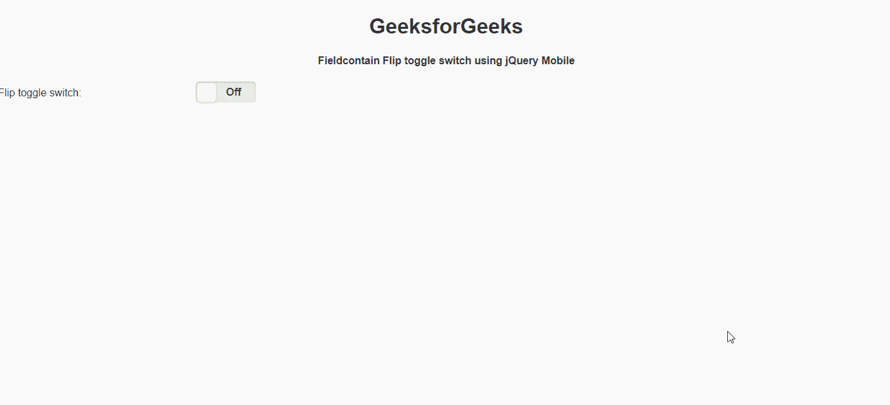

# 如何使用 jQuery Mobile 创建 Fieldcontain 翻转开关？

> 原文:[https://www . geesforgeks . org/how-create-field contain-flip-toggle-switch-using-jquery-mobile/](https://www.geeksforgeeks.org/how-to-create-fieldcontain-flip-toggle-switch-using-jquery-mobile/)

**jQuery Mobile** 是一种基于网络的技术，用于制作可在所有智能手机、平板电脑和台式机上访问的响应内容。

在本文中，我们将使用 **jQuery Mobile** 制作 Fieldcontain 翻转开关。

**方法:**首先，添加项目所需的 jQuery Mobile 脚本。

> <link rel="”stylesheet”" href="”http://code.jquery.com/mobile/1.4.5/jquery.mobile-1.4.5.min.css”">
> <脚本 src = " http://code . jquery . com/jquery-1 . 11 . 1 . min . js "></脚本>
> <脚本 src = " http://code . jquery . com/mobile/1 . 4 . 5/jquery . mobile-1 . 4 . 5 . min . js "></脚本>

**示例:**

## 超文本标记语言

```html
<!DOCTYPE html>
<html>

<head>
    <link rel="stylesheet" href=
"http://code.jquery.com/mobile/1.4.5/jquery.mobile-1.4.5.min.css" />

    <script src=
        "http://code.jquery.com/jquery-1.11.1.min.js">
    </script>

    <script src=
"http://code.jquery.com/mobile/1.4.5/jquery.mobile-1.4.5.min.js">
    </script>
</head>

<body>
    <center>
        <h1>GeeksforGeeks</h1>

        <h4>
            Fieldcontain Flip toggle switch 
            using jQuery Mobile
        </h4>
    </center>

    <form>
        <div data-role="fieldcontain">
            <label for="geeks-1">
                Flip toggle switch:
            </label>

            <select name="geeks-1" id="geeks-1" 
                data-role="slider">

                <option value="off">Off</option>
                <option value="on">On</option>
            </select>
        </div>
    </form>
</body>

</html>
```

**输出:**

