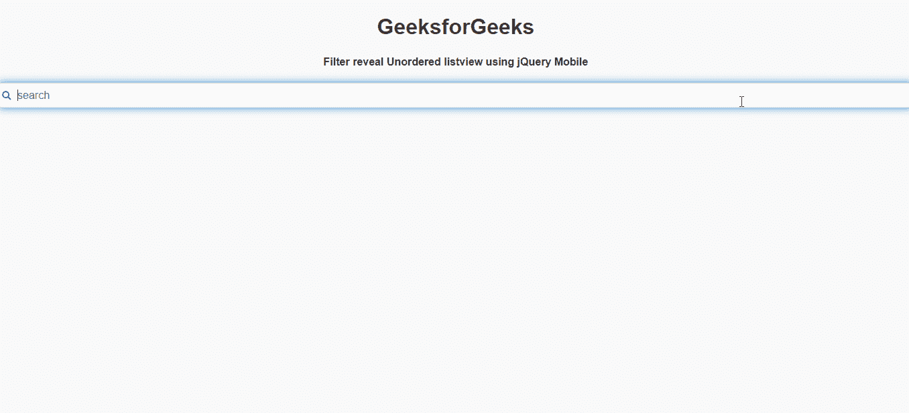

# 如何使用 jQuery Mobile 创建过滤器来显示无序列表视图？

> 原文:[https://www . geeksforgeeks . org/如何创建-过滤-显示-无序-列表视图-使用-jquery-mobile/](https://www.geeksforgeeks.org/how-to-create-filter-reveal-unordered-listviews-using-jquery-mobile/)

**jQuery Mobile** 是一种基于网络的技术，用于制作可在所有智能手机、平板电脑和台式机上访问的响应内容。在本文中，我们将使用 jQuery Mobile 创建过滤器来显示无序列表视图。

**方法:**首先，添加项目所需的 jQuery Mobile 脚本。

> <link rel="”stylesheet”" href="”http://code.jquery.com/mobile/1.4.5/jquery.mobile-1.4.5.min.css”/">
> <脚本 src = " http://code . jquery . com/jquery-1 . 11 . 1 . min . js "></脚本>
> <脚本 src = " http://code . jquery . com/mobile/1 . 4 . 5/jquery . mobile-1 . 4 . 5 . min . js "></脚本>

**示例:**

## 超文本标记语言

```html
<!DOCTYPE html>
<html>

<head>
    <link rel="stylesheet" href=
"http://code.jquery.com/mobile/1.4.5/jquery.mobile-1.4.5.min.css" />

    <script src=
        "http://code.jquery.com/jquery-1.11.1.min.js">
    </script>

    <script src=
"http://code.jquery.com/mobile/1.4.5/jquery.mobile-1.4.5.min.js">
    </script>
</head>

<body>
    <center>
        <h1>GeeksforGeeks</h1>
        <h4>
            Filter reveal Unordered listview
            using jQuery Mobile
        </h4>
    </center>

    <ul data-role="listview" 
        data-filter-reveal="true" 
        data-filter-placeholder="search" 
        data-filter="true">

        <li>One</li>
        <li>Two</li>
        <li>Three</li>
        <li>Four</li>
        <li>Five</li>
        <li>Six</li>
        <li>Seven</li>
        <li>Eight</li>
        <li>Nine</li>
        <li>Ten</li>
    </ul>
</body>

</html>
```

**输出:**

