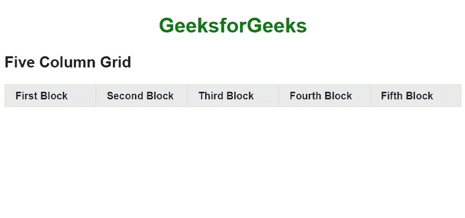

# 如何在 jQuery Mobile 中创建五列网格？

> 原文:[https://www . geeksforgeeks . org/如何创建-五列-网格-in-jquery-mobile/](https://www.geeksforgeeks.org/how-to-create-five-column-grid-in-jquery-mobile/)

**jQuery Mobile 中的网格**是宽度为 100%的元素，完全不可见，没有边框、背景、填充或边距。在网格容器中，元素被分配了名称为*ui-block-a/b/c/d/e*的类。这使得每个“block”元素通过彼此相邻浮动而以网格的形式出现。

**创建五列网格:**我们可以使用容器类作为 *ui-block-a/b/c/d 来创建五列网格。*所有的列宽将各占 20%，并占据整个屏幕的宽度。下面的例子将演示这种方法。

**示例:**

## 超文本标记语言

```html
<!DOCTYPE html>
<html>

<head>
    <link rel="stylesheet"
          href=
"https://code.jquery.com/mobile/1.4.5/jquery.mobile-1.4.5.min.css">
    <script src=
"https://code.jquery.com/jquery-1.11.3.min.js">
    </script>
</head>

<body>
    <center>
        <h1 style="color:green">
            GeeksforGeeks
        </h1>
    </center>
    <h2>Five Column Grid </h2>
    <div class="ui-grid-d">
        <div class="ui-block-a">
            <div class="ui-bar ui-bar-a">
                First Block
            </div>
        </div>

        <div class="ui-block-b">
            <div class="ui-bar ui-bar-a">
                Second Block
            </div>
        </div>

        <div class="ui-block-c">
            <div class="ui-bar ui-bar-a">
                Third Block
            </div>
        </div>

        <div class="ui-block-d">
            <div class="ui-bar ui-bar-a">
                Fourth Block
            </div>
        </div>

        <div class="ui-block-e">
            <div class="ui-bar ui-bar-a">
                Fifth Block
            </div>
        </div>
    </div>
</body>

</html>
```

**输出:**



**支持的浏览器:**

*   谷歌 Chrome
*   微软边缘
*   火狐浏览器
*   歌剧
*   旅行队