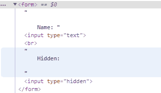
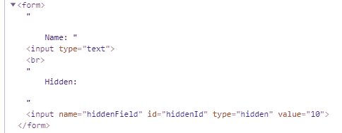
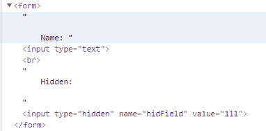

# 如何使用 jQuery 动态创建隐藏的表单元素？

> 原文:[https://www . geeksforgeeks . org/如何使用-jquery/](https://www.geeksforgeeks.org/how-to-create-hidden-form-element-on-the-fly-using-jquery/) 动态创建隐藏表单元素

JQuery 是使 JavaScript 的使用变得容易的库。插入 **<输入类型= '隐藏'>** 也可以使用 jQuery 完成。可以使用 **append()** 和 **appendTo()** 内置函数来添加隐藏的表单元素，但它们不仅仅限于 **<输入类型=“隐藏”>** ，我们还可以添加其他 html 元素。

**注:**它们的表现基本相同。主要区别仅在于语法，这将在下面解释。

**使用 appendTo()方法:**在**appendo()**方法中，**内容**先于`$(content).appendTo(selector)`这样的方法。

以下示例说明了创建隐藏表单元素的 **appendTo()** 方法:

**例 1:** 如果只添加一个属性，那么可以通过在 *attr()* 方法中传递两个参数来给出。第一个参数是属性的名称，第二个参数是属性的值。

```
<!DOCTYPE html>

<html>

<head>
    <title>GeeksforGeeks </title>

    <script src="https://code.jquery.com/jquery-3.4.1.js" 
integrity="sha256-WpOohJOqMqqyKL9FccASB9O0KwACQJpFTUBLTYOVvVU=" 
            crossorigin="anonymous">
    </script>
</head>

<body>
    <script>
        $(document).ready(function() {
            $("<input>").attr("type", "hidden").appendTo("form");
        })
    </script>

    <form>

        Name:
        <input type="text">
        <br> Hidden:

    </form>

</body>

</html>
```

**输出:**使用*检查元素*功能(如谷歌 Chrome 中的 *ctrl + shift + i* )可以在浏览器中看到输出。


**例 2:** 在 **attr()** 方法中，通过将多个属性作为属性对象传递，也可以给出多个属性。

```
<!DOCTYPE html>
<html>

<head>
    <title>GeeksforGeeks</title>

    <script src="https://code.jquery.com/jquery-3.4.1.js" 
integrity="sha256-WpOohJOqMqqyKL9FccASB9O0KwACQJpFTUBLTYOVvVU=" 
            crossorigin="anonymous">
    </script>

</head>

<body>
    <script>
        $(document).ready(function() {
            $("<input>").attr({
                name: "hiddenField",
                id: "hiddenId",
                type: "hidden",
                value: 10
            }).appendTo("form");

        })
    </script>

    <form>

        Name:
        <input type="text">
        <br> Hidden:

    </form>

</body>

</html>
```

**输出:**使用*检查元素*功能(如谷歌 Chrome 中的 *ctrl + shift + i* )可以在浏览器中看到输出。


**使用追加()方法:**在**追加()**方法中，**内容**跟在`$(selector).append(content)` 一样的方法后面。

以下示例说明了创建隐藏表单元素的 **append()** 方法:

**示例:**

```
<!DOCTYPE html>

<html>

<head>
    <title>GeeksforGeeks</title>

    <script src="https://code.jquery.com/jquery-3.4.1.js" 
integrity="sha256-WpOohJOqMqqyKL9FccASB9O0KwACQJpFTUBLTYOVvVU=" 
            crossorigin="anonymous"></script>

</head>

<body>
    <script>
        $(document).ready(function() {
            $("form").append("<input type='hidden'
                    name='hidField' value='111'>")
        })
    </script>

    <form>

        Name:
        <input type="text">
        <br> Hidden:

    </form>

</body>

</html>
```

**输出:**使用**检查元素**功能可以在浏览器中看到输出(例如谷歌浏览器中的`ctrl + shift + i`)。
