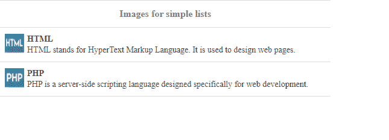

# 如何使用 jQuery 易 UI Mobile 创建列表和链接？

> 原文:[https://www . geeksforgeeks . org/如何创建列表和链接-使用-jquery-easyui-mobile/](https://www.geeksforgeeks.org/how-to-create-lists-and-links-using-jquery-easyui-mobile/)

在本文中，我们将学习如何使用 [jQuery 易 UI Mobile](https://www.jeasyui.com/index.php) 设计列表、对列表进行分组并创建链接以便于导航。

EasyUI 是一个 HTML5 框架，用于使用基于 jQuery、React、Angular 和 Vue 技术的用户界面组件。它有助于构建交互式 web 和移动应用程序的功能，为开发人员节省了大量时间。

**jQuery 易 UI 下载:**

```html
https://www.jeasyui.com/download/index.php
```

实现时请注意预编译库文件的文件路径。

**示例 1:** 以下示例演示了使用 **jQuery 易 UI Mobile** 通过按钮创建列表和链接。

## 超文本标记语言

```html
<!DOCTYPE html>
<html>

<head>
    <meta charset="UTF-8">
    <meta name="viewport" content="initial-scale=1.0, 
      maximum-scale=1.0, user-scalable=no">

    <!-- EasyUI specific stylesheets-->
    <link rel="stylesheet" type="text/css" href="themes/metro/easyui.css">
    <link rel="stylesheet" type="text/css" href="themes/mobile.css">
    <link rel="stylesheet" type="text/css" href="themes/icon.css">

    <!--jQuery library -->
    <script type="text/javascript" src="jquery.min.js">
    </script>

    <!--jQuery libraries of EasyUI  -->
    <script type="text/javascript" src="jquery.easyui.min.js">
    </script>

    <!--jQuery libraries of EasyUI Mobile-->
    <script type="text/javascript" src="jquery.easyui.mobile.js">
    </script>
</head>

<body>

    <!--'easyui-navpanel' class is used for nav panel-->
    <div class="easyui-navpanel">
        <header>
            <div class="m-toolbar">
                <span class="m-title">List Button</span>
            </div>
        </header>

        <!--'m-list' class is used for simple list-->
        <ul class="m-list">
            <li>C
                <div class="m-right">
                    <a href=
"https://www.geeksforgeeks.org/c-programming-language/" 
                        class="easyui-linkbutton">
                        Add
                    </a>
                </div>
            </li>
            <li>C++
                <div class="m-right">
                    <a href=
"https://www.geeksforgeeks.org/c-plus-plus/" 
                        class="easyui-linkbutton">
                        Add
                    </a>
                </div>
            </li>
            <li>Java
                <div class="m-right">
                    <a href=
                "https://www.geeksforgeeks.org/java/" 
                        class="easyui-linkbutton">
                        Add
                    </a>
                </div>
            </li>
            <li>Python
                <div class="m-right">
                    <a href=
"https://www.geeksforgeeks.org/python-programming-language/"
                        class="easyui-linkbutton">
                        Add
                    </a>
                </div>
            </li>
        </ul>
    </div>
</body>

</html>
```

**输出:**

*   **执行前:**


**执行后:**


**示例 2:** 以下示例演示了使用上述插件对列表进行分组。

## 超文本标记语言

```html
<!DOCTYPE html>
<html>

<head>
    <meta charset="UTF-8">
    <meta name="viewport" content="initial-scale=1.0, 
      maximum-scale=1.0, user-scalable=no">

    <!-- EasyUI specific stylesheets-->
    <link rel="stylesheet" type="text/css" href="themes/metro/easyui.css">
    <link rel="stylesheet" type="text/css" href="themes/mobile.css">
    <link rel="stylesheet" type="text/css" href="themes/icon.css">

    <!--jQuery library -->
    <script type="text/javascript" src="jquery.min.js">
    </script>

    <!--jQuery libraries of EasyUI  -->
    <script type="text/javascript" src="jquery.easyui.min.js">
    </script>

    <!--jQuery libraries of EasyUI Mobile-->
    <script type="text/javascript" src="jquery.easyui.mobile.js">
    </script>
</head>

<body>

    <!--'easyui-navpanel' class for navigation panel-->
    <div class="easyui-navpanel">
        <header>
            <div class="m-toolbar">
                <span class="m-title">
                    List group and link lists
                </span>
            </div>
        </header>
        <!--'m-list' class is used for simple lists -->
        <ul class="m-list">
            <!--'m-list-group' class is used to group lists -->
            <li class="m-list-group">Algorithms</li>
            <li>
                <a href=
"https://www.geeksforgeeks.org/analysis-of-algorithms-set-1-asymptotic-analysis/"
                    onclick="display(this)">
                    Analysis of algorithms
                </a>
            </li>

            <li>
                <a href=
"https://www.geeksforgeeks.org/searching-algorithms/"
                    onclick="display(this)">
                    Searching algorithms
                </a>
            </li>

            <li>
                <a href=
"https://www.geeksforgeeks.org/geometric-algorithms/"
                    onclick="display(this)">
                    Geometric algorithms
                </a>
            </li>

            <li><a href=
"https://www.geeksforgeeks.org/greedy-algorithms/"
                    onclick="display(this)">
                    Greedy algorithms
                </a>
            </li>

            <li class="m-list-group">
                Web Technologies
            </li>

            <li><a href="" onclick="display(this)">
                HTML</a>
            </li>

            <li>
                <a href=
"https://www.geeksforgeeks.org/javascript-tutorial/" 
                    onclick="display(this)">
                    Javascript
                </a>
            </li>
        </ul>
    </div>

    <div id="divID2" class="easyui-navpanel">
        <header>
            <div class="m-toolbar">
                <span id="panel2-title" class="m-title">
                    Details
                </span>
                <div class="m-left">

                    <!--'m-back' class is used for 
                        going back-->
                    <a href="javascript:void(0)" 
                        class="easyui-linkbutton m-back" 
                        plain="true" outline="true"
                        onclick="$.mobile.back()">
                        Back
                    </a>
                </div>
            </div>
        </header>

        <div style="margin:50px 0 0;text-align:center">
            <a href="javascript:void(0)" 
                class="easyui-linkbutton" 
                style="width:100px;height:30px"
                onclick="$.mobile.back()">
                Go Back
            </a>
        </div>
    </div>

    <script type="text/javascript">

        function display(target) {

            var link = $(target).text();
            $('#panel2-title').html(link);
            $.mobile.go('#divID2');
        }
    </script>
</body>

</html>
```

**输出:**

*   **执行前:**


*   **执行后:**


**示例 3:** 以下示例使用上述插件演示了带有图像的简单列表。

## 超文本标记语言

```html
<!DOCTYPE html>
<html>

<head>
    <meta charset="UTF-8">
    <meta name="viewport" content="initial-scale=1.0, 
        maximum-scale=1.0, user-scalable=no">

    <!-- EasyUI specific stylesheets-->
    <link rel="stylesheet" type="text/css" href="themes/metro/easyui.css">
    <link rel="stylesheet" type="text/css" href="themes/mobile.css">
    <link rel="stylesheet" type="text/css" href="themes/icon.css">

    <!--jQuery library -->
    <script type="text/javascript" src="jquery.min.js">
    </script>

    <!--jQuery libraries of EasyUI  -->
    <script type="text/javascript" src="jquery.easyui.min.js">
    </script>

    <!--jQuery libraries of EasyUI Mobile-->
    <script type="text/javascript" src="jquery.easyui.mobile.js">
    </script>

    <style>
        #listID .list-image {
            float: left;
            width: 32px;
            height: 32px;
            border: 0;
            margin-right: 5px;
        }

        #listID .list-header {
            font-size: 14px;
            font-weight: bold;
        }

        #listID .list-content {
            text-overflow: ellipsis;
            overflow: hidden;
        }
    </style>
</head>

<body>

    <!--'easyui-navpanel' class for 
        navigation panel-->
    <div class="easyui-navpanel">
        <header>
            <div class="m-toolbar">
                <span class="m-title">
                    Images for simple lists
                </span>
            </div>
        </header>

        <!--'m-list' class is used -->
        <ul id="listID" class="m-list">
            <li>
                <!--'list-image' class is used -->
                

                <!--'list-header' class is used for heading-->
                <div class="list-header">HTML</div>

                <!--'list-content' class for the list content-->
                <div class="list-content">
                    HTML stands for HyperText Markup Language.
                    It is used to design web pages.
                </div>
            </li>

            <li>
                
                <div class="list-header">PHP</div>
                <div class="list-content">
                    PHP is a server-side scripting language
                    designed specifically for web development.
                </div>
            </li>
        </ul>
    </div>
</body>

</html>
```

**输出:**

