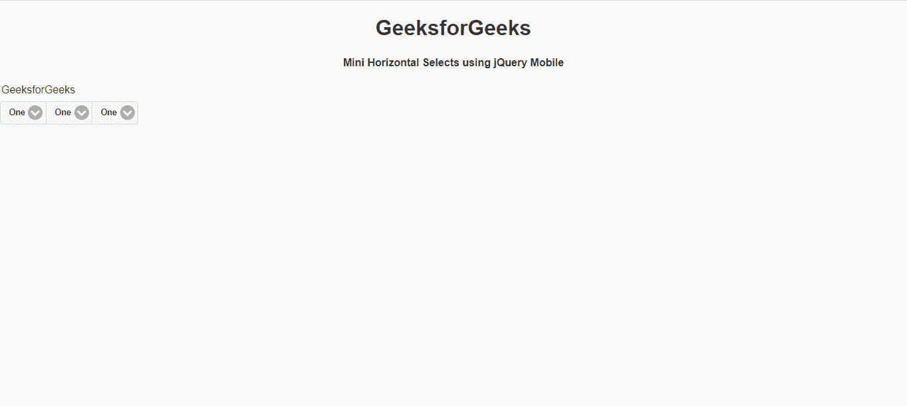

# 如何使用 jQuery Mobile 创建迷你水平选择控件组？

> 原文:[https://www . geesforgeks . org/如何创建-迷你-水平-选择-控制组-使用-jquery-mobile/](https://www.geeksforgeeks.org/how-to-create-mini-horizontal-selects-controlgroup-using-jquery-mobile/)

jQuery Mobile 是一种基于网络的技术，用于制作可在所有智能手机、平板电脑和台式机上访问的响应内容。在本文中，我们将使用 jQuery Mobile 制作一个迷你水平选择控件组按钮。

**方法:**首先，添加项目所需的 jQuery Mobile 脚本。

> <link rel="”stylesheet”" href="”http://code.jquery.com/mobile/1.4.5/jquery.mobile-1.4.5.min.css”">
> <脚本 src = " http://code . jquery . com/jquery-1 . 11 . 1 . min . js "></脚本>
> <脚本 src = " http://code . jquery . com/mobile/1 . 4 . 5/jquery . mobile-1 . 4 . 5 . min . js "></脚本>

**例 1:**

## 超文本标记语言

```
<!DOCTYPE html>
<html>

<head>
    <link rel="stylesheet" href=
"http://code.jquery.com/mobile/1.4.5/jquery.mobile-1.4.5.min.css" />

    <script src=
        "http://code.jquery.com/jquery-1.11.1.min.js">
    </script>

    <script src=
"http://code.jquery.com/mobile/1.4.5/jquery.mobile-1.4.5.min.js">
    </script>
</head>

<body>
    <center>
        <h1>GeeksforGeeks</h1>

        <h4>
            Mini horizontal Selects 
            using jQuery Mobile
        </h4>
    </center>

    <fieldset data-role="controlgroup" 
        data-type="horizontal" data-mini="true" />

    <legend>GeeksforGeeks</legend>

    <select name="gfg1" id="gfg">
        <option value="#">Geeks1</option>
        <option value="#">Geeks2</option>
        <option value="#">Geeks3</option>
    </select>

    <select name="gfg2" id="gfg">
        <option value="#">Geeks1</option>
        <option value="#">Geeks2</option>
        <option value="#">Geeks3</option>
    </select>

    <select name="gfg3" id="gfg">
        <option value="#">Geeks1</option>
        <option value="#">Geeks2</option>
        <option value="#">Geeks3</option>
    </select>
</body>

</html>
```

**输出:**


**例 2:**

## 超文本标记语言

```
<!DOCTYPE html>
<html>

<head>
    <link rel="stylesheet" href=
"http://code.jquery.com/mobile/1.4.5/jquery.mobile-1.4.5.min.css" />

    <script src=
        "http://code.jquery.com/jquery-1.11.1.min.js">
    </script>

    <script src=
"http://code.jquery.com/mobile/1.4.5/jquery.mobile-1.4.5.min.js">
    </script>
</head>

<body>
    <center>
        <h1>GeeksforGeeks</h1>

        <h4>
            Mini Horizontal Selects 
            using jQuery Mobile
        </h4>
    </center>

    <fieldset data-role="controlgroup" 
        data-type="horizontal" data-mini="true" />

    <legend>GeeksforGeeks</legend>

    <select name="gfg1" id="gfg">
        <option value="#">One</option>
        <option value="#">Two</option>
        <option value="#">Three</option>
    </select>

    <select name="gfg2" id="gfg">
        <option value="#">One</option>
        <option value="#">Two</option>
        <option value="#">Three</option>
    </select>

    <select name="gfg3" id="gfg">
        <option value="#">One</option>
        <option value="#">Two</option>
        <option value="#">Three</option>
    </select>
</body>

</html>
```

**输出:**

