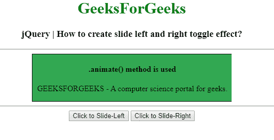
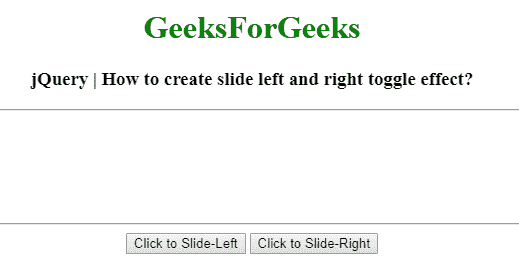
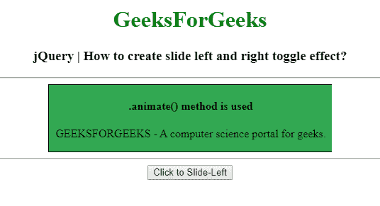
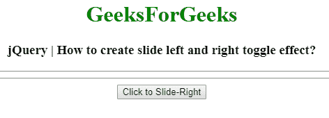

# 如何使用 jQuery 创建幻灯片左右切换效果？

> 原文:[https://www . geesforgeks . org/how-create-slide-left-and-right-toggle-effect-use-jquery/](https://www.geeksforgeeks.org/how-to-create-slide-left-and-right-toggle-effect-using-jquery/)

这里的任务是在 JQuery 中创建一个左右滑动的切换效果，可以使用 [jQuery animate()方法。](https://www.geeksforgeeks.org/jquery-animate-with-examples/)
**。animate()方法:**用于改变 CSS 属性，为所选元素创建动画效果。

**语法:**

```html
(selector).animate({styles}, para1, para2, para3);
```

**进场:**

*   实际盒子宽度存储在要更改宽度值的变量中。
*   **。animate()方法**选择要制作动画的选择器。
*   宽度样式属性根据要求给出值。
*   **宽度:**0–用于向左拨动。
*   **宽度:**先前存储的值–用于向右切换。

**例 1:**

```html
<!DOCTYPE html>
<html>

<head>
    <title>How to create slide left and
      right toggle effect using jQuery?</title>
    <script src="https://code.jquery.com/jquery-1.12.4.min.js">
  </script>
    <style type="text/css">
        .box {
            float: center;
            overflow: hidden;
            background: #32a852;
            width: 400px;
            padding: 0px;
        }
        /* Add padding and border to inner content
    for better animation effect */

        .box-inner {
            width: 400px;
            padding: 0px;
            border: 1px solid #000000;
        }
    </style>
</head>

<body>
    <center>
        <h1 style="color:green;"> 
        GeeksForGeeks 
    </h1>
        <h3>jQuery | How to create slide 
          left and right toggle effect?</h3>
        <hr>
        <div class="box">
            <div class="box-inner">
                <h4>.animate() method is used</h4>
                <p>GEEKSFORGEEKS - A computer
                  science portal for geeks.</p>
            </div>
        </div>
        <hr>
        <button type="button" class="slide-left">
          Click to Slide-Left
      </button>
        <button type="button" class="slide-right">
          Click to Slide-Right
      </button>
        <script type="text/javascript">
            $(document).ready(function() {
                var boxWidth = $(".box").width();
                $(".slide-left").click(function() {
                    $(".box").animate({
                        width: 0
                    });
                });
                $(".slide-right").click(function() {
                    $(".box").animate({
                        width: boxWidth
                    });
                });
            });
        </script>
    </center>
</body>

</html>
```

**输出:**
**点击按钮前:**

**点击按钮后–“点击向左滑动”:**

**点击按钮后–“点击向右滑动”:**


**例 2:**

```html
<!DOCTYPE html>
<html>

<head>
    <title>How to create slide left and
      right toggle effect using jQuery?</title>
    <script src="https://code.jquery.com/jquery-1.12.4.min.js">
  </script>
    <style type="text/css">
        .box {
            float: center;
            overflow: hidden;
            background: #32a852;
            width: 400px;
            padding: 0px;
        }
        /* Add padding and border to inner content
    for better animation effect */

        .box-inner {
            width: 400px;
            padding: 0px;
            border: 1px solid #000000;
        }
    </style>
</head>

<body>
    <center>
        <h1 style="color:green;"> 
        GeeksForGeeks 
    </h1>
        <h3>jQuery | How to create slide 
          left and right toggle effect?</h3>
        <hr>
        <div class="box">
            <div class="box-inner">
                <h4>.animate() method is used</h4>
                <p>GEEKSFORGEEKS - A computer 
                  science portal for geeks.</p>
            </div>
        </div>
        <hr>
        <input onclick="change()" 
               type="button" 
               class="slide-toggle"
               value="Click to Slide-Left" 
               id="myButton1">

        <script type="text/javascript">
            $(document).ready(function() {
                $(".slide-toggle").click(function() {
                    if (this.value == "Click to Slide-Left") this.value = 
                      "Click to Slide-Right";
                    else this.value = "Click to Slide-Left";
                    $(".box").animate({
                        width: "toggle"
                    });
                });
            });
        </script>
    </center>
</body>

</html>
```

**输出:**
**点击按钮前:**

**点击按钮后–“点击向左滑动”:**

**点击按钮后–“点击向右滑动”:**
