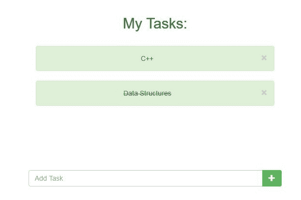
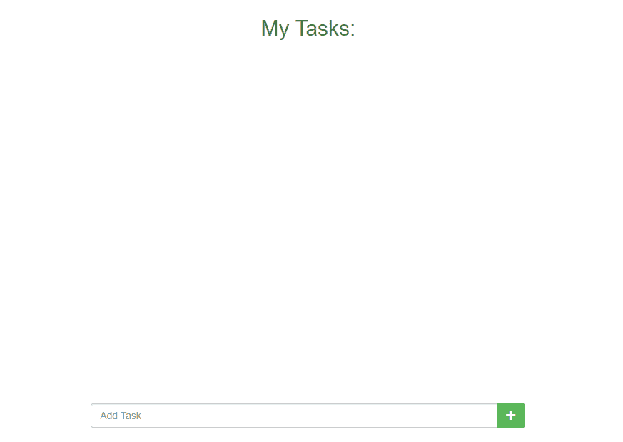
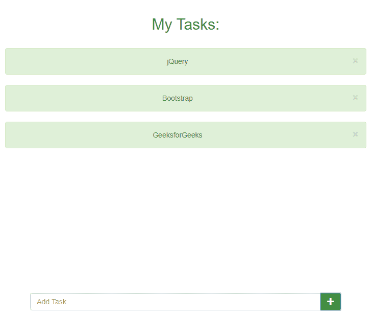

# 如何使用 jQuery 创建待办事项列表？

> 原文:[https://www . geeksforgeeks . org/如何使用-jquery 创建待办事项/](https://www.geeksforgeeks.org/how-to-create-to-do-list-using-jquery/)

本文着重于开发一个*待办事项列表*，它具有一些基本特性，例如:

1.  添加任务
2.  删除任务
3.  交叉完成的任务



**先决条件:**
使用 HTML、CSS、JS、jQuery 的前端开发基础知识& Bootstrap-3。

**步骤:**

1.  **Initialize the layout:**
    – Add a input text-box with a button to add the tasks to the main list.
    – We will set the container containing the above as fixed at the button using some CSS position *fixed* property.
    – Now we will add the container where the tasks will be added.

    <u>下面是代码，以及上面的解释:</u>

    ```
    <!-- Initialize the layout -->
    <!DOCTYPE html>
    <html lang="en">

    <head>
        <meta charset="utf-8" />
        <!-- Required CDN's -->
        <link rel="stylesheet"
              href=
    "https://maxcdn.bootstrapcdn.com/bootstrap/3.4.1/css/bootstrap.min.css">
        <script src=
    "https://ajax.googleapis.com/ajax/libs/jquery/3.4.1/jquery.min.js">
      </script>
        <script src=
    "https://maxcdn.bootstrapcdn.com/bootstrap/3.4.1/js/bootstrap.min.js">
      </script>
        <script src="https://code.jquery.com/jquery-3.4.1.js" 
                integrity=
                "sha256-WpOohJOqMqqyKL9FccASB9O0KwACQJpFTUBLTYOVvVU=" 
                crossorigin="anonymous">
      </script>

        <style>
            .container {
                width: 90%;
                height: auto;
            }

            .foot {
                position: fixed;
                left: 10%;
                bottom: 0;
                width: 80%;
                text-align: center;
            }
        </style>

    </head>

    <body>
        <center>

            <div class="foot">
                <div class="row">
                    <div class="col-sm-1">   </div>
                    <div class="col-sm-10">
                        <!-- Input for tasks -->
                        <div class="input-group">
                            <input type="text"
                                   class="form-control" 
                                   placeholder="Add Task" 
                                   id="text">
                            <div class="input-group-btn">
                                <button class="btn btn-success">
                                  <i class="glyphicon glyphicon-plus">
                                  </i></button>
                            </div>
                        </div>
                        <br>
                        <br>
                    </div>
                </div>
            </div>

            <!-- Rest of the screen used for Adding Tasks -->
            <br>
            <h2 class="text text-success">My Tasks:</h2>
            <br>

            <div class="container">
                <!-- For adding tasks to the list -->
            </div>

        </center>
    </body>

    </html>
    ```

2.  **jQuery script to add tasks:**
    Now we will add the jQuery code so that we can add tasks in our to-do list. Here we have used Bootstrap *alert* class to add task containers.
    *   单击任务右侧的十字按钮将永久删除该任务。
        ( *警报*对此有属性，否则我们也必须实现删除脚本)。

    **下面是代码，以及上面的解释:**

    ```
    <!-- Adding tasks in the list  -->
    <!DOCTYPE html>
    <html lang="en">

    <head>
        <meta charset="utf-8" />
        <link rel="stylesheet"
              href=
    "https://maxcdn.bootstrapcdn.com/bootstrap/3.4.1/css/bootstrap.min.css">
        <script src=
    "https://ajax.googleapis.com/ajax/libs/jquery/3.4.1/jquery.min.js">
      </script>
        <script src=
    "https://maxcdn.bootstrapcdn.com/bootstrap/3.4.1/js/bootstrap.min.js">
      </script>
        <script src="https://code.jquery.com/jquery-3.4.1.js" 
                integrity="sha256-WpOohJOqMqqyKL9FccASB9O0KwACQJpFTUBLTYOVvVU=" 
                crossorigin="anonymous"></script>

        <style>
            .container {
                width: 80%;
                height: auto;
            }

            .foot {
                position: fixed;
                left: 10%;
                bottom: 0;
                width: 80%;
                text-align: center;
            }
        </style>

    </head>

    <body>
        <center>

            <div class="foot">
                <div class="row">
                    <div class="col-sm-1">   </div>
                    <div class="col-sm-10">
                        <!-- Input for tasks -->
                        <div class="input-group">
                            <input type="text"
                                   class="form-control" 
                                   placeholder="Add Task" 
                                   id="text">
                            <div class="input-group-btn">
                                <button class="btn btn-success">
                                  <i class="glyphicon glyphicon-plus">
                                  </i></button>
                            </div>
                        </div>
                        <br>
                        <br>
                    </div>
                </div>
            </div>

            <br>
            <h2 class="text text-success">My Tasks:</h2>
            <br>

            <div class="container">
            </div>

        </center>
        <script>
            $(document).ready(function() {
                $('.btn-success').click(function() {
                    // If something is written
                    if ($('#text').val().length != 0) {
                        //Store previous data
                        var x = $('.container').html();

                        // Add typed text in alert container
                        var y = 
             `<div class="alert alert-success alert-dismissible fade in">
    <a href="#" class="close" data-dismiss="alert" aria-label="close">×</a>
                      ` + $('#text').val() + `</div>`;

                        //Update
                        $('.container').html(y + x);
                        //Clear after addition
                        $('#text').val("");
                    } else alert("Enter some Text!");
                });
            });
        </script>
    </body>

    </html>
    ```

3.  **指示已完成任务的脚本:**
    最后，我们将添加脚本来实现这样一个功能，即每当我们单击任务时，它都会被交叉，如果已经完成，则会被恢复回来。
    穿越任务，我们将使用 CSS 中的*文字-装饰-线条:线通*属性。

**最终解决方案:**

```
<!-- To-Do List implemented using jQuery -->
<!DOCTYPE html>
<html lang="en">

<head>
    <meta charset="utf-8" />
    <link rel="stylesheet"
          href=
"https://maxcdn.bootstrapcdn.com/bootstrap/3.4.1/css/bootstrap.min.css">
    <script src=
"https://ajax.googleapis.com/ajax/libs/jquery/3.4.1/jquery.min.js">
  </script>
    <script src=
"https://maxcdn.bootstrapcdn.com/bootstrap/3.4.1/js/bootstrap.min.js">
  </script>
    <script src="https://code.jquery.com/jquery-3.4.1.js" 
            integrity=
            "sha256-WpOohJOqMqqyKL9FccASB9O0KwACQJpFTUBLTYOVvVU=" 
            crossorigin="anonymous"></script>

    <style>
        .container {
            width: 80%;
            height: auto;
        }

        .foot {
            position: fixed;
            left: 10%;
            bottom: 0;
            width: 80%;
            text-align: center;
        }
    </style>

</head>

<body>
    <center>

        <div class="foot">
            <div class="row">
                <div class="col-sm-1">   </div>
                <div class="col-sm-10">
                    <!-- Input for tasks -->
                    <div class="input-group">
                        <input type="text"
                               class="form-control" 
                               placeholder="Add Task" 
                               id="text">
                        <div class="input-group-btn">
                            <button class="btn btn-success">
                              <i class="glyphicon glyphicon-plus">
                              </i></button>
                        </div>
                    </div>
                    <br>
                    <br>
                </div>
            </div>
        </div>

        <br>
        <h2 class="text text-success">My Tasks:</h2>
        <br>

        <div class="container">
        </div>

    </center>
    <script>
        $(document).ready(function() {
            $('.btn-success').click(function() {
                if ($('#text').val().length != 0) {
                    var x = $('.container').html();
                    var y = 
          `<div class="alert alert-success alert-dismissible fade in">
     <a href="#" class="close" data-dismiss="alert" aria-label="close">×</a>
                           ` + $('#text').val() + `</div>`;
                    $('.container').html(y + x);
                    $('#text').val("");
                } else alert("Enter some Text!");
            });
            // When Task is clicked
            $(document).on('click', '.alert', function() {
                if ($(this).css('text-decoration-line') == "none")
                    $(this).css('text-decoration-line', 'line-through');
                else
                    $(this).css('text-decoration-line', 'none');
            });
        });
    </script>
</body>

</html>
```

**输出:**
**添加任务前:**

**添加任务后:**
