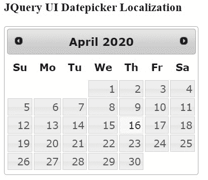
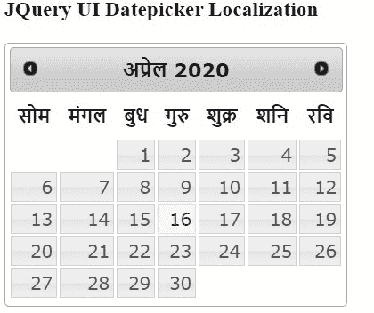

# 如何使用 jQuery 创建 UI 日期选择器？

> 原文:[https://www . geesforgeks . org/how-create-ui-date picker-using-jquery/](https://www.geeksforgeeks.org/how-to-create-ui-datepicker-using-jquery/)

本地化是指浏览器根据浏览器设置或应用程序内部的手动设置，以不同的语言显示数据。要实现根据浏览器设置以不同语言显示的 jQuery UI 日期选择器，请执行以下步骤:

**进场:**

*   添加以下 JavaScript 引用。

    ```html
    <script src=
        "https://ajax.googleapis.com/ajax/libs/jquery/1.11.3/jquery.min.js">
    </script>      

    <script src=
        "http://code.jquery.com/ui/1.11.4/jquery-ui.js">
    </script>    

    <link href="http://code.jquery.com/ui/1.11.4/themes/smoothness/jquery-ui.css" 
          rel="stylesheet" type="text/css" />   

    <script src=
        "https://ajax.googleapis.com/ajax/libs/jqueryui/1.11.1/i18n/jquery-ui-i18n.min.js">
    </script> 
    ```

*   使用 JavaScript 获取浏览器语言版本。下面是代码:

    ```html
    var userLang = navigator.language || navigator.userLanguage;
    ```

*   添加以下 JavaScript 代码，在 jQuery Datepicker 中实现本地化。这里我们使用扩展属性来根据浏览器设置设置区域语言(步骤 2)。

    ```html
    var options = $.extend(
        {},  // empty object  
        $.datepicker.regional[userLang], // Dynamically  
        { dateFormat: "mm/dd/yy" } // your custom options  
    );

    $("#calendar").datepicker(options);
    ```

**示例:**

```html
<!doctype html>  
<html lang="en">  

<head>  
    <title>Localization JQuery UI Datepicker </title>  
    <meta charset="utf-8">  
    <script src=
"https://ajax.googleapis.com/ajax/libs/jquery/1.11.3/jquery.min.js">
    </script>  
    <script src=
"http://code.jquery.com/ui/1.11.4/jquery-ui.js">
    </script>  
    <link href=
"http://code.jquery.com/ui/1.11.4/themes/smoothness/jquery-ui.css" 
          rel="stylesheet" type="text/css" />  
    <script src=
"https://ajax.googleapis.com/ajax/libs/jqueryui/1.11.1/i18n/jquery-ui-i18n.min.js">
    </script>  
    <script type="text/javascript">  
        $(document).ready(function() {  

            var userLang = navigator.language || navigator.userLanguage;  

            var options = $.extend({}, // empty object    
                $.datepicker.regional[userLang], {  
                    dateFormat: "mm/dd/yy"  
                } // your custom options    
            );  

            $("#calendar").datepicker(options);  
        });  
    </script>  
</head>  

<body>  
    <div class="container">  
        <h3>JQuery UI Datepicker Localization</h3>  
        <div id="calendar"> </div>  
    </div>  
</body>  

</html>  
```

让我们看看下面的图，当语言改变时，它是如何显示的:

**输出 1:** 当使用以下代码中的“en-US”将地区语言更改为英语时:

```html
var options = $.extend(        
    {},  // empty object        
    $.datepicker.regional["en-US"], // Dynamically        
    { dateFormat: "mm/dd/yy"} // your custom options    
);  
```



**输出 2:** 当使用以下代码中的“hi”将地区语言更改为印地语时:

```html
var options = $.extend(        
    {},  // empty object        
    $.datepicker.regional["hi"], // Dynamically        
    { dateFormat: "mm/dd/yy"} // your custom options    
);  
```



**您可以通过以下链接根据需要使用地区语言代码:**[ISO 639-1 代码列表](https://en.wikipedia.org/wiki/List_of_ISO_639-1_codes)