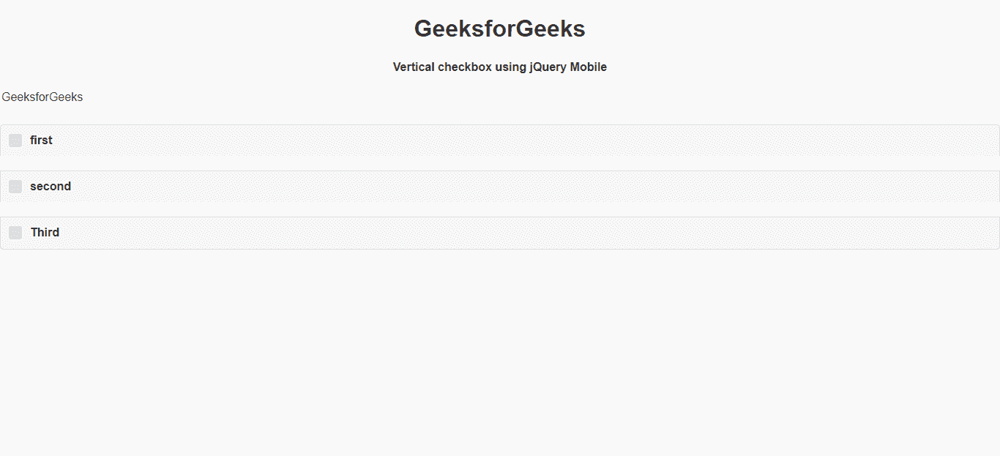
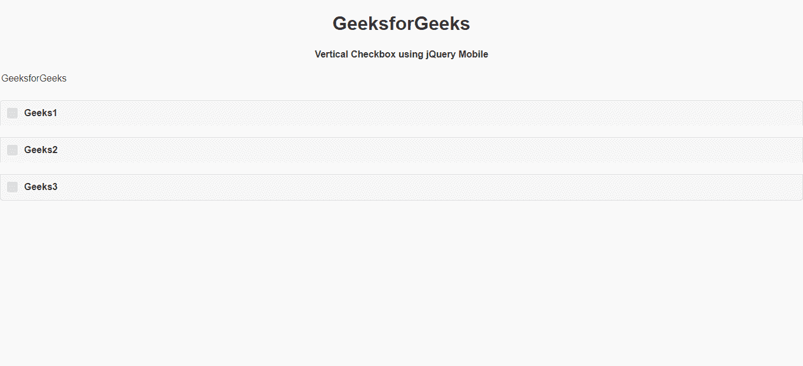

# 如何使用 jQuery Mobile 创建垂直复选框控件组？

> 原文:[https://www . geeksforgeeks . org/如何创建-垂直-复选框-控制组-使用-jquery-mobile/](https://www.geeksforgeeks.org/how-to-create-vertical-checkbox-controlgroups-using-jquery-mobile/)

jQuery Mobile 是一种基于网络的技术，用于制作可在所有智能手机、平板电脑和台式机上访问的响应内容。在本文中，我们将使用 jQuery Mobile 制作一个垂直复选框控件组按钮。

**方法:**首先，添加项目所需的 jQuery Mobile 脚本。

> <link rel="”stylesheet”" href="”http://code.jquery.com/mobile/1.4.5/jquery.mobile-1.4.5.min.css”">
> <脚本 src = " http://code . jquery . com/jquery-1 . 11 . 1 . min . js "></脚本>
> <脚本 src = " http://code . jquery . com/mobile/1 . 4 . 5/jquery . mobile-1 . 4 . 5 . min . js "></脚本>

**例 1:**

```html
<!DOCTYPE html>
<html>

<head>
    <link rel="stylesheet" href=
"http://code.jquery.com/mobile/1.4.5/jquery.mobile-1.4.5.min.css" />

    <script src=
        "http://code.jquery.com/jquery-1.11.1.min.js">
    </script>

    <script src=
"http://code.jquery.com/mobile/1.4.5/jquery.mobile-1.4.5.min.js">
    </script>
</head>

<body>
    <center>
        <h1>GeeksforGeeks</h1>
        <h4>
            Vertical Checkbox
            using jQuery Mobile
        </h4>
    </center>

    <fieldset data-role="controlgroup">
        <legend>GeeksforGeeks</legend>
        <input type="checkbox" name="gfg" id="gfg1" />
        <label for="gfg1">first</label>
        <input type="checkbox" name="gfg" id="gfg2" />
        <label for="gfg2">second</label>
        <input type="checkbox" name="gfg" id="gfg3" />
        <label for="gfg3">Third</label>
    </fieldset>
</body>

</html>
```

**输出:**



**例 2:**

```html
<!DOCTYPE html>
<html>

<head>
    <link rel="stylesheet" href=
"http://code.jquery.com/mobile/1.4.5/jquery.mobile-1.4.5.min.css" />

    <script src=
        "http://code.jquery.com/jquery-1.11.1.min.js">
    </script>

    <script src=
"http://code.jquery.com/mobile/1.4.5/jquery.mobile-1.4.5.min.js">
    </script>
</head>

<body>
    <center>
        <h1>GeeksforGeeks</h1>
        <h4>Vertical Checkbox using jQuery Mobile</h4>
    </center>

    <fieldset data-role="controlgroup">
        <legend>GeeksforGeeks</legend>
        <input type="checkbox" name="gfg" id="gfg1" />
        <label for="gfg1">Geeks1</label>
        <input type="checkbox" name="gfg" id="gfg2" />
        <label for="gfg2">Geeks2</label>
        <input type="checkbox" name="gfg" id="gfg3" />
        <label for="gfg3">Geeks3</label>
    </fieldset>
</body>

</html>
```

**输出:**

