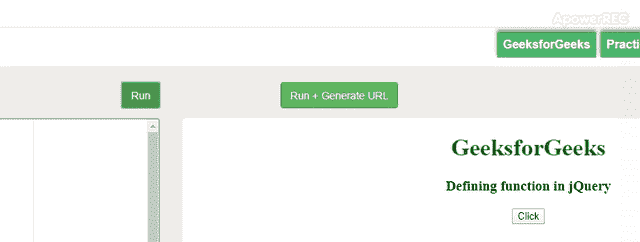

# 如何定义 jQuery 函数？

> 原文:[https://www . geeksforgeeks . org/如何定义-jquery-function/](https://www.geeksforgeeks.org/how-to-define-jquery-function/)

在 jQuery 中定义函数不同于 JavaScript，语法完全不同。函数是一组接受输入、进行特定计算并产生输出的语句。基本上，一个函数是一组语句，它们执行一些特定的任务或进行一些计算，然后将结果返回给用户。
这个想法是把一些通常或者重复完成的任务放在一起，做一个函数，这样我们就可以调用那个函数，而不是针对不同的输入一遍又一遍地编写相同的代码。

**语法:**

```html
$.fn.myFunction = function(){}
```

以下示例说明了 jQuery 中的函数定义:

**例 1:**

```html
<!DOCTYPE html> 
<html> 

<head> 
    <title>
        How to Define jQuery function ?
    </title> 

    <script src=
"https://code.jquery.com/jquery-1.12.4.min.js">
    </script>

    <script>
        $(document).ready(function() {
            $.fn.myFunction = function() { 
                document.getElementById("geeks").innerHTML
                    = "JQuery function is defined!";
            }

            $(".gfg").click(function(){
                $.fn.myFunction();
            });
        });
    </script>
</head> 

<body style="text-align:center"> 

    <h1 style="color:green;"> 
        GeeksforGeeks 
    </h1> 

    <h3>
        Defining function in jQuery
    </h3> 

    <p id="geeks"></p>

    <button type="button" class="gfg">
        Click
    </button>
</body> 

</html>        
```

**输出:**


**例 2:**

```html
<!DOCTYPE html> 
<html> 

<head> 
    <title>
        How to Define jQuery function ?
    </title> 

    <script src=
"https://code.jquery.com/jquery-1.12.4.min.js">
    </script>

    <script>
        $(document).ready(function() {
            $.fn.myFunction = function() { 
                alert('JQuery function is defined!'); 
            }
            $(".gfg").click(function(){
                $.fn.myFunction();
            });
        });
    </script>
</head> 

<body style="text-align:center;"> 

    <h1 style="color:green;"> 
        GeeksforGeeks 
    </h1> 

    <h3>
        Defining function in jQuery
    </h3> 

    <button type="button" class="gfg">
        Click
    </button>
</body> 

</html>       
```

**输出:**
