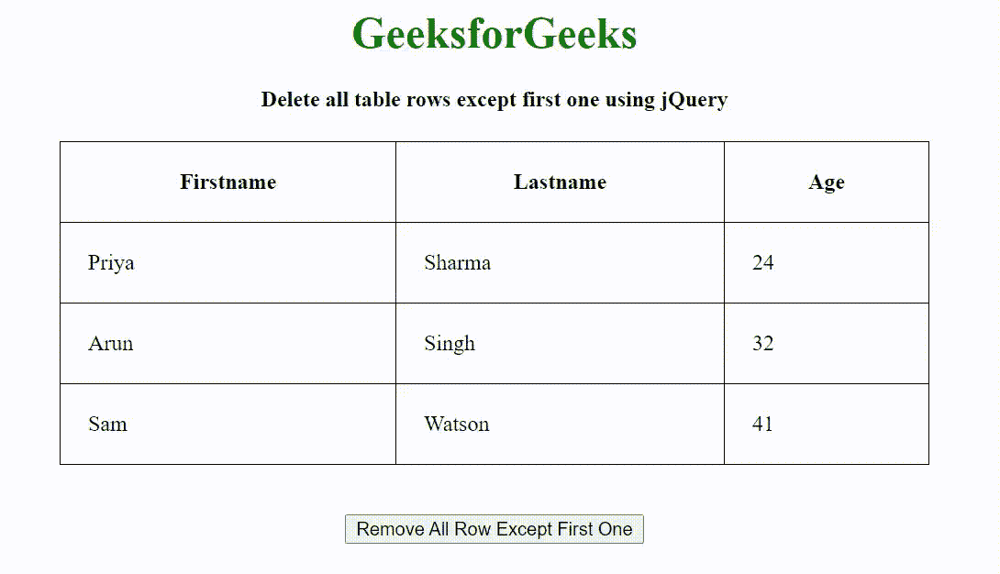

# 如何使用 jQuery 删除除第一行以外的所有表行？

> 原文:[https://www . geeksforgeeks . org/如何使用-jquery/](https://www.geeksforgeeks.org/how-to-delete-all-table-rows-except-first-one-using-jquery/) 删除所有表行-除第一个以外的行

给定一个包含 HTML 表的 HTML 文档，任务是使用 jQuery 删除除第一行之外的表行。

**方法:**首先，我们使用 **<表>** 标签创建一个表，并添加一个包含 **btn** id 的按钮。当用户点击按钮时，jQuery 函数被调用。jQuery 函数使用 **remove()** 方法移除除第一行之外的所有行。

**语法:**

```html
$('#btn').click(function () {
    $("#rTable").find("tr:gt(0)").remove();
});
```

**示例:**

## 超文本标记语言

```html
<!DOCTYPE HTML>
<html>

<head>
    <meta http-equiv="Content-Type" 
        content="text/html; charset=utf-8">

    <script src="https://code.jquery.com/jquery-3.5.1.min.js">
    </script>

    <style>
        table,
        th,
        td {
            border: 1px solid black;
            border-collapse: collapse;
        }

        th,
        td {
            padding: 20px;
        }
    </style>

    <script>
        $(document).ready(function () {
            $('#btn').click(function () {
                $("#rTable").find("tr:gt(0)").remove();
            });
        });
    </script>
</head>

<body>
    <center>
        <h1 style="color: green;">
            GeeksforGeeks
        </h1>

        <h4>
            Delete all table rows except
            first one using jQuery
        </h4>

        <table style="width:50%" id="rTable">
            <tr>
                <th>Firstname</th>
                <th>Lastname</th>
                <th>Age</th>
            </tr>
            <tr>
                <td>Priya</td>
                <td>Sharma</td>
                <td>24</td>
            </tr>
            <tr>
                <td>Arun</td>
                <td>Singh</td>
                <td>32</td>
            </tr>
            <tr>
                <td>Sam</td>
                <td>Watson</td>
                <td>41</td>
            </tr>
        </table>
        <br><br>

        <button id="btn">
            Remove All Row Except First One
        </button>
    </center>
</body>

</html>
```

**输出:**

