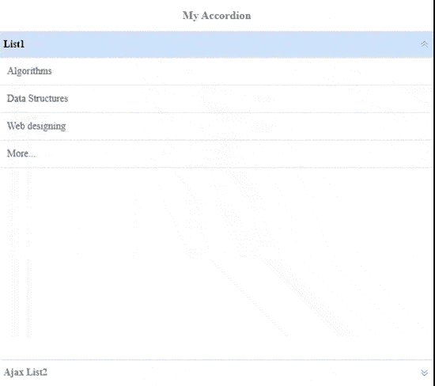
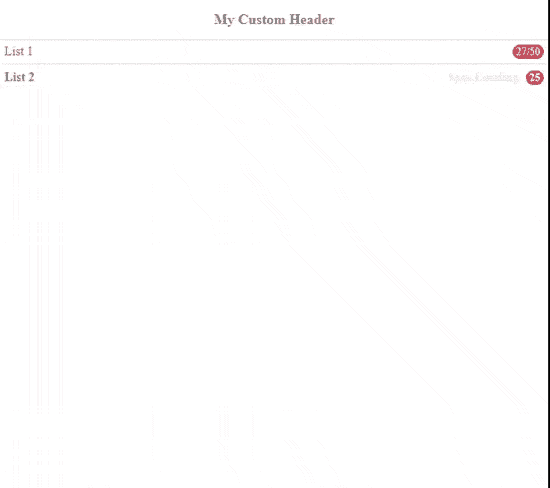

# 如何使用 jQuery 易 UI Mobile 设计手风琴？

> 原文:[https://www . geesforgeks . org/how-design-accordian-use-jquery-easy ui-mobile/](https://www.geeksforgeeks.org/how-to-design-accordian-using-jquery-easyui-mobile/)

**易用户**是一个 HTML5 框架，用于使用基于 jQuery、React、Angular 和 Vue 技术的用户界面组件。它有助于构建交互式 web 和移动应用程序的功能，为开发人员节省了大量时间。手风琴是在显示和隐藏之间切换的 HTML 内容。

**jQuery 易 UI 框架下载链接:**

```html
https://www.jeasyui.com/download/index.php
```

请下载以下代码实现的所有预编译文件，并注意正确的文件路径。

**示例 1:** 以下示例使用 jQuery **易用户**框架演示了基础手风琴。它有两个内容可以显示和隐藏。一个是列表，第二个列表显示其内容，就像从另一个名为“mycontent.html”的 HTML 文件中加载 Ajax 一样。

## 超文本标记语言

```html
<!DOCTYPE html>
<html>

<head>
    <meta charset="UTF-8">
    <meta name="viewport" content=
        "initial-scale=1.0, maximum-scale=1.0, 
        user-scalable=no">

    <link rel="stylesheet" type="text/css" 
        href="themes/metro/easyui.css">
    <link rel="stylesheet" type="text/css" 
        href="themes/mobile.css">
    <link rel="stylesheet" type="text/css" 
        href="themes/icon.css">

    <script type="text/javascript" 
        src="jquery.min.js"></script>
    <script type="text/javascript" 
        src="jquery.easyui.min.js"></script>
    <script type="text/javascript" 
        src="jquery.easyui.mobile.js"></script>
</head>

<body>
    <div class="easyui-navpanel">
        <header>
            <div class="m-toolbar">
                <span class="m-title">
                    My Accordion
                </span>
            </div>
        </header>

        <div class="easyui-accordion" 
            fit="true" border="false">

            <div title="List1">
                <ul class="m-list">
                    <li>Algorithms</li>
                    <li>Data Structures</li>
                    <li>Web designing</li>
                    <li>More...</li>
                </ul>
            </div>

            <div title="Ajax List2" 
                href="mycontent.html"
                style="padding:10px">
            </div>
        </div>
    </div>
</body>

</html>
```

**“my content . html”文件:**以下文件在两个例子中都用于数据内容的 Ajax 加载。

## 超文本标记语言

```html
<!DOCTYPE html>
<html>

<body>
    <p style="font-size:14px">My AJAX content.</p>

    <ul>
        <li>
            There are many important things that 
            should be taken care of, like user 
            friendliness, modularity, security, 
            maintainability, etc.
        </li>

        <li>
            Python is a high-level, general-purpose 
            and a very popular programming language.
        </li>

        <li>
            Java has been one of the most popular 
            programming language for many years.
        </li>

        <li>
            The Java codes are first compiled into 
            byte code (machine independent code). 
        </li>

        <li>
            Java is used in all kind of applications
            like Mobile Applications (Android is 
            Java based).
        </li>

        <li>
            When compared with C++, Java codes are 
            generally more maintainable because Java 
            does not allow many things which may lead
            bad/inefficient programming if used 
            incorrectly.
        </li>
    </ul>
</body>

</html>
```

**输出:**



**示例 2:** 下面的示例演示了一个使用 jQuery 易用户移动插件的自定义折叠标题。

## 超文本标记语言

```html
<!doctype html>
<html>

<head>
    <meta charset="UTF-8">
    <meta name="viewport" content="initial-scale=1.0, 
       maximum-scale=1.0, user-scalable=no">

    <link rel="stylesheet" type="text/css" 
        href="themes/metro/easyui.css">
    <link rel="stylesheet" type="text/css" 
        href="themes/mobile.css">
    <link rel="stylesheet" type="text/css" 
        href="themes/icon.css">

    <script type="text/javascript" 
        src="jquery.min.js">
    </script>
    <script type="text/javascript" 
        src="jquery.easyui.min.js">
    </script>
    <script type="text/javascript" 
        src="jquery.easyui.mobile.js">
    </script>

     <style scoped>
        .ajax-list {
            padding: 5px;
            position: relative;
            line-height: 20px;
            background: #fff;
            font-weight: bold;
            margin: -5px;
        }
    </style>
</head>

<body>
    <div class="easyui-navpanel">
        <header>

            <!-- Mobile.css has styles 
                for m-toobar,m-title -->
            <div class="m-toolbar">
                <span class="m-title">
                    My Custom Header
                </span>
            </div>
        </header>
        <div class="easyui-accordion" data-options
            ="fit:true,border:false,selected:-1">
            <div>
                <header>
                    <div class="hh-inner">
                        <span>List 1</span>
                        <span class="m-badge" 
                            style="float:right">
                            27/50
                        </span>
                    </div>
                </header>
                <ul class="m-list">
                    <li>Web design</li>
                    <li>Mobile Apps</li>
                    <li>Tableau</li>
                    <li>More...</li>
                </ul>
            </div>

            <!-- mycontent.html file contains 
                the content for ajax load-->
            <div href="mycontent.html" style="padding:10px">
                <header>
                    <div class="ajax-list">
                        <span>List 2</span>
                        <span style="float:right">
                            <span style="color:#e9e9e9;
                                margin-right:5px">
                                Ajax Loading
                            </span>
                            <span class="m-badge">25</span>
                        </span>
                    </div>
                </header>
            </div>
        </div>
    </div>
</body>

</html>
```

**输出:**

