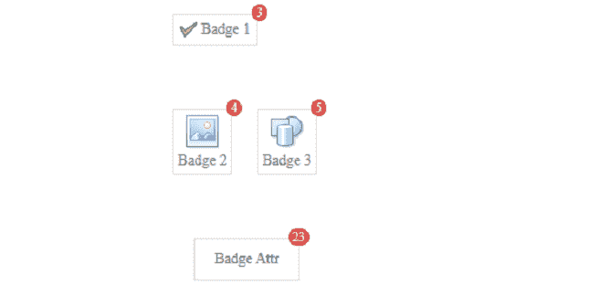
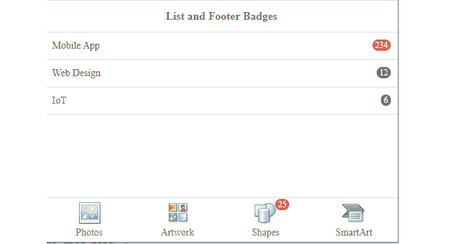
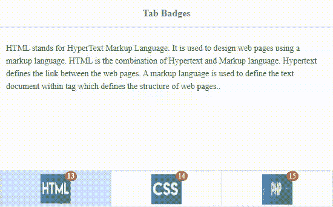

# 如何使用 jQuery 易 UI Mobile 为手机设计徽章？

> 原文:[https://www . geeksforgeeks . org/how-design-徽章-手机-使用-jquery-easyui-mobile/](https://www.geeksforgeeks.org/how-to-design-badges-for-mobiles-using-jquery-easyui-mobile/)

EasyUI 是一个 HTML5 框架，用于使用基于 jQuery、React、Angular 和 Vue 技术的用户界面组件。它有助于构建交互式 web 和移动应用程序的功能，为开发人员节省了大量时间。

在本文中，我们将了解移动界面的徽章。 ***徽章*** 是与链接相关联的数字，用于指示与链接相关联的项目数量。

**jQuery 易 UI 下载:**

```html
https://www.jeasyui.com/download/index.php
```

在为移动应用程序实现代码时，请注意预编译文件的文件路径。

**示例 1:** 以下示例演示了使用**易用户**框架的移动应用的一些基本徽章。

## 超文本标记语言

```html
<!DOCTYPE html>
<html>

<head>
    <meta charset="UTF-8">
    <meta name="viewport" content="initial-scale=1.0, 
        maximum-scale=1.0, user-scalable=no">

    <!-- EasyUI specific stylesheets-->
    <link rel="stylesheet" type="text/css" 
        href="themes/metro/easyui.css">

    <link rel="stylesheet" type="text/css" 
        href="themes/mobile.css">

    <link rel="stylesheet" type="text/css" 
        href="themes/icon.css">

    <!--jQuery library -->
    <script type="text/javascript" 
        src="jquery.min.js">
    </script>

    <!--jQuery libraries of EasyUI and 
        EasyUI Mobile -->
    <script type="text/javascript" 
        src="jquery.easyui.min.js">
    </script>

    <script type="text/javascript" 
        src="jquery.easyui.mobile.js">
    </script>
</head>

<body>
    <div class="easyui-navpanel">

        <!-- m-badge class is used for badges-->

        <div style="padding:30px 40px">
            <a href="#" class="easyui-linkbutton"
                iconCls="icon-ok">
                Badge 1
                <span class="m-badge">3</span>
            </a>
        </div>
        <div style="padding:30px 40px">
            <a href="#" class="easyui-linkbutton" 
                data-options="iconCls:'icon-large-picture',
                iconAlign:'top',size:'large'">
                Badge 2
                <span class="m-badge">4</span>
            </a>
            <a href="#" class="easyui-linkbutton" 
                data-options="iconCls:'icon-large-shapes',
                    iconAlign:'top', size:'large'" 
                    style="margin-left:20px">
                Badge 3
                <span class="m-badge">5</span>
            </a>
        </div>
        <div style="padding:30px 40px">
            <a href="#" class="easyui-linkbutton m-badge" 
                data-badge="23" style="width:100px;
                    height:40px; margin-left:20px">
                Badge Attr
            </a>
        </div>
    </div>
</body>

</html>
```

**输出:**



**示例 2:** 以下示例演示了使用**易用户**框架的移动应用程序的列表和页脚徽章。

## 超文本标记语言

```html
<!doctype html>
<html>

<head>
    <meta charset="UTF-8">
    <meta name="viewport" content="initial-scale=1.0,
        maximum-scale=1.0, user-scalable=no">

    <!-- EasyUI specific stylesheets-->
    <link rel="stylesheet" type="text/css" 
        href="themes/metro/easyui.css">

    <link rel="stylesheet" type="text/css" 
        href="themes/color.css">

    <link rel="stylesheet" type="text/css" 
        href="themes/mobile.css">

    <link rel="stylesheet" type="text/css" 
        href="themes/icon.css">

    <!--jQuery library -->
    <script type="text/javascript" 
        src="jquery.min.js">
    </script>

    <!--jQuery libraries of EasyUI and 
        EasyUI Mobile -->
    <script type="text/javascript" 
        src="jquery.easyui.min.js">
    </script>

    <script type="text/javascript" 
        src="jquery.easyui.mobile.js">
    </script>
</head>

<body>
    <div class="easyui-navpanel">
        <header>
            <div class="m-toolbar">
                <span class="m-title">
                    List and Footer Badges
                </span>
            </div>
        </header>

        <!-- m-list class is used here-->
        <ul class="m-list">
            <li>Mobile App
                <div class="m-right">
                    <span class="m-badge" 
                        style="margin-top:10px">
                        234
                    </span>
                </div>
            </li>

            <li>Web Design
                <div class="m-right">
                    <span class="m-badge c1" 
                        style="margin-top:10px">12
                    </span>
                </div>
            </li>
            <li>IoT
                <div class="m-right">
                    <span class="m-badge c2" 
                        style="margin-top:10px">6
                    </span>
                </div>
            </li>
        </ul>

        <!-- m-buttongroup class is used here-->
        <footer>
            <div class="m-buttongroup 
                m-buttongroup-justified" 
                style="width:100%">
                <a href="#" class="easyui-linkbutton" 
                data-options="iconCls:'icon-large-picture',
                size:'large', iconAlign:'top',plain:true">
                    Photos
                </a>

                <a href="#" class="easyui-linkbutton" 
                    data-options="iconCls:'icon-large-clipart',
                    size:'large', iconAlign:'top',plain:true">
                    Artwork
                </a>

                <a href="#" class="easyui-linkbutton" 
                    data-options="iconCls:'icon-large-shapes',
                    size:'large', iconAlign:'top',plain:true">
                    Shapes
                    <span class="m-badge">
                        25
                    </span>
                </a>

                <a href="#" class="easyui-linkbutton" 
                    data-options="iconCls:'icon-large-smartart',
                    size:'large', iconAlign:'top',plain:true">
                    SmartArt
                </a>
            </div>
        </footer>
    </div>
</body>

</html>
```

**输出:**



**示例 3:** 以下示例演示了选项卡徽章。

## 超文本标记语言

```html
<!doctype html>
<html>

<head>
    <meta charset="UTF-8">
    <meta name="viewport" content="initial-scale=1.0,
        maximum-scale=1.0, user-scalable=no">

    <!-- EasyUI specific stylesheets-->
    <link rel="stylesheet" type="text/css" 
        href="themes/metro/easyui.css">

    <link rel="stylesheet" type="text/css" href="themes/color.css">

    <link rel="stylesheet" type="text/css" href="themes/mobile.css">

    <link rel="stylesheet" type="text/css" href="themes/icon.css">

    <!--jQuery library -->
    <script type="text/javascript" src="jquery.min.js"></script>

    <!--jQuery libraries of EasyUI and 
        EasyUI Mobile -->
    <script type="text/javascript" src="jquery.easyui.min.js">
    </script>

    <script type="text/javascript" src="jquery.easyui.mobile.js">
    </script>

    <style>
        .tab-class {
            padding-top: 6px;
            position: relative;
            display: inline-block;
            line-height: 12px;
        }

        p {
            line-height: 150%;
        }
    </style>
</head>

<body>
    <div class="easyui-navpanel">
        <header>
            <div class="m-toolbar">
                <span class="m-title">
                    Tab Badges
                </span>
            </div>
        </header>
        <!-- easyui-tabs class is used -->
        <div class="easyui-tabs" data-options= "tabHeight: 60,
            fit: true, tabPosition: 'bottom', border: false, 
            pill: true, narrow: true, justified: true">

            <!-- m-badge class is used -->
            <div style="padding:10px">
                <div id="htmlDiv" class="panel-header tab-class">
                    
                    <span class="m-badge">13</span>
                </div>

                <p>
                    HTML stands for HyperText Markup Language.
                    It is used to design web pages using a
                    markup language. HTML is the combination 
                    of Hypertext and Markup language. Hypertext 
                    defines the link between the web pages.
                    A markup language is used to define the 
                    text document within tag which defines the 
                    structure of web pages..
                </p>
            </div>

            <div style="padding:10px">
                <div id="cssDiv" class="panel-header tab-class">
                    
                    <span class="m-badge">14</span>
                </div>

                <p>
                    Cascading Style Sheets, fondly referred to 
                    as CSS, is a simply designed language 
                    intended to simplify the process of making 
                    web pages presentable. CSS allows you to 
                    apply styles to web pages. More importantly,
                    CSS enables you to do this independent of 
                    the HTML that makes up each web page.
                </p>
            </div>

            <div style="padding:10px">
                <div id="phpDiv" class="panel-header tab-class">
                    
                    <span class="m-badge">15</span>
                </div>

                <p>
                    The term PHP is an acronym for PHP: 
                    Hypertext Preprocessor. PHP is a server-side 
                    scripting language designed specifically
                    for web development. PHP can be easily 
                    embedded in HTML files and HTML codes can 
                    also be written in a PHP file.
                </p>
            </div>
        </div>
    </div>
</body>

</html>
```

**输出:**

