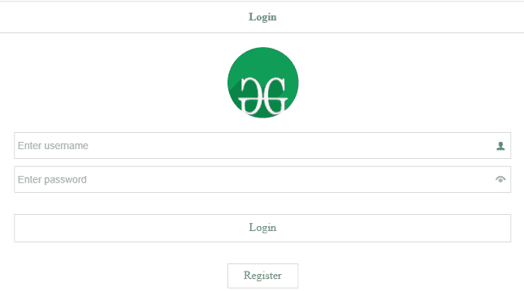
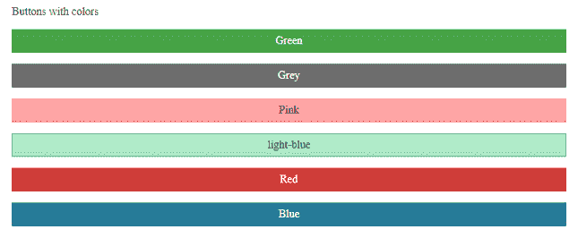
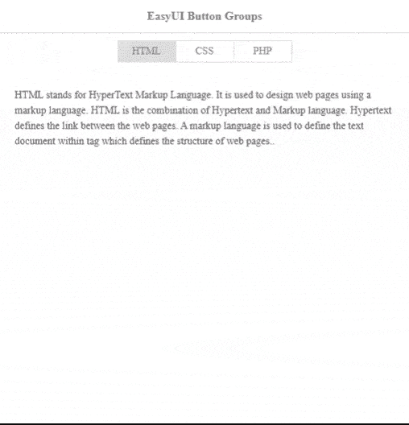
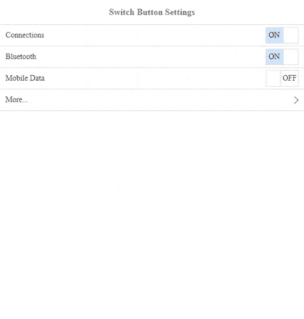

# 如何使用 jQuery 易 UI Mobile 为手机设计按钮？

> 原文:[https://www . geeksforgeeks . org/how-to-design-buttons-for-mobile-use-jquery-easy ui-mobile/](https://www.geeksforgeeks.org/how-to-design-buttons-for-mobiles-using-jquery-easyui-mobile/)

易 UI 是一个 HTML5 框架，用于使用基于 [jQuery](https://www.geeksforgeeks.org/jquery-tutorials/) 、 [React](https://www.geeksforgeeks.org/react-js-introduction-working/) 、 [Angular](https://www.geeksforgeeks.org/angularjs-tutorials/) 和 [Vue](https://www.geeksforgeeks.org/vue-js-introduction-installation/) 技术的用户界面组件。它有助于构建交互式 web 和移动应用程序的功能，为开发人员节省了大量时间。

在本文中，我们将学习为移动应用程序的用户界面设计各种按钮样式。

**jQuery 易 UI 下载:**

> https://www.jeasyui.com/download/index.php

在实现代码时，请注意正确的文件路径。

**示例 1:** 以下代码演示了一些用户界面用途的基本登录类型按钮。

## 超文本标记语言

```html
<!DOCTYPE html>
<html>
<head>
    <meta charset="UTF-8">
    <meta name="viewport" 
       content="initial-scale=1.0, maximum-scale=1.0,
       user-scalable=no">
    <link rel="stylesheet" type="text/css" 
          href="themes/metro/easyui.css">
    <link rel="stylesheet" type="text/css"
          href="themes/mobile.css">
    <link rel="stylesheet" type="text/css"
          href="themes/icon.css">

    <!--jQuery library -->
    <script type="text/javascript" 
            src="jquery.min.js">
    </script>

    <!--jQuery libraries of EasyUI and EasyUI Mobile -->
    <script type="text/javascript"
            src="jquery.easyui.min.js">
    </script>
    <script type="text/javascript" 
            src="jquery.easyui.mobile.js">
    </script>
</head>
<body>
    <div class="easyui-navpanel">
        <header>
            <div class="m-toolbar">
                <span class="m-title">Login</span>
            </div>
        </header>
        <div style="margin:20px auto;width:100px;
                    height:100px;border-radius:100px;
                    overflow:hidden">
            
        </div>
        <div style="padding:0 20px">
            <div style="margin-bottom:10px">
                <input class="easyui-textbox" 
                       data-options="prompt:'Enter username',
                                     iconCls:'icon-man'" 
                       style="width:100%;height:38px">
            </div>
            <div>
                <input class="easyui-passwordbox" 
                       data-options="prompt:'Enter password'" 
                       style="width:100%;height:38px">
            </div>
            <div style="text-align:center;margin-top:30px">
                <a href="#" class="easyui-linkbutton" 
                   style="width:100%;height:40px">
                <span style="font-size:16px">
                 Login
                </span></a>
            </div>
            <div style="text-align:center;margin-top:30px">
                <a href="#" class="easyui-linkbutton" 
                   plain="true" outline="true"
                   style="width:100px;height:35px">
                <span style="font-size:16px">
                 Register
                </span></a> 
            </div>
        </div>
    </div>
</body>
</html>
```

**输出:**



**示例 2:** 下面的代码显示了手机用户界面应用程序中包含的一些彩色按钮。

## 超文本标记语言

```html
<!DOCTYPE html>
<html>
<head>

    <meta charset="UTF-8">
    <meta name="viewport" 
          content="initial-scale=1.0, maximum-scale=1.0,
                   user-scalable=no">

     <!--EasyUI specific stylesheets -->
    <link rel="stylesheet" type="text/css" 
          href="themes/metro/easyui.css">

     <!--EasyUI stylesheet for colours -->
    <link rel="stylesheet" type="text/css"
          href="themes/mobile.css">
    <link rel="stylesheet" type="text/css"
          href="themes/color.css"> 
    <link rel="stylesheet" type="text/css" 
          href="themes/icon.css">

    <!--jQuery library -->
    <script type="text/javascript"
            src="jquery.min.js">
    </script>

    <!--jQuery libraries of EasyUI and EasyUI Mobile -->
    <script type="text/javascript"
            src="jquery.easyui.min.js">
    </script>
    <script type="text/javascript" 
            src="jquery.easyui.mobile.js">
    </script>
</head>
<body>
    <div class="easyui-navpanel">

        <div style="padding:20px">

        <p>Buttons with colors</p>

        <p><a href="#" class="easyui-linkbutton c1"
              style="width:100%">Green</a></p>
        <p><a href="#" class="easyui-linkbutton c2"
              style="width:100%">Grey</a></p>
        <p><a href="#" class="easyui-linkbutton c3"
              style="width:100%">Pink</a></p>
        <p><a href="#" class="easyui-linkbutton c4" 
              style="width:100%">light-blue</a></p>
        <p><a href="#" class="easyui-linkbutton c5" 
              style="width:100%">Red</a></p>
        <p><a href="#" class="easyui-linkbutton c6" 
              style="width:100%">Blue</a></p>

        </div>
    </div>
</body>    
</html>
```

**输出:**



**示例 3:** 下面的代码演示了一组水平或垂直位于一条直线上的按钮。

## 超文本标记语言

```html
<!DOCTYPE html>
<html>
<head>
    <meta charset="UTF-8">  
    <meta name="viewport" content="initial-scale=1.0, 
                maximum-scale=1.0, user-scalable=no">

    <!--EasyUI specific stylesheets -->
    <link rel="stylesheet" type="text/css" 
          href="themes/metro/easyui.css">
    <link rel="stylesheet" type="text/css"
          href="themes/mobile.css">
    <link rel="stylesheet" type="text/css"
          href="themes/icon.css">

    <!--jQuery library -->
    <script type="text/javascript" 
            src="jquery.min.js">
    </script>

    <!--jQuery libraries of EasyUI and EasyUI Mobile -->
    <script type="text/javascript" 
            src="jquery.easyui.min.js">
    </script>
    <script type="text/javascript" 
            src="jquery.easyui.mobile.js">
    </script>
    <style>
        p{
            line-height:150%;
        }

    </style>
</head>
<body>
    <div class="easyui-navpanel">
        <header>
            <div class="m-toolbar">
                <div class="m-title">
                  EasyUI Button Groups
                </div>
            </div>
        </header>
        <!--EasyUI allows buttons along the same line -->
        <div style="text-align:center;padding:10px">
            <span class="m-buttongroup">
                <a href="javascript:void(0)"
                   class="easyui-linkbutton" 
                   data-options="toggle:true,group:'g1',selected:true" 
                   onclick="display('#htmlDiv')" 
                   style="width:80px;height:30px">HTML</a> 
                <a href="javascript:void(0)"
                   class="easyui-linkbutton" 
                   data-options="toggle:true,group:'g1'" 
                   onclick="display('#cssDiv')" 
                   style="width:80px;height:30px">CSS</a> 
                <a href="javascript:void(0)" 
                   class="easyui-linkbutton" 
                   data-options="toggle:true,group:'g1'" 
                   onclick="display('#phpDiv')" 
                   style="width:80px;height:30px">PHP</a> 
            </span>
        </div>
        <div id="items" style="padding:10px 20px;">
            <div id="htmlDiv" class="m-item">

             <p>HTML stands for HyperText Markup Language. 
                It is used to design web pages using a markup
                language. HTML is the combination of Hypertext
                and Markup language. Hypertext defines the link 
                between the web pages. A markup language is used 
                to define the text document within tag which defines 
                the structure of web pages..
             </p>

            </div>
            <div id="cssDiv" class="m-item" style="display:none">

             <p>Cascading Style Sheets, fondly referred to as CSS, 
                is a simply designed language intended to simplify 
                the process of making web pages presentable.
                CSS allows you to apply styles to web pages.
                More importantly, CSS enables you to do this 
                independent of the HTML that makes up each web page.
             </p>

            </div>
            <div id="phpDiv" class="m-item" style="display:none">

             <p>The term PHP is an acronym for PHP: Hypertext
                Preprocessor. PHP is a server-side scripting language 
                designed specifically for web development. PHP can be 
                easily embedded in HTML files and HTML codes can also 
                be written in a PHP file.
             </p>

            </div>
        </div>
    </div>

    <script>
        function display(id){
            $('div.m-item').hide();
            $(id).show();
        }
    </script>

</body>    
</html>
```

**输出:**



**示例 4:** 以下代码演示了互联网连接的开关按钮，如“开/关”。

## 超文本标记语言

```html
<!DOCTYPE html>
<html>
<head>
    <meta charset="UTF-8">  
    <meta name="viewport" content="initial-scale=1.0,
                maximum-scale=1.0, user-scalable=no">

     <!--EasyUI specific stylesheets -->
    <link rel="stylesheet" type="text/css" 
          href="themes/metro/easyui.css">

     <!--EasyUI stylesheet for colours -->
    <link rel="stylesheet" type="text/css"
          href="themes/mobile.css">
    <link rel="stylesheet" type="text/css"
          href="themes/color.css"> 
    <link rel="stylesheet" type="text/css"
          href="themes/icon.css">

    <!--jQuery library -->
    <script type="text/javascript" 
            src="jquery.min.js">
    </script>

    <!--jQuery libraries of EasyUI and EasyUI Mobile -->
    <script type="text/javascript"
            src="jquery.easyui.min.js">
    </script>
    <script type="text/javascript" 
            src="jquery.easyui.mobile.js">
    </script>
</head>
<body>

    <div class="easyui-navpanel">
        <header>
            <div class="m-toolbar">
                <span class="m-title">
                  Switch Button Settings
                </span>
            </div>
        </header>
        <ul class="m-list">
            <li>
                <span>Connections</span>
                <div class="m-right">
                <input class="easyui-switchbutton"
                       checked></div>
            </li>
            <li>
                <span>Bluetooth</span>
                <div class="m-right">
                <input class="easyui-switchbutton" 
                       checked></div>
            </li>
            <li>
                <span>Mobile Data</span>
                <div class="m-right">
                <input class="easyui-switchbutton" 
                       data-options="checked:false">
                </div>
            </li>

            <li>
                <a href="javascript:void(0)">More...</a>
            </li>
        </ul>
    </div>
</body>    
</html>
```

**输出:**

