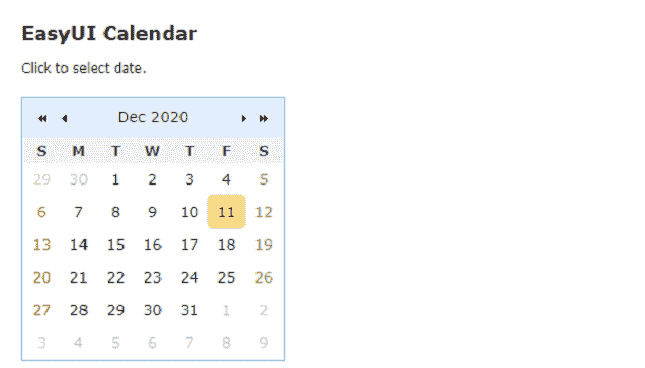
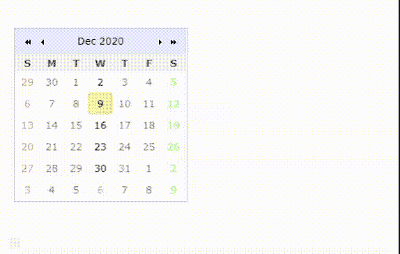
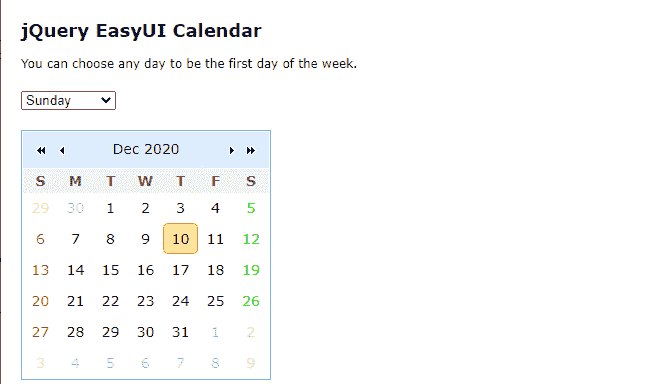
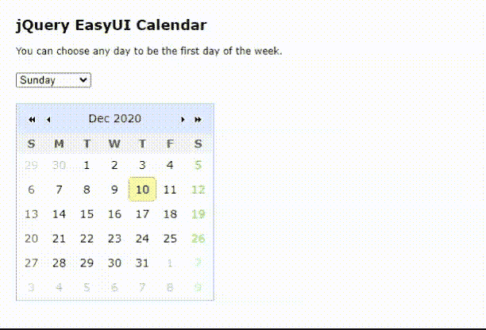

# 如何使用 jQuery 易 UI 为网页设计日历？

> 原文:[https://www . geeksforgeeks . org/网页日历设计方法-使用-jquery-easyui/](https://www.geeksforgeeks.org/how-to-design-calendar-for-web-page-using-jquery-easyui/)

[易用户](https://www.jeasyui.com/index.php)是一个 HTML5 框架，用于使用基于 jQuery、React、Angular 和 Vue 技术的用户界面组件。它有助于构建交互式 web 和移动应用程序的功能，为开发人员节省了大量时间。

在本文中，我们将学习如何为我们的网页界面设计日历功能。

**jQuery 易 UI 下载:**

```html
https://www.jeasyui.com/download/index.php
```

**示例 1:** 以下示例使用 **jQuery 易用户**框架演示了基本的日历功能。开发人员可以根据需要将它们包含在网页中。

## 超文本标记语言

```html
<!DOCTYPE html>
<html>

<head>
    <meta charset="UTF-8">

    <!--EasyUI css files -->
    <link rel="stylesheet" type="text/css" 
          href="themes/default/easyui.css">
    <link rel="stylesheet" type="text/css" 
          href="themes/icon.css">
    <link rel="stylesheet" type="text/css" 
          href="demo.css">

    <!--jQuery library -->
    <script type="text/javascript" 
            src="jquery.min.js">
    </script>

    <!--EasyUI library  -->
    <script type="text/javascript" 
            src="jquery.easyui.min.js">
    </script>
</head>

<body>
    <h2>EasyUI Calendar</h2>

<p>Click to select date.</p>

    <div style="margin:20px 0"></div>

    <!--"easyui-calendar" class is used -->
    <div class="easyui-calendar" 
         style="width:250px;height:250px;">
    </div>
</body>

</html>
```

**输出:**



**示例 2:** 以下示例演示了日历功能，在该功能中，用户可以出于任何目的禁用除所选日期之外的其他日期进行用户交互。

## 超文本标记语言

```html
<!DOCTYPE html>
<html>
<head>
    <meta charset="UTF-8">

    <!--EasyUI css files -->
    <link rel="stylesheet" type="text/css" 
          href="themes/default/easyui.css">
    <link rel="stylesheet" type="text/css" 
          href="themes/icon.css">
    <link rel="stylesheet" type="text/css" 
          href="demo.css">

    <!--jQuery library -->
    <script type="text/javascript" 
        src="jquery.min.js">
    </script>

    <!--EasyUI library  -->
    <script type="text/javascript" 
        src="jquery.easyui.min.js">
    </script>
</head>

<body>
    <div style="margin:20px 0"></div>
    <!--Allows only wednesdays for user selection  -->
    <div class="easyui-calendar" 
        style="width:250px;height:250px;" 
        data-options="
        validator: function(date) {
            if (date.getDay() == 3) {
                return true;
            } else {
                return false;
            }
        }
        ">
    </div>
</body>

</html>
```

**输出:**



**示例 3:** 以下示例演示了日历功能，其中用户可以根据自己的需要选择一周中的某一天作为“*第一个*”天。

## 超文本标记语言

```html
<!DOCTYPE html>
<html>

<head>
    <meta charset="UTF-8">

    <!--EasyUI css files -->
    <link rel="stylesheet" type="text/css" 
          href="themes/default/easyui.css">
    <link rel="stylesheet" type="text/css" 
          href="themes/icon.css">
    <link rel="stylesheet" type="text/css" 
          href="demo.css">

    <!--jQuery library -->
    <script type="text/javascript" 
        src="jquery.min.js">
    </script>

    <!--EasyUI library  -->
    <script type="text/javascript" 
        src="jquery.easyui.min.js">
    </script>
</head>

<body>  
    <h2>jQuery EasyUI Calendar</h2>

<p>
        You can choose any day to be
        the first day of the week.
    </p>

    <div style="margin:20px 0">
        <select 
            onchange="$('#calendarID')
                .calendar({firstDay:this.value})">
            <option value="0">Sunday</option>
            <option value="1">Monday</option>
            <option value="2">Tuesday</option>
            <option value="3">Wednesday</option>
            <option value="4">Thursday</option>
            <option value="5">Friday</option>
            <option value="6">Saturday</option>
        </select>
    </div>

    <div id="calendarID" class="easyui-calendar"   
         style="width:250px;height:250px;">
    </div>
</body>

</html>
```

**输出:**

*   **执行前:**



*   **执行后:**

