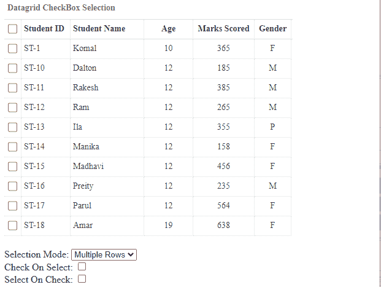
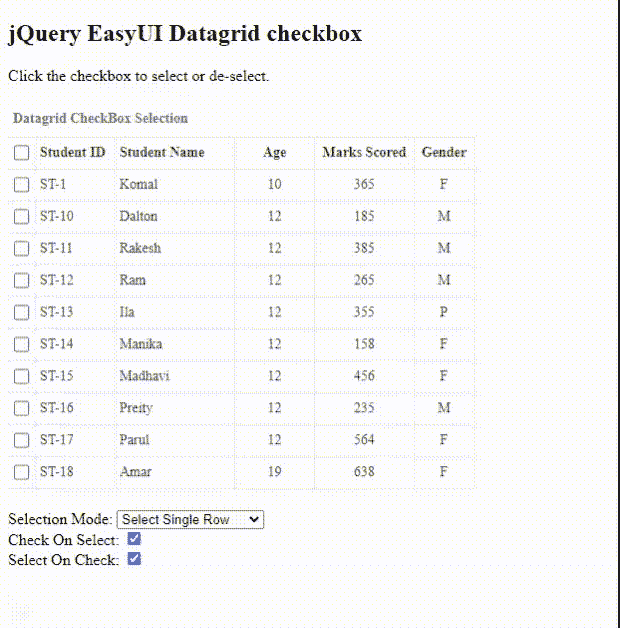
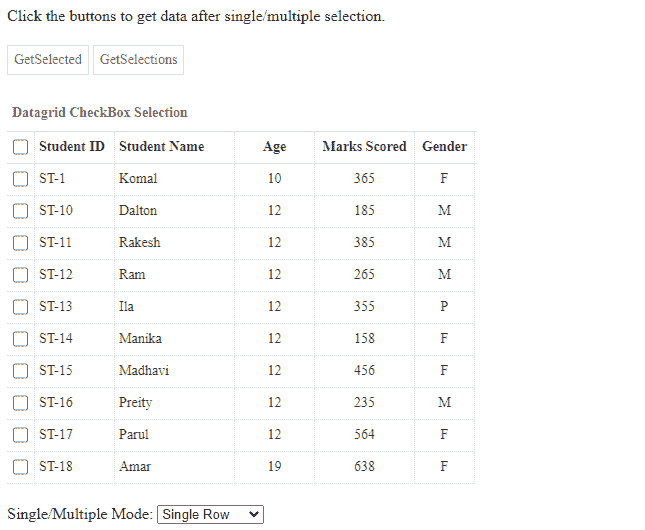
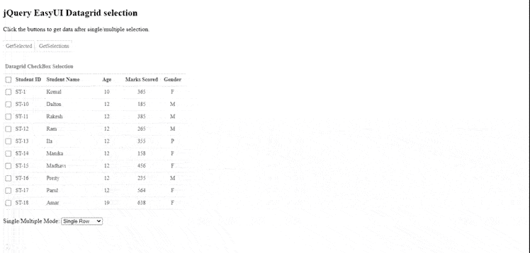

# 如何使用 jQuery 易 UI 设计网页的复选框选择？

> 原文:[https://www . geesforgeks . org/how-design-checkbox-selection-for-网页-use-jquery-easy ui/](https://www.geeksforgeeks.org/how-to-design-checkbox-selection-for-webpage-using-jquery-easyui/)

[易用户](https://jeasyui.com/index.php)是一个 HTML5 框架，用于使用基于 jQuery、React、Angular 和 Vue 技术的用户界面组件。它有助于构建交互式 web 和移动应用程序的功能，为开发人员节省了大量时间。

在本文中，我们将学习使用 **jQuery 易用户界面**插件设计单个和多个选择复选框。

**jQuery 易 UI 下载:**

```html
https://www.jeasyui.com/download/index.php
```

**注意:**执行以下代码时，请注意正确的文件路径。

**示例 1:** 以下代码演示了单次选择和取消选择为网页实现的数据网格的复选框。它还提供了在输出用户界面组件中复选框的多重选择和取消选择。

## 超文本标记语言

```html
<!doctype html>
<html>

<head>
    <meta charset="UTF-8">
    <meta name="viewport" content="initial-scale=1.0, 
        maximum-scale=1.0, user-scalable=no">

    <!-- EasyUI specific stylesheets-->
    <link rel="stylesheet" type="text/css" 
        href="themes/metro/easyui.css">

    <link rel="stylesheet" type="text/css" 
        href="themes/mobile.css">

    <link rel="stylesheet" type="text/css" 
        href="themes/icon.css">

    <!--jQuery library -->
    <script type="text/javascript" src="jquery.min.js">
    </script>
    <!--jQuery libraries of EasyUI  -->
    <script type="text/javascript" src="jquery.easyui.min.js">
    </script>

</head>

<body>
    <h2>jQuery EasyUI Datagrid checkbox</h2>

<p>Click the checkbox to select or de-select.</p>

    <table id="tableID" class="easyui-datagrid" 
        title="Datagrid CheckBox Selection" 
        style="width:470px;height:400px"
        data-options="rownumbers:false,singleSelect:true,
            url:'datafile.json',method:'get',border:false">
        <thead>
            <tr>
                <th data-options="field:'ck',checkbox:true"></th>
                <th data-options="field:'studentid',width:80">
                    <b>Student ID</b>
                </th>
                <th data-options="field:'studentname',width:120">
                    <b>Student Name</b>
                </th>
                <th data-options="field:'age',
                    width:80,align:'center'">
                    <b>Age</b>
                </th>
                <th data-options="field:'marksscored',
                                 width:100,align:'center'">
                    <b>Marks Scored</b>
                </th>
                <th data-options="field:'gender',
                    width:60,align:'center'">
                    <b>Gender</b>
                </th>
            </tr>
        </thead>
    </table>

    <div style="margin:10px 0;">
        <span>Selection Mode: </span>

        <select onchange="$('#tableID')
            .datagrid({singleSelect:(this.value==0)})">

            <option value="0">Select Single Row</option>
            <option value="1">Select Multiple Rows</option>
        </select><br />

        Check On Select: <input type="checkbox" checked
            onchange="$('#tableID').datagrid(
                {checkOnSelect:$(this).is(':checked')})">
        <br />

        Select On Check: <input type="checkbox" checked
            onchange="$('#tableID').datagrid(
                {selectOnCheck:$(this).is(':checked')})">
        <br />
    </div>
</body>

</html>
```

**输出:**

*   **数据网格复选框屏幕:**



*   **数据网格复选框执行:**



**例 2:**

## 超文本标记语言

```html
<!doctype html>
<html>

<head>
    <meta charset="UTF-8">
    <meta name="viewport" content="initial-scale=1.0, 
        maximum-scale=1.0, user-scalable=no">

    <!-- EasyUI specific stylesheets-->
    <link rel="stylesheet" type="text/css" 
        href="themes/metro/easyui.css">

    <link rel="stylesheet" type="text/css" 
        href="themes/mobile.css">

    <link rel="stylesheet" type="text/css" 
        href="themes/icon.css">

    <!--jQuery library -->
    <script type="text/javascript" src="jquery.min.js">
    </script>
    <!--jQuery libraries of EasyUI  -->
    <script type="text/javascript" 
        src="jquery.easyui.min.js">
    </script>

</head>

<body>
    <h2>jQuery EasyUI Datagrid selection</h2>

<p>
        Click the buttons to get data after 
        single/multiple selection.
    </p>

    <div style="margin:20px 0;">
        <a href="#" class="easyui-linkbutton" 
            onclick="getSelectedData()">
            GetSelected
        </a>

        <a href="#" class="easyui-linkbutton" 
            onclick="getMultipleData()">
            GetSelections
        </a>
    </div>

    <table id="tableID" class="easyui-datagrid" 
        title="Datagrid CheckBox Selection" 
        style="width:470px;height:400px"
        data-options="rownumbers:false,
            singleSelect:true, url:'datafile.json',
            method:'get', border:false">
        <thead>
            <tr>
                <th data-options="field:'ck',checkbox:true"></th>
                <th data-options="field:'studentid',width:80">
                    <b>Student ID</b>
                </th>
                <th data-options="field:'studentname',width:120">
                    <b>Student Name</b>
                </th>
                <th data-options="field:'age',
                    width:80,align:'center'">
                    <b>Age</b>
                </th>
                <th data-options="field:'marksscored',
                    width:100, align:'center'">
                    <b>Marks Scored</b>
                </th>
                <th data-options="field:'gender',
                    width:60,align:'center'">
                    <b>Gender</b>
                </th>
            </tr>
        </thead>
    </table>
    <div style="margin:10px 0;">
        <span>Single/Multiple Mode: </span>
        <select onchange="$('#tableID').datagrid({
            singleSelect:(this.value==0)})">

            <option value="0">Single Row</option>
            <option value="1">Multiple Rows</option>
        </select><br />
    </div>

    <script>
        function getSelectedData() {
            var row = $('#tableID').datagrid('getSelected');
            if (row) {

                /* If row is selected, it displays data */
                $.messager.alert('Details', row.studentid 
                    + ":" + row.studentid + ": " 
                    + ",Gender: " + row.gender + ",Name: "
                    + row.studentid + ": " + row.studentname);
            }
        }
        function getMultipleData() {

            /* This array is used to push data */
            var resultArray = [];

            var rows = $('#tableID')
                .datagrid('getSelections');

            /* Traversing through multiple selection */
            for (var i = 0; i < rows.length; i++) {
                var row = rows[i];

                /* Push multiple selection in 
                    result array */
                resultArray.push('<span>' + row.studentid 
                    + ":" + row.studentid + ": " + 
                    ", Gender:" + row.gender + ", Name: "
                    + row.studentid + ": " 
                    + row.studentname + '</span>');
            }

            $.messager.alert('Details', 
                resultArray.join('<br/>'));
        }
    </script>
</body>

</html>
```

**输出:**



