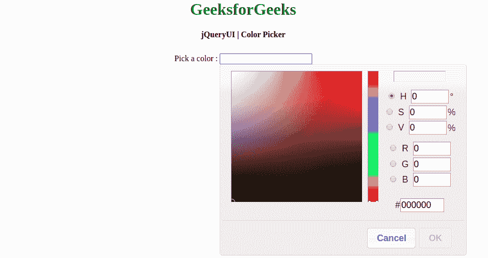
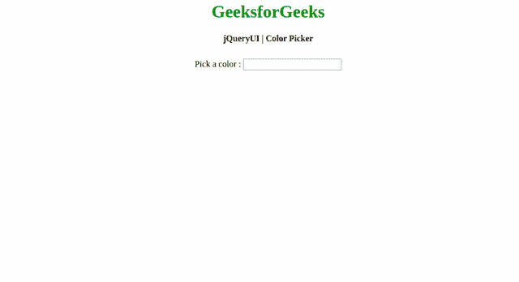

# 如何使用 jQuery UI 设计拾色器？

> 原文:[https://www . geesforgeks . org/how-design-color-picker-use-jquery-ui/](https://www.geeksforgeeks.org/how-to-design-color-picker-using-jquery-ui/)

颜色选择器是一个 jQuery UI 框架工具或小部件，它为用户提供了一个调色板下拉框来选择一些彩色作品的颜色。它通常连接到一个文本框，以便用户从调色板中选择的颜色可以转移到文本框。下拉框可以是 HSV(色调、饱和度、值)选择器或预定义的 RGB 调色板，如图所示。这是一个非常有用的用户界面工具，因为另一端的用户不需要记住或知道困难的颜色代码。这个工具可以理解为图像或文本编辑器。
**使用 jQuery UI 浏览拾色器:**



如果你想在网站上附加调色板下拉框，那么你需要[**jQuery yui color picker 库**](https://github.com/vanderlee/colorpicker) 并在你的 PHP 或 HTML 代码中包含所需的 JavaScript(jQuery . color picker . js)和 CSS(jquery.colorpicker.css)依赖项来显示任何 JqueryUI 小部件。我们必须使用 jQuery 和 jQuery 用户界面库和样式。您可以更改文件以符合您的样式要求。在本文中，我们将在一个 HTML 页面中创建颜色选择器的结构。在 HTML 网页中，提供了用户输入控件供用户选择。用户输入控件通过 jQuery 代码附加到 jQuery UI 颜色选择器小部件。下面是完整的实现。
**创建结构:**在这一部分，我们正在创建基本的页面结构，并附上将使用的所需链接。

*   **jQuery 用户界面链接:**

> <src = " https://Ajax . Google APIs . com/Ajax/libs/jquery ui/1 . 8 . 16/jquery-ui . js "></script><link href = " http://Ajax . Google APIs . com/Ajax

*   **HTML 代码:**这个例子显示了一个简单的颜色选择器弹出窗口。如上所述，颜色选择器下载的相关文件(CSS 和 JS)保存在**颜色选择器-主控**文件夹中。确保开发人员根据代码中自己的 localhost 路径给出正确的路径。

## 超文本标记语言

```html
<!DOCTYPE html>
<html>

<head>
    <title>jQueryUI | Color Picker</title>
</head>

<body>
    <h1>GeeksforGeeks</h1>
    <b>jQueryUI | Color Picker </b>
    <div class="height"></div>
    <br/>

    <body>
        Pick a color :
        <input type="text" id="my_color_picker">
    </body>
</body>

</html>
```

**设计结构:**在上一节中，我们已经创建了使用拾色器小部件的基本代码。在这一节中，我们将设计结构并将颜色选择器小部件附加到我们的输入控件，在这里我们将设置选项来覆盖颜色选择器插件的默认选项。用您自己的选项设置覆盖默认选项可以在 HTML 代码的脚本部分完成。它以一种灵活的方式设计，让用户可以选择应用程序所需的选项。

*   **下载文件的链接:**

> <链接 href = " color picker-master/jquery . color picker . CSS " rel = " style sheet " type = " text/CSS "/>

*   **CSS 代码:**

## 半铸钢ˌ钢性铸铁(Cast Semi-Steel)

```html
<style>
    h1 {
        color: green;
    }

    body {
        text-align: center;
    }
    .height {
        height: 10px;
    }
</style>
```

*   **JS 代码:**

## java 描述语言

```html
<script>
       $(document).ready(function() {
           $(function() {
                $("#my_color_picker").colorpicker();
            });
       });
</script>
```

*   **程序:**

## 超文本标记语言

```html
<!DOCTYPE html>
<html>

<head>
    <title>jQueryUI | Color Picker</title>

    <script src=
"https://ajax.googleapis.com/ajax/libs/jquery/1.7.1/jquery.js">
    </script>
    <script src=
"https://ajax.googleapis.com/ajax/libs/jqueryui/1.8.16/jquery-ui.js">
    </script>
    <link href=
"http://ajax.googleapis.com/ajax/libs/jqueryui/1.8.16/themes/ui-lightness/jquery-ui.css"
          rel="stylesheet" type="text/css" />

    <!-- Include Pre-compiled files from link or
        download the files in your localhost folder -->
    <script src=
"colorpicker-master/jquery.colorpicker.js">
    </script>
    <link href=
"colorpicker-master/jquery.colorpicker.css"
          rel="stylesheet" type="text/css" />

    <style>
        h1 {
            color: green;
        }

        body {
            text-align: center;
        }
        .height {
            height: 10px;
        }
    </style>
</head>

<body>
    <h1>GeeksforGeeks</h1>
    <b>jQueryUI | Color Picker </b>
    <div class="height"></div>
    <br/>

    <body>
        Pick a color :
        <input type="text" id="my_color_picker">

        <script>
            $(document).ready(function() {
                $(function() {
                    $("#my_color_picker").colorpicker();
                });
            });
        </script>
    </body>
</body>

</html>
```

*   **输出:**



*   **管理初始颜色和颜色格式:**在显示颜色选择器时，我们可以管理初始颜色和颜色格式。我们可以在脚本部分使用下面的 jQuery 代码来获得结果。

## java 描述语言

```html
<script>
   $(function() {
     $( '#colorpickerId').colorpicker({
     color:'#00FF00',
     colorFormat: ['#HEX']
  });
 });  
</script>
```

*   **管理对话框:**在显示颜色选择器时，如果标题可见且对话框不是内嵌的，我们可以将对话框管理为可拖动的。我们可以在脚本部分使用下面的 jQuery 代码来获得结果。

## java 描述语言

```html
<script>
   $(function() {
     $( '#colorpickerId').colorpicker({
     draggable:true,
  });
 });  
</script>
```

*   **管理模态窗口:**在显示拾色器时，我们可以将拾色器窗口作为模态窗口进行管理。我们可以在脚本部分使用下面的 jQuery 代码来获得结果。

## java 描述语言

```html
<script>
   $(function() {
     $( '#colorpickerId').colorpicker({
     modal: true,
  });
 });  
</script>
```

*   **管理无、关闭和取消按钮:**在显示颜色选择器时，我们可以管理无、关闭和取消等按钮。我们可以在脚本部分使用下面的 jQuery 代码来获得结果。

## java 描述语言

```html
<script>
   $(function() {
     $( '#colorpickerId').colorpicker({
      showNoneButton: true,
     showCloseButton: true,
     showCancelButton: true,
  });
 });  
</script>
```