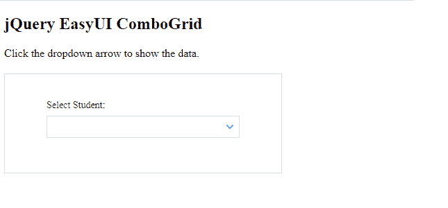
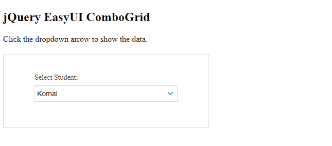
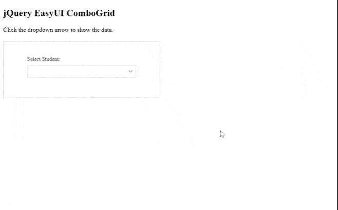
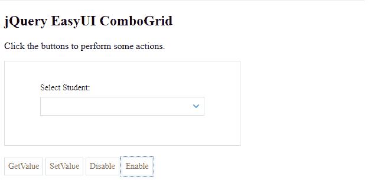
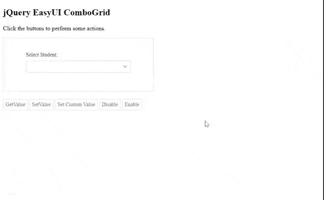

# 如何使用 jQuery EasyUI 设计 combogrids？

> 原文:[https://www . geeksforgeeks . org/how-design-combo grids-using-jquery-easy ui/](https://www.geeksforgeeks.org/how-to-design-combogrids-using-jquery-easyui/)

[易用户](https://www.jeasyui.com/index.php)是一个 HTML5 框架，用于使用基于 jQuery、React、Angular 和 Vue 技术的用户界面组件。它有助于构建交互式 web 和移动应用程序的功能，为开发人员节省了大量时间。

在这篇文章中，我们将学习如何设计**组合框。**组合框是两个可编辑输入框和一个下拉网格面板的组合。

**jQuery 易 UI 下载:**

```html
https://www.jeasyui.com/download/index.php
```

**示例 1:** 下面的代码演示了使用 **jQuery EasyUI** 插件的基本组合网格。

## 超文本标记语言

```html
<!doctype html>
<html>

<head>
    <meta charset="UTF-8">
    <meta name="viewport" content="initial-scale=1.0, 
            maximum-scale=1.0, user-scalable=no">

    <!-- EasyUI specific stylesheets-->
    <link rel="stylesheet" type="text/css" 
        href="themes/metro/easyui.css">

    <link rel="stylesheet" type="text/css" 
        href="themes/mobile.css">

    <link rel="stylesheet" type="text/css" 
        href="themes/icon.css">

    <!--jQuery library -->
    <script type="text/javascript" 
        src="jquery.min.js">
    </script>

    <!--jQuery libraries of EasyUI  -->
    <script type="text/javascript" 
        src="jquery.easyui.min.js">
    </script>

</head>

<body>
    <h2>jQuery EasyUI ComboGrid</h2>

<p>Click the dropdown arrow to show the data.</p>

    <div style="margin:20px 0"></div>

    <div class="easyui-panel" style="width:100%; 
        max-width:400px; padding:30px 60px;">

        <div style="margin-bottom:20px">
            <select class="easyui-combogrid" 
                style="width:100%" data-options="
                    panelWidth: 600,                    
                    panelMinWidth: '50%',
                    idField: 'studentid',
                    textField: 'studentname',
                    url: 'datafile.json',
                    method: 'get',
                    value: 'ST-1',/*Initialize value*/
                    columns: [[{
                        field: 'studentid',
                        title: 'Student ID',
                        width: 100
                    },
                    {
                        field: 'studentname',
                        title: 'Name',
                        width: 120
                    },
                    {
                        field: 'age',
                        title: 'Age',
                        width: 80,
                        align: 'right'
                    },
                    {
                        field: 'marksscored',
                        title: 'Marks',
                        width: 150,
                        align: 'center'
                    },                        
                    {
                        field: 'gender',
                        title: 'Gender',
                        width: 60,
                        align: 'center'
                    }]],
                    fitColumns: true,
                    label: 'Select Student:',
                    labelPosition: 'top'
                ">
            </select>
        </div>
    </div>
</body>

</html>
```

**datafile.json** 以下是所有示例中使用的“datafile.json”文件的代码。

```html
{"total":10,"rows":[
    {"studentname":"Komal","age":10,"gender":"F",
      "marksscored":365,"studentid":"ST-1"},
    {"studentname":"Dalton","age":12,"gender":"M",
      "marksscored":185,"studentid":"ST-10"},
    {"studentname":"Rakesh","age":12,"gender":"M",
      "marksscored":385,"studentid":"ST-11"},
    {"studentname":"Ram","age":12,"gender":"M",
      "marksscored":265,"studentid":"ST-12"},
    {"selected":true,"studentname":"Ila","age":12,"gender":"P",
       "marksscored":355,"studentid":"ST-13"},
    {"studentname":"Manika","age":12,"gender":"F",
       "marksscored":158,"studentid":"ST-14"},
    {"studentname":"Madhavi","age":12,"gender":"F",
       "marksscored":456,"studentid":"ST-15"},
    {"studentname":"Preity","age":12,"gender":"M",
       "marksscored":235,"studentid":"ST-16"},
    {"studentname":"Parul","age":12,"gender":"F",
       "marksscored":564,"studentid":"ST-17"},
    {"studentname":"Amar","age":19,"gender":"F",
       "marksscored":638,"studentid":"ST-18"}
]}
```

**输出:**

*   **基本输出:**



*   **带初始值的组合网格:**



*   **Combogrid 执行:**



**示例 2:** 以下示例演示了与 combogrid 相关的基本操作。

## 超文本标记语言

```html
<!doctype html>
<html>

<head>
    <meta charset="UTF-8">
    <meta name="viewport" content="initial-scale=1.0, 
        maximum-scale=1.0, user-scalable=no">

    <!-- EasyUI specific stylesheets-->
    <link rel="stylesheet" type="text/css" 
        href="themes/metro/easyui.css">

    <link rel="stylesheet" type="text/css" 
        href="themes/mobile.css">

    <link rel="stylesheet" type="text/css" 
        href="themes/icon.css">

    <!--jQuery library -->
    <script type="text/javascript" 
        src="jquery.min.js">
    </script>

    <!--jQuery libraries of EasyUI  -->
    <script type="text/javascript" 
        src="jquery.easyui.min.js">
    </script>

</head>

<body>
    <h2>jQuery EasyUI ComboGrid</h2>

<p>Click the buttons to perform some actions.</p>

    <div class="easyui-panel" style="width: 100%;
        max-width: 400px; padding: 30px 60px;">
        <div style="margin-bottom:20px">

            <input id="combogridID" 
                class="easyui-combogrid" 
                style="width:100%" data-options="
                    panelWidth: 600,
                    idField: 'studentid',
                    textField: 'studentname',
                    url: 'datafile.json',
                    method: 'get',
                    columns: [[
                    {
                        field: 'studentid',
                        title: 'Student ID',
                        width: 100
                    },
                    {
                        field: 'studentname',
                        title: 'Name',
                        width: 120
                    },
                    {
                        field: 'age',
                        title: 'Age',
                        width: 80,
                        align: 'right'
                    },
                    {
                        field: 'marksscored',
                        title: 'Marks',
                        width: 150,
                        align: 'center'
                    },                        
                    {
                        field: 'gender',
                        title: 'Gender',
                        width: 60,
                        align: 'center'
                    }
                    ]],
                    fitColumns: true,
                    label: 'Select Student:',
                    labelPosition: 'top'
                ">
        </div>
    </div>
    <div style="margin:20px 0">
        <div style="margin:20px 0">
            <a href="javascript:void(0)" 
                class="easyui-linkbutton" 
                onclick="getValue()">
                GetValue
            </a>

            <a href="javascript:void(0)" 
                class="easyui-linkbutton" 
                onclick="setValue()">
                SetValue
            </a>

            <a href="javascript:void(0)" 
                class="easyui-linkbutton" 
                onclick="setCustomValue()">
                Set Custom Value
            </a>

            <a href="javascript:void(0)" 
                class="easyui-linkbutton" 
                onclick="disable()">
                Disable
            </a>

            <a href="javascript:void(0)" 
                class="easyui-linkbutton" 
                onclick="enable()">
                Enable
            </a>
        </div>

        <div id="getValueResult"></div>
    </div>

    <script type="text/javascript">

        /* To set and get value */
        function getValue() {
            var val = $('#combogridID').combogrid('getValue');
            $('#getValueResult').html(val + " is set");
        }
        function setValue() {
            $('#combogridID').combogrid('setValue', 'ST-14');
        }
        function setCustomValue() {
            $('#combogridID').combogrid('setValue', {
                studentid: 'ST-19',
                studentname: 'Pari'
            });
        }

        /* To disable the combogrid */
        function disable() {
            $('#combogridID').combogrid('disable');
        }

        /* To enable the combogrid */
        function enable() {
            $('#combogridID').combogrid('enable');
        }
    </script>
</body>

</html>
```

**输出:**

*   **基本画面:**



*   **动作示范:**


*   **自定义设置:**

