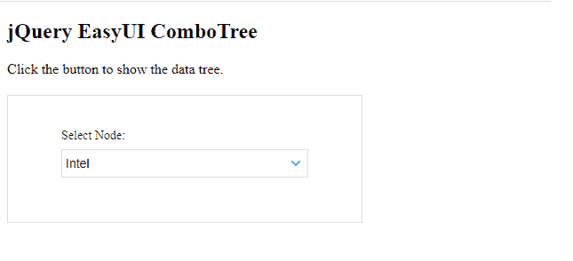
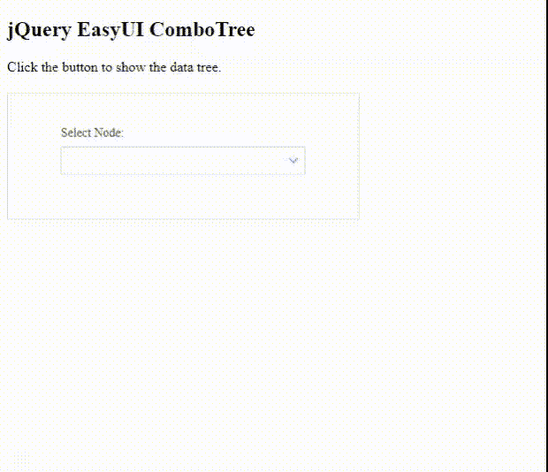
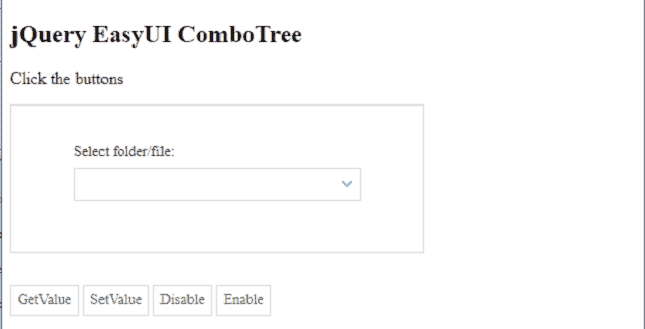
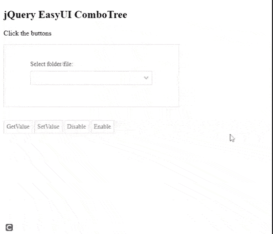

# 如何使用 jQuery EasyUI 设计 combotree？

> 原文:[https://www . geesforgeks . org/how-design-combo tree-using-jquery-easy ui/](https://www.geeksforgeeks.org/how-to-design-combotree-using-jquery-easyui/)

EasyUI 是一个 HTML5 框架，用于使用基于 jQuery、React、Angular 和 Vue 技术的用户界面组件。它有助于构建交互式 web 和移动应用程序的功能，为开发人员节省了大量时间。

组合框是一个用户界面组件，它是一个下拉树和选择控件的组合。

**jQuery 易 UI 下载:**

```html
https://www.jeasyui.com/download/index.php
```

**注意:**执行以下代码时，请注意预编译文件的正确文件路径。

**示例 1:** 以下示例演示了使用文件“dataTree.json”和 jQuery EasyUI 库的基本 combotree。

## 超文本标记语言

```html
<!doctype html>
<html>

<head>
    <meta charset="UTF-8">
    <meta name="viewport" content="initial-scale=1.0, 
            maximum-scale=1.0, user-scalable=no">

    <!-- EasyUI specific stylesheets-->
    <link rel="stylesheet" type="text/css"
        href="themes/metro/easyui.css">

    <link rel="stylesheet" type="text/css" 
        href="themes/mobile.css">

    <link rel="stylesheet" type="text/css" 
        href="themes/icon.css">

    <!--jQuery library -->
    <script type="text/javascript" 
        src="jquery.min.js">
    </script>

    <!--jQuery libraries of EasyUI  -->
    <script type="text/javascript" 
        src="jquery.easyui.min.js">
    </script>
</head>

<body>
    <h2>jQuery EasyUI ComboTree</h2>

    <p>
        Click the button to show 
        the data tree.
    </p>

    <div style="margin: 20px 0"></div>

    <!-- easyui-panel class is used -->
    <div class="easyui-panel" style=
        "width: 100%; max-width: 400px;
        padding: 30px 60px;">

        <div style="margin-bottom: 20px">

            <!--easyui-combotree class is used-->
            <input class="easyui-combotree" 
                value="131" data-options=
                "url: 'dataTree.json', 
                method: 'get', 
                label: 'Select Node:',
                labelPosition: 'top'" 
                style="width:100%">
        </div>
    </div>
</body>

</html>
```

**dataTree.json:** 以下是所有数据示例中使用的文件“dataTree.json”的代码。

## java 描述语言

```html
[{
    "id":1,
    "text":"Users",
    "children":[{
        "id":11,
        "text":"Photos",
        "state":"closed",
        "children":[{
            "id":101,
            "text":"Family"
        },{
            "id":102,
            "text":"Colleagues"
        },{
            "id":103,
            "text":"Relatives"
        }]
    },{
        "id":12,
        "text":"Program Files",
        "children":[{
            "id":131,
            "text":"Intel"
        },{
            "id":132,
            "text":"nodejs",
            "attributes":{
                "p1":"my Attribute1",
                "p2":"my Attribute2"
            }
        },{
            "id":133,
            "text":"Common files"
        },{
            "id":134,
            "text":"Mail",
            "checked":true
        }]
    },{
        "id":13,
        "text":"home.html"
    },{
        "id":14,
        "text":"tutorials.html"
    },{
        "id":15,
        "text":"jobs.html"
    }]
}]
```

**输出:**

*   **带初始值的组合框:** 
*   **基本组合体:** 

**示例 2:** 下面的代码演示了在 combotree 上执行的基本方法。

## 超文本标记语言

```html
<!doctype html>
<html>

<head>
    <meta charset="UTF-8">
    <meta name="viewport" content="initial-scale=1.0, 
                maximum-scale=1.0, user-scalable=no">

    <!-- EasyUI specific stylesheets-->
    <link rel="stylesheet" type="text/css"
        href="themes/metro/easyui.css">

    <link rel="stylesheet" type="text/css"
        href="themes/mobile.css">

    <link rel="stylesheet" type="text/css" 
        href="themes/icon.css">

    <!--jQuery library -->
    <script type="text/javascript" 
        src="jquery.min.js">
    </script>

    <!--jQuery libraries of EasyUI  -->
    <script type="text/javascript" 
    src="jquery.easyui.min.js">
    </script>
</head>

<body>
    <h2>jQuery EasyUI ComboTree </h2>

    <p>Click the buttons </p>

    <div class="easyui-panel" style=
        "width: 100%; max-width: 400px;
        padding: 30px 60px;">

        <div style="margin-bottom: 20px">
            <input id="combotreeID" 
                class="easyui-combotree" 
                data-options="url: 'dataTree.json',
                method: 'get', 
                label: 'Select folder/file:',
                labelPosition: 'top'" 
                style="width:100%">
        </div>
    </div>

    <div style="height:10px"></div>
    <div id="resultDivID"></div>
    <div style="margin:20px 0">

        <!-- easyui-linkbutton class 
            is used to link  -->
        <a href="javascript:void(0)" 
            class="easyui-linkbutton" 
            onclick="getValue()">
            GetValue
        </a>

        <a href="javascript:void(0)" 
            class="easyui-linkbutton" 
            onclick="setValue()">
            SetValue
        </a>

        <a href="javascript:void(0)" 
            class="easyui-linkbutton" 
            onclick="disable()">
            Disable
        </a>

        <a href="javascript:void(0)" 
            class="easyui-linkbutton" 
            onclick="enable()">
            Enable
        </a>
    </div>

    <script type="text/javascript">

        /* Method to get value */
        function getValue() {
            var val = $('#combotreeID')
                .combotree('getValue');

            $('#resultDivID')
                .html(val + " is set");
        }

        /* Method to set value */
        function setValue() {
            $('#combotreeID')
                .combotree('setValue', '103');
        }

        /* Method to disable select button */
        function disable() {
            $('#combotreeID')
                .combotree('disable');
        }

        /* Method to enable select button */
        function enable() {
            $('#combotreeID')
                .combotree('enable');
        }
    </script>
</body>

</html>
```

**输出:**

***   **Before execution:** *   **After execution:** **