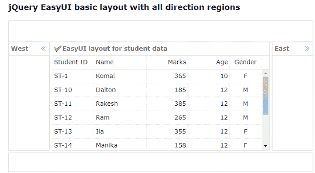
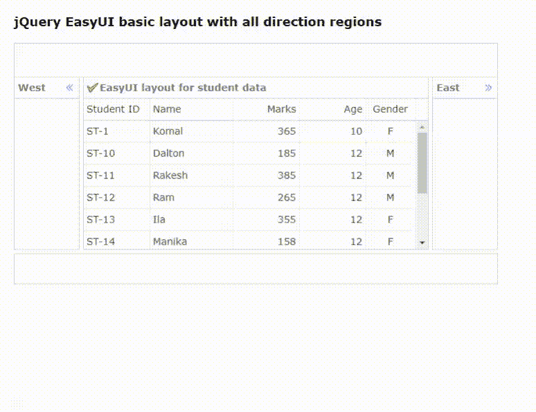
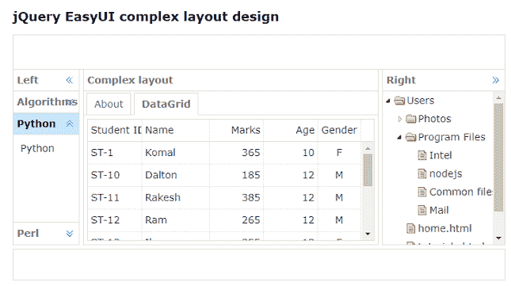
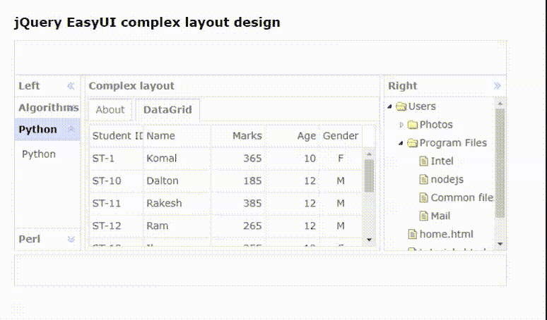

# 如何使用 jQuery 易 UI 为网页设计复杂的布局？

> 原文:[https://www . geeksforgeeks . org/how-design-complex-layout-for-web-use-jquery-easy ui/](https://www.geeksforgeeks.org/how-to-design-complex-layout-for-webpage-using-jquery-easyui/)

[易用户](https://jeasyui.com/index.php)是一个 HTML5 框架，用于使用基于 jQuery、React、Angular 和 Vue 技术的用户界面组件。
它有助于构建交互式网络和移动应用程序的功能，为开发人员节省了大量时间。

在本文中，我们将学习使用 **jQuery 易用户界面**插件为任何网页设计基本和复杂的布局。

**jQuery 易 UI 下载:**

```html
https://www.jeasyui.com/download/index.php
```

**注意:**执行以下代码时，请注意正确的文件路径。

**示例 1:** 以下示例演示了使用 jQuery EasyUI 框架对学生数据进行的基本布局设计。学生数据采用 [JSON](https://www.geeksforgeeks.org/javascript-json/) 的形式。

## 超文本标记语言

```html
<!doctype html>
<html>

<head>
    <meta charset="UTF-8">
    <meta name="viewport" content="initial-scale=1.0, 
            maximum-scale=1.0, user-scalable=no">

    <!-- EasyUI specific stylesheets-->
    <link rel="stylesheet" type="text/css" 
        href="themes/metro/easyui.css">

    <link rel="stylesheet" type="text/css" 
        href="demo.css">

    <link rel="stylesheet" type="text/css" 
        href="themes/icon.css">

    <!--jQuery library -->
    <script type="text/javascript" 
        src="jquery.min.js">
    </script>

    <!--jQuery libraries of EasyUI  -->
    <script type="text/javascript" 
        src="jquery.easyui.min.js">
    </script>
</head>

<body>
    <h2>
        jQuery EasyUI basic layout with 
        all direction regions
    </h2>

    <!-- easyui-layout class is used -->
    <div class="easyui-layout" style
            ="width:700px;height:350px;">

        <div data-options="region:'north'" 
            style="height:50px"></div>

        <!-- Set split to "true" for separate region-->
        <div data-options="region:'south',split:true"
            style="height:50px;">
        </div>

        <div data-options="region:'east',split:true" 
            title="East" style="width:100px;">
        </div>

        <div data-options="region:'west',split:true" 
            title="West" style="width:100px;">
        </div>

        <div data-options="region:'center',title:'EasyUI 
            layout for student data',iconCls:'icon-ok'">

            <!-- easyui-datagrid class is used for 
                    tabular data-->
            <table class="easyui-datagrid" data-options=
                "url:'datafile.json',method:'get',border:false,
                singleSelect:true,fit:true,fitColumns:true">

                <thead>
                    <tr>
                        <th data-options="field:'studentid'"
                            width="80">Student ID
                        </th>

                        <th data-options="field:'studentname'"
                            width="100">Name</th>

                        <th data-options="field:'marksscored',
                            align:'right'" width="80">
                            Marks
                        </th>

                        <th data-options="field:'age',align:'right'"
                            width="80">Age
                        </th>

                        <th data-options="field:'gender',
                            align:'center'" width="60">
                            Gender
                        </th>
                    </tr>
                </thead>
            </table>
        </div>
    </div>
</body>

</html>
```

**datafile.json:** 以下是上述代码中使用的“datafile.json”文件的内容。

```html
{
    "total": 10,
    "rows": [
        { 
            "studentname": "Komal", "age": 10, "gender": "F", 
            "marksscored": 365, "studentid": "ST-1" 
        },
        { 
            "studentname": "Dalton", "age": 12, "gender": "M",
            "marksscored": 185, "studentid": "ST-10" 
        },

        { 
            "studentname": "Rakesh", "age": 12, "gender": "M",
            "marksscored": 385, "studentid": "ST-11" 
        },

        { 
            "studentname": "Ram", "age": 12, "gender": "M",
            "marksscored": 265, "studentid": "ST-12" 
        },

        { 
            "selected": true, "studentname": "Ila", "age": 12,
            "gender": "F", "marksscored": 355, "studentid": "ST-13"
        },

        { 
            "studentname": "Manika", "age": 12, "gender": "F",
            "marksscored": 158, "studentid": "ST-14" 
        },

        { 
            "studentname": "Madhavi", "age": 12, "gender": "F",
            "marksscored": 456, "studentid": "ST-15" 
        },

        { 
            "studentname": "Preity", "age": 12, "gender": "M",
            "marksscored": 235, "studentid": "ST-16" 
        },

        { 
            "studentname": "Parul", "age": 12, "gender": "F",
            "marksscored": 564, "studentid": "ST-17" 
        },

        { 
            "studentname": "Amar", "age": 19, "gender": "F",
            "marksscored": 638, "studentid": "ST-18" 
        }
    ]
}
```

**输出:**

*   **执行前:**



*   **执行后:**



**示例 2:** 以下示例演示了使用 jQuery EasyUI 框架为任何网页设计复杂布局。下面的代码使用“htmlContent.html”、“dataTree.json”和“datafile.json”文件用于数据检索。文件参考 [树形结构](https://www.geeksforgeeks.org/how-to-design-tree-structure-for-files-using-jquery-easyui-mobile/)

## 超文本标记语言

```html
<!doctype html>
<html>

<head>
    <meta charset="UTF-8">
    <meta name="viewport" content="initial-scale=1.0, 
            maximum-scale=1.0, user-scalable=no">

    <!-- EasyUI specific stylesheets-->
    <link rel="stylesheet" type="text/css" 
            href="themes/metro/easyui.css">
    <link rel="stylesheet" type="text/css" 
            href="demo.css">
    <link rel="stylesheet" type="text/css" 
            href="themes/icon.css">

    <!--jQuery library -->
    <script type="text/javascript" 
        src="jquery.min.js">
    </script>

    <!--jQuery libraries of EasyUI  -->
    <script type="text/javascript" 
        src="jquery.easyui.min.js">
    </script>
</head>

<body>
    <h2>jQuery EasyUI complex layout design</h2>

    <!-- easyui-layout class is used-->
    <div class="easyui-layout" style=
            "width:700px;height:350px;">

        <div data-options="region:'north'"
            style="height:50px">
        </div>

        <!-- set split data-option to "true" 
                for separate region-->
        <div data-options="region:'south',split:true"
            style="height:50px;">
        </div>

        <div data-options="region:'east',split:true"
            title="Right" style="width:180px;">

            <!-- easyui-tree class is used for 
                file tree structure -->
            <ul class="easyui-tree" data-options=
                "url:'dataTree.json',method:'get',
                animate:true,dnd:true">
            </ul>
        </div>

        <div data-options="region:'west',split:true"
            title="Left" style="width:100px;">

            <!-- easyui-accordion class is used 
                for toggled menu-->
            <div class="easyui-accordion" 
                data-options="fit:true,border:false">

                <div title="Algorithms" style="padding:10px;">
                    Algorithms
                </div>

                <div title="Python" data-options="selected:true"
                    style="padding:10px;">
                    Python
                </div>

                <div title="Perl" style="padding:10px">
                    Perl
                </div>
            </div>
        </div>
        <div data-options="region:'center',
                title:'Complex layout'">

            <div class="easyui-tabs" data-options=
                "fit:true,border:false,plain:true">

                <div title="About" data-options=
                    "href:'htmlContent.html'"
                    style="padding:10px">
                </div>

                <div title="DataGrid" style="padding:5px">
                    <table class="easyui-datagrid" 
                        data-options="url:'datafile.json',
                        method:'get',singleSelect:true,
                        fit:true,fitColumns:true">

                        <thead>
                            <tr>
                                <th data-options=
                                    "field:'studentid'"
                                    width="80">
                                    Student ID
                                </th>
                                <th data-options=
                                    "field:'studentname'"
                                    width="100">
                                    Name
                                </th>
                                <th data-options=
                                    "field:'marksscored',
                                    align:'right'" width="80">
                                    Marks
                                </th>
                                <th data-options=
                                    "field:'age',align:'right'"
                                    width="80">
                                    Age
                                </th>
                                <th data-options=
                                    "field:'gender',align:'center'"
                                    width="60">
                                    Gender
                                </th>
                            </tr>
                        </thead>
                    </table>
                </div>
            </div>
        </div>
    </div>
</body>

</html>
```

**htmlContent.html:** 以下是上述代码中使用的“htmlContent.html”文件的内容。

## 超文本标记语言

```html
<!DOCTYPE html>
<html>

<head>
    <meta charset="UTF-8">
</head>

<body>
    <p style="font-size:12px">
        HTML content for Python.
    </p>

    <ul>
        <li>
            Python is a high-level, general
            -purpose and a very popular 
            programming language.
        </li>

        <li>
            Python programming language 
            (latest Python 3) is being 
            used in web development, 
        </li>

        <li>
            Machine Learning applications, 
            along with all cutting edge 
            technology in Software Industry.
        </li>

        <li>
            Python Programming Language is 
            very well suited for Beginners,
        </li>

        <li>
            also for experienced programmers 
            with other programming languages 
            like C++ and Java.
        </li>
    </ul>
</body>

</html>
```

**dataTree.json:** 以下是上述代码中使用的“dataTree.json”文件的内容。

```html
[{
    "id":1,
    "text":"Users",
    "children":[{
        "id":11,
        "text":"Photos",
        "state":"closed",
        "children":[{
            "id":101,
            "text":"Family"
        },{
            "id":102,
            "text":"Colleagues"
        },{
            "id":103,
            "text":"Relatives"
        }]
    },{
        "id":12,
        "text":"Program Files",
        "children":[{
            "id":131,
            "text":"Intel"
        },{
            "id":132,
            "text":"nodejs",
            "attributes":{
                "p1":"my Attribute1",
                "p2":"my Attribute2"
            }
        },{
            "id":133,
            "text":"Common files"
        },{
            "id":134,
            "text":"Mail",
            "checked":true
        }]
    },{
        "id":13,
        "text":"home.html"
    },{
        "id":14,
        "text":"tutorials.html"
    },{
        "id":15,
        "text":"jobs.html"
    }]
}]
```

**输出:**

*   **执行前:**



*   **执行后:**

