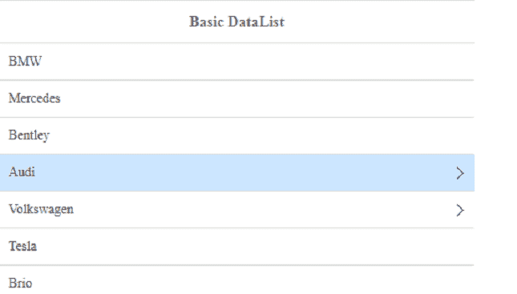

# 如何使用 jQuery 易 UI Mobile 为手机设计数据表？

> 原文:[https://www . geesforgeks . org/how-design-data list-for-mobile-use-jquery-easy ui-mobile/](https://www.geeksforgeeks.org/how-to-design-datalists-for-mobiles-using-jquery-easyui-mobile/)

[易用户](https://www.jeasyui.com/documentation/index.php)是一个 HTML5 框架，用于使用基于 jQuery、React、Angular 和 Vue 技术的用户界面组件。它有助于构建交互式 web 和移动应用程序的功能，为开发人员节省了大量时间。

在本文中，我们将学习为移动界面设计数据表。数据列表是带有预定义输入选项的下拉列表。

**jQuery 易 UI 下载:**

```html
https://www.jeasyui.com/download/index.php
```

在实现您的移动应用程序代码时，请注意正确的文件路径。

**示例 1:** 以下代码演示了使用 jQuery **易用户**的简单数据列表。

## 超文本标记语言

```html
<!DOCTYPE html>
<html>

<head>
    <meta charset="UTF-8">
    <meta name="viewport" content="initial-scale=1.0, 
      maximum-scale=1.0, user-scalable=no">

    <!-- EasyUI specific stylesheets-->
    <link rel="stylesheet" type="text/css" 
        href="themes/metro/easyui.css">

    <link rel="stylesheet" type="text/css" 
        href="themes/mobile.css">

    <link rel="stylesheet" type="text/css" 
        href="themes/icon.css">

    <!--jQuery library -->
    <script type="text/javascript" 
        src="jquery.min.js">
    </script>

    <!--jQuery libraries of EasyUI and 
        EasyUI Mobile -->
    <script type="text/javascript" 
        src="jquery.easyui.min.js">
    </script>

    <script type="text/javascript" 
        src="jquery.easyui.mobile.js">
    </script>
</head>

<body>
    <div class="easyui-navpanel">
        <header>

            <!--EasyUI m-toolbar class is used  -->
            <div class="m-toolbar">
                <span class="m-title">
                    Basic DataList
                </span>
            </div>
        </header>
        <!--EasyUI easyui-datalist class is used -->
        <ul class="easyui-datalist" data-options="
                    fit: true,
                    lines: true,
                    border: false
                    ">
            <li>BMW</li>
            <li>Mercedes</li>
            <li>Bentley</li>
            <li><a href="javascript:void(0)" 
                class="datalist-link">
                Audi
            </a></li>

            <li><a href="javascript:void(0)" 
                class="datalist-link">
                    Volkswagen
                </a>
            </li>
            <li>Tesla</li>
            <li>Brio</li>
        </ul>
    </div>
</body>

</html>
```

**输出:**



**示例 2:** 下面的代码演示了使用 jQuery EasyUI 的分组数据列表。单击数据列表中的每个项目，它会显示带有“返回”链接的相应项目内容。

## 超文本标记语言

```html
<!DOCTYPE html>
<html>

<head>
    <meta charset="UTF-8">
    <meta name="viewport" content="initial-scale=1.0, 
      maximum-scale=1.0, user-scalable=no">

    <!-- EasyUI specific stylesheets-->
    <link rel="stylesheet" type="text/css" 
        href="themes/metro/easyui.css">

    <link rel="stylesheet" type="text/css"
        href="themes/mobile.css">

    <link rel="stylesheet" type="text/css" 
        href="themes/icon.css">

    <!--jQuery library -->
    <script type="text/javascript" 
        src="jquery.min.js">
    </script>

    <!--jQuery libraries of EasyUI  -->
    <script type="text/javascript" 
        src="jquery.easyui.min.js">
    </script>

    <!--jQuery library EasyUI Mobile -->
    <script type="text/javascript" 
        src="jquery.easyui.mobile.js">
    </script>
</head>

<body>
    <div class="easyui-navpanel">
        <header>
            <div class="m-toolbar">
                <span class="m-title">
                    DataList group
                </span>
            </div>
        </header>
        <div id="datalistID" data-options="
                fit: true,
                border: false,
                lines: true">
        </div>
    </div>

    <div id="divID" class="easyui-navpanel">
        <header>
            <!--EasyUI 'm-toobar' class is used-->
            <div class="m-toolbar">
                <span id="divID-title" class="m-title">
                    Car Details
                </span>
                <!--EasyUI 'easyui-linkbutton' class
                        is used for link and
                     'm-back' class is used for backtrack -->
                <div class="m-left">
                    <a href="javascript:void(0)" 
                        class="easyui-linkbutton m-back" 
                        plain="true" outline="true"
                        onclick="$.mobile.back()">
                        Back
                    </a>
                </div>
            </div>
        </header>
    </div>
    <script>
        // The listitems can be grouped
        var data = [
            { "group": "Group1", "item": "Audi" },
            { "group": "Group1", "item": "Mercedes" },
            { "group": "Group2", "item": "Bentley" },
            { "group": "Group2", "item": "BMW" },
            { "group": "Group3", "item": "Sedan" },
            { "group": "Group3", "item": "SUV" }
        ];

        // jQuery function for datalist
        $(function () {
            $('#datalistID').datalist({
                data: data,
                textField: 'item',
                groupField: 'group',
                textFormatter: function (value) {
                    return
'<a href="javascript:void(0)" class="datalist-link">'
                        + value + '</a>';
                },

                /* On click of one row,it takes to the
                   #divID-title with respective item */
                onClickRow: function (index, row) {
                    $('#divID-title').html(row.item);
                    $.mobile.go('#divID');
                }
            })
        })
    </script>
</body>

</html>
```