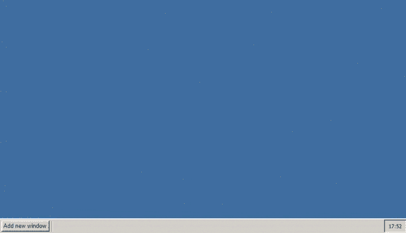

# 如何使用 jQuery-lwd 插件设计桌面功能？

> 原文:[https://www . geesforgeks . org/如何设计-桌面-功能-使用-jquery-lwd-plugin/](https://www.geeksforgeeks.org/how-to-design-desktop-functionality-using-jquery-lwd-plugin/)

本文将帮助你使用 **jQuery-UI lwd** 插件设计一个基本的桌面引擎。这个插件非常轻量级，完全基于 JavaScript 和 CSS。

桌面引擎为 web 开发人员提供了以下一些功能–

*   动产
*   可调整大小的
*   关注活动窗口
*   点击恢复窗口
*   最小化，最大化

从[官方 Github](https://github.com/mstellmacher/jquery-lwd) 下载所有需要的预编译文件，保存在你的工作文件夹中。在代码实现过程中，请注意文件路径

## 超文本标记语言

```html
<!DOCTYPE html>
<html>

<head>
    <meta http-equiv="Content-Type" 
        content="text/html; charset=utf-8" />

    <!--jQuery UI CSS library  -->
    <link href="jquery-ui.structure.min.css"
        rel="stylesheet" type="text/css" />

    <!--jQuery-lwd CSS libraries -->
    <link id="themecss" href=
"jquery-lwd/themes/windows2000/jquery-ui.theme.css"
        rel="stylesheet" type="text/css" />

    <link href="jquery-lwd/jquery-lwd.structure.css"
        rel="stylesheet" type="text/css" />

    <!--jQuery UI and jQuery library  -->
    <script type="text/javascript" 
        src="jquery.min.js">
    </script>

    <script type="text/javascript"
        src="jquery-ui.min.js">
    </script>

    <!--jQuery-lwd JS library -->
    <script type="text/javascript"
        src="jquery-lwd/jquery-lwd.js">
    </script>
</head>

<body>
    <div id="taskbar">
        <div id="lwd-taskbar-left" 
            style="display:inline-block">

            <button id="addWindowbuttonID" 
                class="ui-button lwd-taskbar-button 
                ui-state-default ui-corner-all">
                Add new window
            </button>

            <div class="taskbar-spacer"></div>
        </div>
    </div>

</body>

<script>
    $(document).ready(function () {

        var intCounter = 1;

            /* On click event of button, 
                new window is added */
            $('#addWindowbuttonID').click(function () {
                var $objWindow = $('<div class="window">Window '
                    + intCounter + '</div>');

                var intRandom = Math.floor(
                    (Math.random() * 12) + 1);

                $($objWindow).appendTo('body');
                $objWindow.window({
                    title: 'My window ' + intCounter,
                    width: 480,
                    height: 320,
                    position: {
                        my: 'left+' + 200 + ', top+' + 200,
                        at: 'left top',
                        of: window
                    },
                    maximizable: true,
                    minimizable: true,

                    icon: 'src/jquery-lwd/themes/windows2000/'
                        + 'images/icons/' + intRandom + '.png'
                });
            intCounter++;
        });

        $('#taskbar').taskbar();

        $('#theme').change(function () {
            $("head link#themecss").attr("href", $(this).val());
        });
    });
</script>

</html>
```

**输出:**用户可以使用插件尝试不同的选项或功能。

