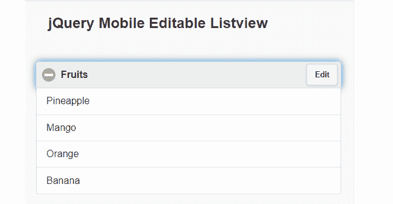
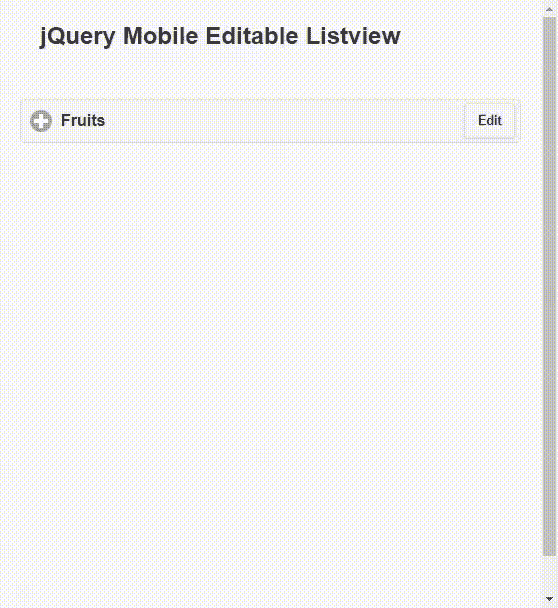
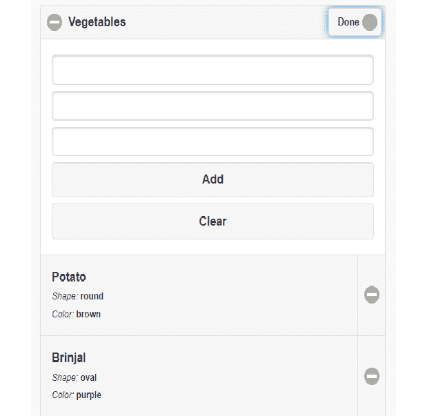
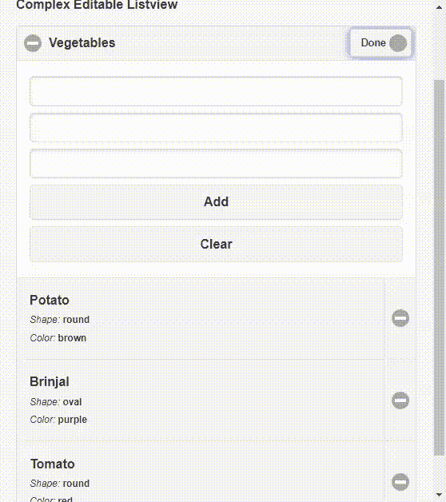

# 如何使用 jQuery Mobile 插件设计可编辑的 listview？

> 原文:[https://www . geesforgeks . org/how-design-edited-listview-using-jquery-mobile-plugin/](https://www.geeksforgeeks.org/how-to-design-editable-listview-using-jquery-mobile-plugin/)

在本文中，我们将学习如何使用 jQuery 移动插件设计一个**可编辑列表视图**功能。该插件提供了一个直观的用户界面，可以在现有列表中添加或删除列表项。

要设计和实现插件，请从[链接](https://github.com/baig/jquerymobile-editablelistview)下载所需的预编译文件或库，并将其保存在您的工作文件夹中。编码时应该注意文件路径名。

**注意:**请使用 HTML 代码头部的以下链接执行，如下所示。

> <link href="”http://ajax.googleapis.com/ajax/libs/jquerymobile/1.4.2/jquery.mobile.css”&nbsp;<br/"> rel= "样式表" type="text/css"/ >
> 
> <link href="”editable-listview.css”&nbsp;<br/"> rel= "样式表" type="text/css"/ >

**示例 1:** 以下示例演示了一个使用 jQuery 移动插件的简单可编辑 listview。用户可以在列表中添加和删除水果名称，如下图所示。

## 超文本标记语言

```html
<!DOCTYPE html>
<html lang="en">
    <head>
        <meta charset="utf-8" />
        <meta name="viewport" 
              content="width=device-width, initial-scale=1" />
        <link rel="stylesheet"
              href=
"http://ajax.googleapis.com/ajax/libs/jquerymobile/1.4.2/jquery.mobile.css"/>

        <link rel="stylesheet" href="editable-listview.css"/>
        <script src=
"http://code.jquery.com/jquery-2.1.1.js">
        </script>
        <script src=
"http://ajax.googleapis.com/ajax/libs/jquerymobile/1.4.2/jquery.mobile.js">
        </script>
        <script src="editable-listview.js"></script>
    </head>
    <body style="padding: 20px;">
        <h2>jQuery Mobile Editable Listview</h2>
        <div style="padding: 20px;">
            <ul id="mylistID" data-role="listview"
                data-item-name="fruitName">
                <li>Pineapple</li>
                <li>Mango</li>
                <li>Orange</li>
                <li>Banana</li>
            </ul>
            <br />
        </div>

        <script>
            var $list = $("#mylistID").listview({
                editable: true,
                title: "Fruits",
                emptyTitle: "No Fruits",
            });
        </script>
    </body>
</html>
```

**输出:**

*   **编辑前:**



*   **编辑后:**



**示例 2:** 以下示例演示了另一个添加了一些属性的可编辑列表视图。表单“id”应与“ul”标签上的*数据-可编辑表单*属性匹配，并且*数据-可编辑*属性设置为“真”。

## 超文本标记语言

```html
<!DOCTYPE html>
<html lang="en">
    <head>
        <meta charset="utf-8" />
        <meta name="viewport"
              content="width=device-width, initial-scale=1"/>
        <link rel="stylesheet"
              href=
"http://ajax.googleapis.com/ajax/libs/jquerymobile/1.4.2/jquery.mobile.css"/>
        <link rel="stylesheet" href="editable-listview.css" />
        <script src=
"http://code.jquery.com/jquery-2.1.1.js">
        </script>
        <script src=
"http://ajax.googleapis.com/ajax/libs/jquerymobile/1.4.2/jquery.mobile.js">
        </script>
        <script src="editable-listview.js"></script>
    </head>

    <body style="padding: 20px;">
        <h2>jQuery Mobile editable listview</h2>
        <div style="padding: 20px;">
            <p><strong>Complex Editable Listview</strong></p>

            <ul id="list" data-role="listview" 
                data-editable="true" 
                data-editable-type="complex" 
                data-editable-form="editing-formID"
                data-title="Vegetables" 
                data-empty-title="No Veggies">
                <li>
                    <a>
                        <h3>
                            <span id="veggieName">
                              Potato
                            </span>
                        </h3>
                        <p>
                            <em>Shape:</em>
                            <strong>
                                <span id="veggieShape">
                                 round
                                </span>
                            </strong>
                        </p>
                        <p>
                            <em>Color:</em>
                            <strong>
                                <span id="veggieColor">
                                 brown
                                </span>
                            </strong>
                        </p>
                    </a>
                </li>
                <li>
                    <a>
                        <h3><span id="veggieName">
                             Brinjal
                            </span>
                        </h3>
                        <p>
                            <em>Shape:</em>
                            <strong>
                                <span id="veggieShape">
                                  oval
                                </span>
                            </strong>
                        </p>
                        <p>
                            <em>Color:</em>
                            <strong>
                                <span id="veggieColor">
                                  purple
                                </span>
                            </strong>
                        </p>
                    </a>
                </li>
                <li>
                    <a>
                        <h3><span id="veggieName">
                             Tomato
                            </span>
                        </h3>
                        <p>
                            <em>Shape:</em>
                            <strong>
                                <span id="veggieShape">
                                  round
                                </span>
                            </strong>
                        </p>
                        <p>
                            <em>Color:</em>
                            <strong>
                                <span id="veggieColor">
                                  red
                                </span>
                            </strong>
                        </p>
                    </a>
                </li>
            </ul>
            <form id="editing-formID" 
                  data-editable-form="true">
                <input type="text" 
                       data-item-name="veggieName" 
                       data-item-template="<h3>
                         <span id='veggieName'>%%</span>
                                           </h3>"/>
                <input
                    type="text"
                    data-item-name="veggieShape"
                    data-item-template="<p><em>Shape:</em>
                    <strong><span id='veggieShape'>%%</span>
                                        </strong></p>"/>
                <input
                    type="text"
                    data-item-name="veggieColor"
                    data-item-template="<p><em>Color:</em>
                    <strong><span id='veggieColor'>%%</span>
                                        </strong></p>"/>
                <button class="ui-btn ui-corner-all" 
                        data-add-button="true">
                    Add
                </button>
                <button class="ui-btn ui-corner-all"
                        data-clear-button="true">
                    Clear
                </button>
            </form>
        </div>

        <script>
            var $list = $("#list").listview({
                editable: true,
                editableType: "simple",
                title: "Veggies",
                emptyTitle: "No Veggies",
            });
        </script>
    </body>
</html>
```

**输出:**

*   **编辑前:**



*   **编辑后:**

