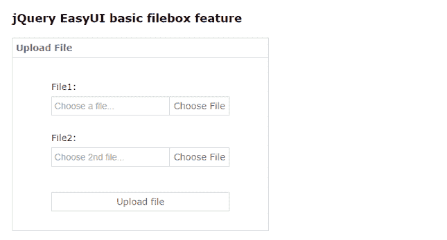
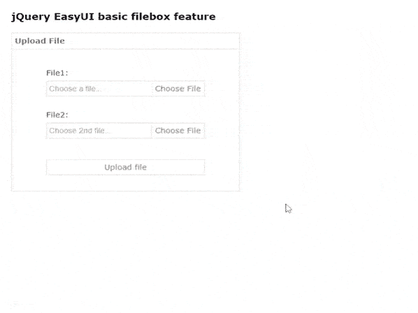
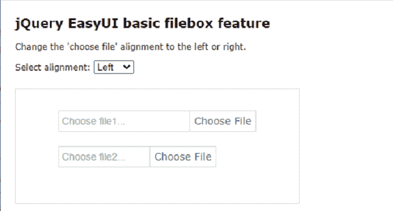
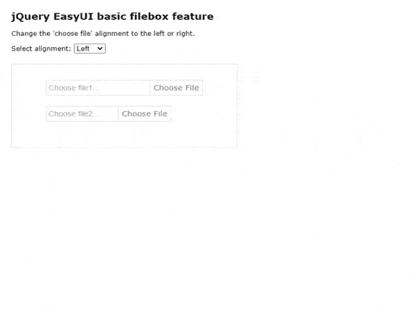

# 如何使用 jQuery 易 UI 设计表单的文件上传功能？

> 原文:[https://www . geesforgeks . org/how-design-file-upload-feature-for-forms-use-jquery-easy ui/](https://www.geeksforgeeks.org/how-to-design-file-upload-feature-for-forms-using-jquery-easyui/)

EasyUI 是一个 HTML5 框架，用于使用基于 jQuery、React、Angular 和 Vue 技术的用户界面组件。它有助于构建交互式 web 和移动应用程序的功能，为开发人员节省了大量时间。

从 [官网](https://www.jeasyui.com/download/index.php) 下载所有需要的预编译文件，保存在你的工作文件夹中。在代码实现过程中，请注意文件路径。

**jQuery 易 UI 下载:**

```html
https://www.jeasyui.com/index.php
```

**示例 1:** 以下示例演示了使用 **jQuery 易用户界面**插件在开发人员的网页表单中包含的基本文件框功能。

## 超文本标记语言

```html
<!doctype html>
<html>
<head>
    <meta charset="UTF-8">  
    <meta name="viewport" 
      content="initial-scale=1.0, 
      maximum-scale=1.0, user-scalable=no">

     <!-- EasyUI specific stylesheets-->
    <link rel="stylesheet" type="text/css" 
      href="themes/metro/easyui.css">       
    <link rel="stylesheet" type="text/css" 
      href="demo.css">  
    <link rel="stylesheet" type="text/css" 
    href="themes/icon.css">  
    <!--jQuery library -->
    <script type="text/javascript" 
      src="jquery.min.js">
    </script>
    <!--jQuery libraries of EasyUI  -->
    <script type="text/javascript" 
     src="jquery.easyui.min.js">
    </script>    

</head>
<body>
     <h2>jQuery EasyUI basic filebox feature</h2>

    <div style="margin:20px 0;"></div>
    <div class="easyui-panel" title="Upload File" 
        style="width:100%;max-width:400px;padding:30px 60px;">

        <div style="margin-bottom:20px"> 
            <!--easyui-filebox class is used -->
            <input class="easyui-filebox" label="File1:" labelPosition="top" 
                 data-options="prompt:'Choose a file...'" style="width:100%">
        </div>
        <div style="margin-bottom:40px">
            <input class="easyui-filebox" label="File2:" labelPosition="top" 
             data-options="prompt:'Choose 2nd file...'" style="width:100%">
        </div>
        <div>
           <!--link can be created with easyui-linkbutton class -->
            <a href="#" class="easyui-linkbutton" style="width:100%">
            Upload file
            </a>
        </div>
    </div>
</body>    
</html>
```

**输出:**

*   **基本文件箱屏幕:**



*   **选择文件后:**



**例 2:**

下面的示例演示了如何根据用户的需要在左侧或右侧对齐 filebox 按钮。它还演示了如何将 filebox 的宽度设置为相对于其父容器的百分比。

## 超文本标记语言

```html
<!doctype html>
<html>
<head>
    <meta charset="UTF-8">  
    <meta name="viewport" 
      content="initial-scale=1.0, 
      maximum-scale=1.0, user-scalable=no">

     <!-- EasyUI specific stylesheets-->
    <link rel="stylesheet" type="text/css" 
      href="themes/metro/easyui.css">       
    <link rel="stylesheet" type="text/css" 
      href="demo.css">  
    <link rel="stylesheet" type="text/css" 
    href="themes/icon.css">  
    <!--jQuery library -->
    <script type="text/javascript" 
      src="jquery.min.js">
    </script>
    <!--jQuery libraries of EasyUI  -->
    <script type="text/javascript" 
     src="jquery.easyui.min.js">
    </script>    

</head>
<body>
     <h2>jQuery EasyUI basic filebox feature</h2>

<p>Change the 'choose file' alignment to the left or right.</p>

    <span>Select alignment:</span>
    <select onchange="selectAlign(this.value)">
        <option value="left" selected>Left</option>
        <option value="right">Right</option>
    </select>
    <div style="margin:20px 0;"></div>
    <div class="easyui-panel" style="width:100%;max-width:400px;padding:30px 60px;">
        <!--set the width of FileBox with respect to its parent container -->
        <div style="margin-bottom:20px">
            <input class="easyui-filebox" labelPosition="top" 
            style="width:100%" data-options="prompt:'Choose file1...'">
        </div>

        <div style="margin-bottom:20px">
            <input class="easyui-filebox" labelPosition="top" 
            style="width:80%" data-options="prompt:'Choose file2...'">
        </div>
    </div>

    <script type="text/javascript">
      <!-- function to change right or left alignment  -->
        function selectAlign(align)
        {
            $('.easyui-filebox').filebox({buttonAlign:align});
        }
    </script>
</body>    
</html>
```

**输出:**

*   **选择文件画面:**



*   **选择对齐方式:**

