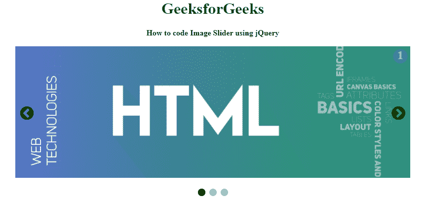
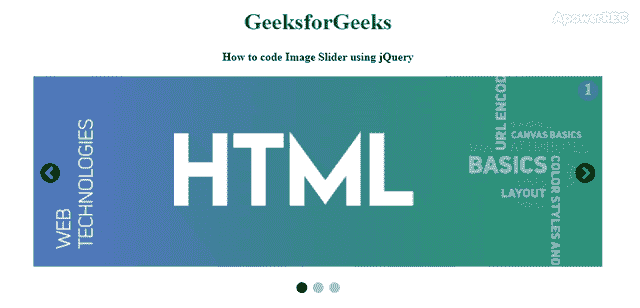

# 如何使用 jQuery 设计图像滑块？

> 原文:[https://www . geesforgeks . org/how-design-image-slider-use-jquery/](https://www.geeksforgeeks.org/how-to-design-image-slider-using-jquery/)



在网页上循环播放图像列表的幻灯片容器。下面的文章将指导您使用 HTML、CSS 和 jQuery 实现一个图像滑块。jQuery 图像滑块包含使用上一个和下一个图标运行它们的图像。**上一个**和**下一个**箭头用于在图像上的鼠标悬停事件上来回移动。下面的示例代码是以一种简单灵活的方式实现的，通过使用 HTML、CSS 和 jQuery 在转盘中一个接一个地显示图像。我们将把任务分成两个部分来完成:首先，我们将通过 HTML 创建结构，通过 CSS 设计结构，并通过 jQuery 进行交互。

**Creatring Structure:** 在本节中，我们将创建图像滑块的结构。

*   **HTML 代码:** HTML 用于创建图像滑块的结构。

    ```html
    <!DOCTYPE html>
    <html>

    <head>
        <title>
            How to Design Image
            Slider using jQuery ?
        </title>

        <meta name="viewport"
              content="width=device-width, initial-scale=1">

        <link rel="stylesheet" href=
    "https://cdnjs.cloudflare.com/ajax/libs/font-awesome/4.7.0/css/font-awesome.min.css"> 
    </head>

    <body>
        <center>
            <h1 style="color:green">
                GeeksforGeeks
            </h1>

            <b>
                How to code Image
                Slider using jQuery
            </b>

            <br><br>
        </center>

        <!-- Image container of the image slider -->
        <div class="image-container">
            <div class="slide">
                <div class="slideNumber">1</div>
                
            </div>
            <div class="slide">
                <div class="slideNumber">2</div>
                
            </div>
            <div class="slide">
                <div class="slideNumber">3</div>
                
            </div>

            <!-- Next and Previous icon to change images -->
            <a class="previous" onclick="moveSlides(-1)">
                <i class="fa fa-chevron-circle-left"></i>
            </a>
            <a class="next" onclick="moveSlides(1)">
                <i class="fa fa-chevron-circle-right"></i>
            </a>
        </div>
        <br>

        <div style="text-align:center">
            <span class="footerdot" 
                onclick="activeSlide(1)">
            </span>
            <span class="footerdot"
                onclick="activeSlide(2)">
            </span>
            <span class="footerdot" 
                onclick="activeSlide(3)">
            </span>
        </div>
    </body>

    </html>
    ```

**设计结构:**这里我们将使用 CSS 完成图像滑块的设计部分，并使用 jQuery 使滑块具有交互性。

*   **CSS 代码:**基于所有元素的标签和类设计结构。

    ```html
    <style>
        img {
            width: 100%;
        }
        .height {
            height: 10px;
        }

        /* Image-container design */
        .image-container {
            max-width: 800px;
            position: relative;
            margin: auto;
        }

        .next {
            right: 0;
        }

        /* Next and previous icon design */
        .previous,
        .next {
            cursor: pointer;
            position: absolute;
            top: 50%;
            padding: 10px;
            margin-top: -25px;
        }

        /* caption decorate */
        .captionText {
            color: #000000;
            font-size: 14px;
            position: absolute;
            padding: 12px 12px;
            bottom: 8px;
            width: 100%;
            text-align: center;
        }

         /* Slider image number */
        .slideNumber {
            background-color: #5574C5;
            color: white;
            border-radius: 25px;
            right: 0;
            opacity: .5;
            margin: 5px;
            width: 30px;
            height: 30px;
            text-align: center;
            font-weight: bold;
            font-size: 24px;
            position: absolute;
        }
        .fa {
            font-size: 32px;
        }

        .fa:hover {
            transform: rotate(360deg);
            transition: 1s;
            color: white;
        }

        .footerdot {
            cursor: pointer;
            height: 15px;
            width: 15px;
            margin: 0 2px;
            background-color: #bbbbbb;
            border-radius: 50%;
            display: inline-block;
            transition: background-color 0.5s ease;
        }

        .active,
        .footerdot:hover {
            background-color: black;
        }

    </style>
    ```

*   **jQuery 代码:** jQuery 用于设计滑块交互。

    ```html
    <script>
        var slideIndex = 1;
        displaySlide(slideIndex);

        function moveSlides(n) {
            displaySlide(slideIndex += n);
        }

        function activeSlide(n) {
            displaySlide(slideIndex = n);
        }

        /* Main function */
        function displaySlide(n) {
            var i;
            var totalslides = 
                document.getElementsByClassName("slide");
            var totaldots = 
                document.getElementsByClassName("footerdot");

            if (n > totalslides.length) {
                slideIndex = 1;
            }

            if (n < 1) {
                slideIndex = totalslides.length;
            }
            for (i = 0; i < totalslides.length; i++) {
                totalslides[i].style.display = "none";
            }
            for (i = 0; i < totaldots.length; i++) {
                totaldots[i].className = 
                totaldots[i].className.replace(" active", "");
            }
            totalslides[slideIndex - 1].style.display = "block";
            totaldots[slideIndex - 1].className += " active";
        }
    </script>
    ```

**完整解决方案:**在本节中，我们将把上面的部分组合在一起，这将是一个图像滑块。

```html
<!DOCTYPE html>
<html>

<head>
    <title>
        How to Design Image
        Slider using jQuery ?
    </title>

    <meta name="viewport"
          content="width=device-width, initial-scale=1">

    <link rel="stylesheet" href=
"https://cdnjs.cloudflare.com/ajax/libs/font-awesome/4.7.0/css/font-awesome.min.css"> 

    <style>
        img {
            width: 100%;
        }
        .height {
            height: 10px;
        }

        /* Image-container design */
        .image-container {
            max-width: 800px;
            position: relative;
            margin: auto;
        }

        .next {
            right: 0;
        }

        /* Next and previous icon design */
        .previous,
        .next {
            cursor: pointer;
            position: absolute;
            top: 50%;
            padding: 10px;
            margin-top: -25px;
        }

        /* caption decorate */
        .captionText {
            color: #000000;
            font-size: 14px;
            position: absolute;
            padding: 12px 12px;
            bottom: 8px;
            width: 100%;
            text-align: center;
        }

         /* Slider image number */
        .slideNumber {
            background-color: #5574C5;
            color: white;
            border-radius: 25px;
            right: 0;
            opacity: .5;
            margin: 5px;
            width: 30px;
            height: 30px;
            text-align: center;
            font-weight: bold;
            font-size: 24px;
            position: absolute;
        }
        .fa {
            font-size: 32px;
        }

        .fa:hover {
            transform: rotate(360deg);
            transition: 1s;
            color: white;
        }

        .footerdot {
            cursor: pointer;
            height: 15px;
            width: 15px;
            margin: 0 2px;
            background-color: #bbbbbb;
            border-radius: 50%;
            display: inline-block;
            transition: background-color 0.5s ease;
        }

        .active,
        .footerdot:hover {
            background-color: black;
        }
    </style>
</head>

<body>
    <center>
        <h1 style="color:green">
            GeeksforGeeks
        </h1>

        <b>
            How to code Image
            Slider using jQuery
        </b>

        <br><br>
    </center>

    <!-- Image container of the image slider -->
    <div class="image-container">
        <div class="slide">
            <div class="slideNumber">1</div>
            
        </div>
        <div class="slide">
            <div class="slideNumber">2</div>
            
        </div>
        <div class="slide">
            <div class="slideNumber">3</div>
            
        </div>

        <!-- Next and Previous icon to change images -->
        <a class="previous" onclick="moveSlides(-1)">
            <i class="fa fa-chevron-circle-left"></i>
        </a>
        <a class="next" onclick="moveSlides(1)">
            <i class="fa fa-chevron-circle-right"></i>
        </a>
    </div>
    <br>

    <div style="text-align:center">
        <span class="footerdot" 
            onclick="activeSlide(1)">
        </span>
        <span class="footerdot"
            onclick="activeSlide(2)">
        </span>
        <span class="footerdot" 
            onclick="activeSlide(3)">
        </span>
    </div>

    <script>
        var slideIndex = 1;
        displaySlide(slideIndex);

        function moveSlides(n) {
            displaySlide(slideIndex += n);
        }

        function activeSlide(n) {
            displaySlide(slideIndex = n);
        }

        /* Main function */
        function displaySlide(n) {
            var i;
            var totalslides = 
                document.getElementsByClassName("slide");

            var totaldots = 
                document.getElementsByClassName("footerdot");

            if (n > totalslides.length) {
                slideIndex = 1;
            }
            if (n < 1) {
                slideIndex = totalslides.length;
            }
            for (i = 0; i < totalslides.length; i++) {
                totalslides[i].style.display = "none";
            }
            for (i = 0; i < totaldots.length; i++) {
                totaldots[i].className = 
                totaldots[i].className.replace(" active", "");
            }
            totalslides[slideIndex - 1].style.display = "block";
            totaldots[slideIndex - 1].className += " active";
        }
    </script>
</body>

</html>
```

**输出:**
