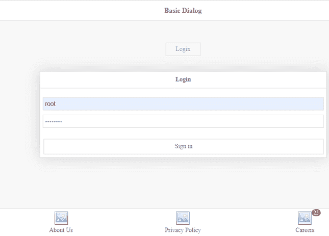
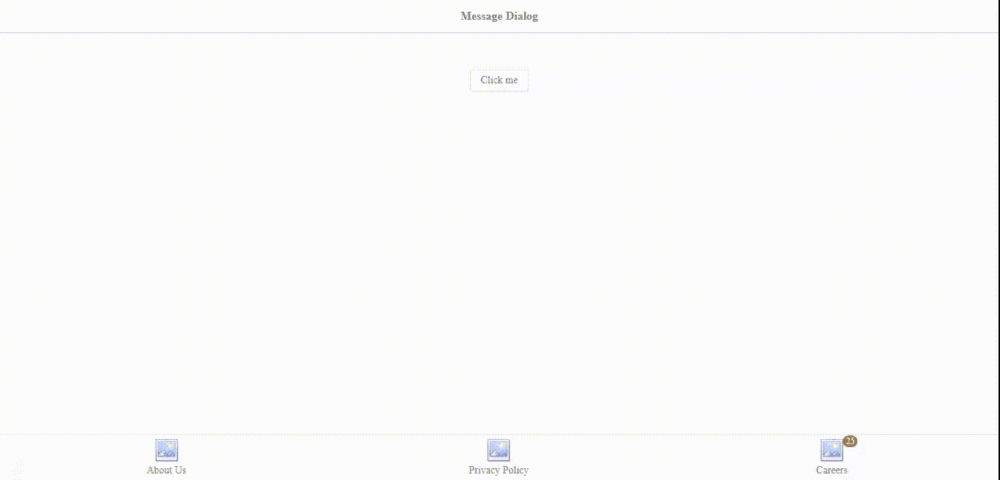

# 如何使用 jQuery 易 UI Mobile 设计登录对话框？

> 原文:[https://www . geesforgeks . org/how-design-log in-dialog-using-jquery-easy ui-mobile/](https://www.geeksforgeeks.org/how-to-design-login-dialog-using-jquery-easyui-mobile/)

[易用户](https://www.jeasyui.com/index.php)是一个 HTML5 框架，用于使用基于 jQuery、React、Angular 和 Vue 技术的用户界面组件。它有助于构建交互式 web 和移动应用程序的功能，为开发人员节省了大量时间。在本文中，我们将学习使用 jQuery 易用户界面插件为手机设计登录对话框和消息对话框。

**jQuery 易 UI 下载:**

```html
https://www.jeasyui.com/download/index.php
```

代码实现时，请注意正确的文件路径。

**示例 1:** 以下示例演示了使用上述插件的登录对话框的设计。*数据选项*中使用的图标取自下载“主题”文件夹。

## 超文本标记语言

```html
<!doctype html>
<html>

<head>
    <meta charset="UTF-8">
    <meta name="viewport" content="initial-scale=1.0,
          maximum-scale=1.0, user-scalable=no">
    <!-- EasyUI specific stylesheets-->
    <link rel="stylesheet" type="text/css" href="themes/metro/easyui.css">
    <link rel="stylesheet" type="text/css" href="themes/mobile.css">
    <link rel="stylesheet" type="text/css" href="themes/icon.css">
    <!--jQuery library -->
    <script type="text/javascript" src="jquery.min.js">
    </script>
    <!--jQuery libraries of EasyUI -->
    <script type="text/javascript" src="jquery.easyui.min.js">
    </script>
    <!--jQuery library of EasyUI Mobile -->
    <script type="text/javascript" src="jquery.easyui.mobile.js">
    </script>
</head>

<body>
    <div class="easyui-navpanel" style="position:relative">
        <!-- m-title,m-toolbar class is used here-->
        <header>
            <div class="m-toolbar">
                <div class="m-title">Basic Dialog</div>
            </div>
        </header>

        <div style="text-align:center;margin:50px 30px">
            <a href="javascript:void(0)" 
                class="easyui-linkbutton" 
                data-options="plain:true,outline:true"
                style="width:80px;height:30px" 
                onclick="$('#dialogID')
                    .dialog('open').dialog('center')">
                Login
            </a>
        </div>

        <!-- easyui-dialog is used for Dialog box-->
        <div id="dialogID" class="easyui-dialog" 
            style="padding:20px 6px;width:80%;"
            data-options="inline: true, modal: true,
                    closed: true, title: 'Login'">

            <div style="margin-bottom:10px">

                <!-- easyui-textbox is used for username-->
                <input class="easyui-textbox" 
                    prompt="Username" 
                    style="width:100%;height:30px">
            </div>

            <div>
                <input class="easyui-textbox" 
                    type="password" prompt="Password" 
                    style="width: 100%; height: 30px">
            </div>

            <!-- dialog-button class is used here-->
            <div class="dialog-button">
                <a href="javascript:void(0)" 
                    class="easyui-linkbutton" 
                    style="width:100%;height:35px"
                    onclick="$('#dialogID').dialog('close')">
                    Sign in
                </a>
            </div>
        </div>

        <!-- m-buttongroup class is used here-->
        <footer>
            <div class="m-buttongroup m-buttongroup-justified" 
                style="width:100%">

                <a href="https://www.geeksforgeeks.org/about/" 
                    class="easyui-linkbutton" 
                    data-options="iconCls:'icon-large-picture',
                        size:'large', iconAlign:'top',plain:true">
                    About Us
                </a>

                <a href="https://www.geeksforgeeks.org/privacy-policy/"
                    class="easyui-linkbutton" 
                    data-options="iconCls:'icon-large-picture',
                    size:'large', iconAlign:'top', plain: true">
                    Privacy Policy
                </a>
                <a href="https://www.geeksforgeeks.org/careers/" 
                    class="easyui-linkbutton"
                    data-options="iconCls:'icon-large-picture',
                    size:'large', iconAlign:'top',plain:true">
                    Careers
                    <span class="m-badge">
                        25
                    </span>
                </a>
            </div>
        </footer>
    </div>
</body>

</html>
```

**输出:**



**示例 2:** 以下示例演示了手机登录界面的消息对话框设计。

## 超文本标记语言

```html
<!doctype html>
<html>

<head>
    <meta charset="UTF-8">
    <meta name="viewport" content="initial-scale=1.0,
          maximum-scale=1.0, user-scalable=no">

    <!-- EasyUI specific stylesheets-->
    <link rel="stylesheet" type="text/css" href="themes/metro/easyui.css">
    <link rel="stylesheet" type="text/css" href="themes/mobile.css">
    <link rel="stylesheet" type="text/css" href="themes/icon.css">

    <!--jQuery library -->
    <script type="text/javascript" src="jquery.min.js">
    </script>

    <!--jQuery libraries of EasyUI -->
    <script type="text/javascript" src="jquery.easyui.min.js">
    </script>

    <!--jQuery library of EasyUI Mobile -->
    <script type="text/javascript" src="jquery.easyui.mobile.js">
    </script>
</head>

<body>
    <div class="easyui-navpanel" style="position:relative">
        <header>
            <div class="m-toolbar">
                <div class="m-title">Message Dialog</div>
            </div>
        </header>

        <div style="text-align:center;margin:50px 30px">
            <a href="javascript:void(0)" 
                class="easyui-linkbutton" 
                data-options="plain:true,outline:true"
                style="width:80px;height:30px" 
                onclick="$('#dialogID')
                    .dialog('open').dialog('center')">
                Click me
            </a>
        </div>

        <div id="dialogID" class="easyui-dialog" 
            style="padding:20px 6px;width:80%;"
            data-options="inline:true,modal:true,
                closed:true,title:'Information'">

<p>This is a message dialog box.</p>

            <div class="dialog-button">
                <a href="javascript:void(0)" 
                    class="easyui-linkbutton" 
                    style="width:100%;height:35px"
                    onclick="$('#dialogID').dialog('close')">
                    OK
                </a>
            </div>
        </div>

        <!-- m-buttongroup class is used here-->
        <footer>
            <div class="m-buttongroup m-buttongroup-justified" 
                style="width:100%">

                <a href="https://www.geeksforgeeks.org/about/" 
                    class="easyui-linkbutton" 
                    data-options="iconCls:'icon-large-picture',
                        size:'large',iconAlign:'top',plain:true">
                    About Us
                </a>
                <a href="https://www.geeksforgeeks.org/privacy-policy/"
                    class="easyui-linkbutton" 
                    data-options="iconCls:'icon-large-picture',
                        size:'large', iconAlign:'top',plain:true">
                    Privacy Policy
                </a>

                <a href="https://www.geeksforgeeks.org/careers/" 
                    class="easyui-linkbutton" 
                    data-options="iconCls:'icon-large-picture',
                    size:'large', iconAlign:'top',plain:true">
                    Careers
                    <span class="m-badge">
                        25
                    </span>
                </a>
            </div>
        </footer>
    </div>
</body>

</html>
```

**输出:**

