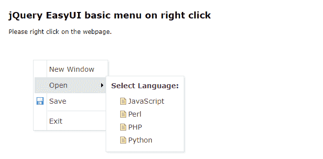

# 如何使用 jQuery 易 UI 设计网页右键菜单？

> 原文:[https://www . geesforgeks . org/how-design-menu-on-右键单击网页-使用-jquery-easyui/](https://www.geeksforgeeks.org/how-to-design-menu-on-right-click-of-webpage-using-jquery-easyui/)

**EasyUI** 是一个 HTML5 框架，用于使用基于 jQuery、React、Angular 和 Vue 技术的用户界面组件。它有助于构建交互式 web 和移动应用程序的功能，为开发人员节省了大量时间。它有助于构建交互式 web 和移动应用程序的功能，为开发人员节省了大量时间。

从[官网](https://www.jeasyui.com/download/index.php)下载所有需要的预编译文件，保存在你的工作文件夹中。在代码实现过程中，请注意文件路径。

**jQuery 易用户官方网站:**

```html
https://www.jeasyui.com/download/index.php
```

**示例 1:** 以下示例演示了在网页的右键上显示的简单菜单。脚本部分还显示了使用 jQuery 易用户界面框架的事件处理。

## 超文本标记语言

```html
<!DOCTYPE html>
<html>

<head>
    <meta charset="UTF-8">
    <meta name="viewport" content="initial-scale=1.0, 
        maximum-scale=1.0, user-scalable=no">

    <!-- EasyUI specific stylesheets-->
    <link rel="stylesheet" type="text/css" 
        href="themes/metro/easyui.css">
    <link rel="stylesheet" type="text/css" 
        href="demo.css">
    <link rel="stylesheet" type="text/css" 
        href="themes/icon.css">

    <!--jQuery library -->
    <script type="text/javascript" 
        src="jquery.min.js">
    </script>

    <!--jQuery libraries of EasyUI  -->
    <script type="text/javascript" 
        src="jquery.easyui.min.js">
    </script>
</head>

<body>
    <h2>
        jQuery EasyUI basic menu
        on right click
    </h2>

    <p>
        Please right click on
        the webpage.
    </p>

    <!-- easyui-menu class is used  -->
    <div id="menuID" style="width:120px;">
        <div>New Window</div>
        <div>
            <span>Open</span>
            <!-- menu-content class is used  -->
            <div class="menu-content" style=
                "text-align:left;padding:10px">

                <div style="font-weight:bold;
                    font-size:14px;margin-bottom:10px">
                    Select Language:
                </div>

                <ul id="listID">
                    <li>JavaScript</li>
                    <li>Perl</li>
                    <li>PHP</li>
                    <li>Python</li>
                </ul>
            </div>
        </div>

        <div data-options="iconCls:'icon-save'">
            Save
        </div>

        <div class="menu-sep"></div>
        <div>Exit</div>
    </div>

    <script>

        /* Event handling */
        $(function () {
            $('#menuID').menu();
            $('#listID').tree();
            $(document).bind('contextmenu', function (e) {
                e.preventDefault();
                $('#menuID').menu('show', {
                    left: e.pageX,
                    top: e.pageY
                });
            });
        });
    </script>
</body>

</html>
```

**输出:**



**示例 2:** 以下示例使用上述框架演示了带有子菜单的菜单。

## 超文本标记语言

```html
<!DOCTYPE html>
<html>

<head>
    <meta charset="UTF-8">
    <meta name="viewport" content="initial-scale=1.0, 
            maximum-scale=1.0, user-scalable=no">

    <!-- EasyUI specific stylesheets-->
    <link rel="stylesheet" type="text/css" 
        href="themes/metro/easyui.css">
    <link rel="stylesheet" type="text/css" 
        href="demo.css">
    <link rel="stylesheet" type="text/css" 
        href="themes/icon.css">

    <!--jQuery library -->
    <script type="text/javascript" 
        src="jquery.min.js">
    </script>

    <!--jQuery libraries of EasyUI  -->
    <script type="text/javascript" 
        src="jquery.easyui.min.js">
    </script>
</head>

<body>
    <h2>
        jQuery EasyUI basic menu
        on right click
    </h2>

    <p>
        Please right click on
        the webpage.
    </p>

    <!-- easyui-menu class is used  -->
    <div id="menuID" class="easyui-menu" 
        style="width:120px;">

        <div onclick="javascript:alert('new')">
            New
        </div>

        <div>
            <span>Open</span>
            <div style="width:150px;">
                <div><b>Interviews</b></div>
                <div>CS subjects</div>
                <div>Data Structures</div>
                <div>
                    <span>Algorithms</span>
                    <div style="width:120px;">
                        <div>Bit algorithms</div>
                        <div>Searching </div>
                        <div>
                            <span>Sorting</span>
                            <div style="width:80px;">
                                <div onclick="javascript:
                                    alert('Linear search')">
                                    Linear search
                                </div>
                                <div>Binary search</div>
                                <div>Jump Search</div>
                            </div>
                        </div>
                        <div>Backtracking</div>
                    </div>
                </div>

                <div>
                    <span>Window</span>
                    <div style="width:120px;">
                        <div>History</div>
                        <div data-options=
"href:'https://www.geeksforgeeks.org/python-programming-language/'">
                            Bookmarks
                        </div>
                        <div>
                            <a href=
        "https://www.geeksforgeeks.org/" target="_blank">
                                GFG
                            </a>
                        </div>
                    </div>
                </div>

            </div>
        </div>

        <div data-options="iconCls:'icon-save'">
            Save
        </div>

        <!-- Set disabled to true if not want to enable -->
        <div data-options="iconCls:'icon-print',disabled:true">
            Print
        </div>
        <div class="menu-sep"></div>

        <!--menu-sep class is used for separator-->
        <div>Exit</div>
    </div>

    <script>
        $(function () {
            $(document).bind('contextmenu', function (e) {
                e.preventDefault();
                $('#menuID').menu('show', {
                    left: e.pageX,
                    top: e.pageY
                });
            });
        });
    </script>
</body>

</html>
```

**输出:**

