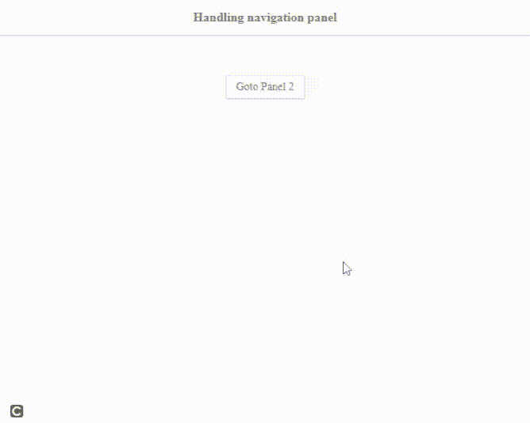
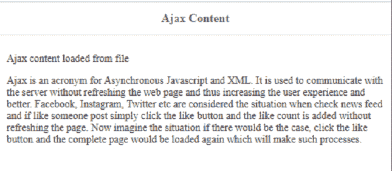

# 如何使用 jQuery 易 UI Mobile 设计带有 ajax 加载的导航面板？

> 原文:[https://www . geesforgeks . org/how-design-navigation-panel-with-Ajax-loading-use-jquery-easy ui-mobile/](https://www.geeksforgeeks.org/how-to-design-navigation-panel-with-ajax-loading-using-jquery-easyui-mobile/)

在本文中，我们将学习如何使用 jQuery [易 UI Mobile](https://www.jeasyui.com/index.php) 插件设计带有 ajax 加载的导航面板。

EasyUI 是一个 HTML5 框架，用于使用基于 jQuery、React、Angular 和 Vue 技术的用户界面组件。它有助于构建交互式 web 和移动应用程序的功能，为开发人员节省了大量时间。

**jQuery 易 UI 下载:**

```html
https://www.jeasyui.com/download/index.php
```

代码实现时，请注意预编译库文件的正确文件路径。

**示例 1:** 下面的代码演示了两个导航面板的设计，使用 jQuery 易用户移动插件将“返回”选项返回到另一个面板。

```html
<!doctype html>
<html>

<head>
    <meta charset="UTF-8">
    <meta name="viewport" content="initial-scale=1.0, 
        maximum-scale=1.0, user-scalable=no">

    <!-- EasyUI specific stylesheets-->
    <link rel="stylesheet" type="text/css" 
        href="themes/metro/easyui.css">

    <link rel="stylesheet" type="text/css" 
        href="themes/mobile.css">

    <link rel="stylesheet" type="text/css" 
        href="themes/icon.css">

    <!--jQuery library -->
    <script type="text/javascript" 
        src="jquery.min.js">
    </script>

    <!--jQuery libraries of EasyUI  -->
    <script type="text/javascript" 
        src="jquery.easyui.min.js">
    </script>

    <!--jQuery libraries of EasyUI Mobile-->
    <script type="text/javascript" 
        src="jquery.easyui.mobile.js">
    </script>
</head>

<body>

    <!--'easyui-navpanel' class of EasyUI 
        Mobile for navigation panel-->
    <div class="easyui-navpanel">
        <header>
            <div class="m-toolbar">
                <div class="m-title">
                    Handling navigation panel
                </div>
            </div>
        </header>
        <div style="margin:50px 0 0;text-align:center">
            <a href="javascript:void(0)" 
                class="easyui-linkbutton" 
                style="width:100px;height:30px"
                onclick="$.mobile.go('#divID2')">
                Goto Panel 2
            </a>
        </div>
    </div>
    <div id="divID2" class="easyui-navpanel">
        <header>
            <div class="m-toolbar">
                <div class="m-title">
                    Navigation panel 2
                </div>

                <div class="m-left">
                    <!--'m-back' class is used-->
                    <a href="#" class="easyui-linkbutton 
                        m-back" data-options=
                        "plain:true,outline:true,back:true">

                        <!--data option back is set to 'true' -->
                        Back
                    </a>
                </div>
            </div>
        </header>
        <div style="margin:50px 0 0;text-align:center">
            <a href="javascript:void(0)" 
                class="easyui-linkbutton" 
                onclick="$.mobile.back()">
                Go Back
            </a>
        </div>

        <footer>
            <div class="m-toolbar">
                <div class="m-title">Footer Content</div>
            </div>
        </footer>
    </div>
</body>

</html>
```

**输出:**


**示例 2:** 下面的代码演示了使用 jQuery 易用户移动插件 Ajax 加载网页内容。

```html
<!doctype html>
<html>

<head>
    <meta charset="UTF-8">
    <meta name="viewport" content="initial-scale=1.0, 
        maximum-scale=1.0, user-scalable=no">

    <!-- EasyUI specific stylesheets-->
    <link rel="stylesheet" type="text/css" 
        href="themes/metro/easyui.css">

    <link rel="stylesheet" type="text/css" 
        href="themes/mobile.css">

    <link rel="stylesheet" type="text/css" 
        href="themes/icon.css">

    <!--jQuery library -->
    <script type="text/javascript" 
        src="jquery.min.js">
    </script>

    <!--jQuery libraries of EasyUI  -->
    <script type="text/javascript" 
        src="jquery.easyui.min.js">
    </script>

    <!--jQuery libraries of EasyUI Mobile-->
    <script type="text/javascript" 
        src="jquery.easyui.mobile.js">
    </script>
</head>

<body>

    <!--'easyui-navpanel' class of EasyUI 
        Mobile for navigation panel-->
    <div class="easyui-navpanel" 
        data-options="href:'displayContent.html'" 
        style="padding:10px">

        <!--For Ajax loading of any page, 
            just set the data-options attribute 
            with file name-->
        <header>
            <div class="m-toolbar">
                <div class="m-title">
                    Ajax Content
                </div>
            </div>
        </header>

        <footer>
            <div class="m-toolbar">
                <div class="m-title">
                    Footer Content
                </div>
            </div>
        </footer>
    </div>
</body>

</html>
```

**displayContent.html**以下是上述示例代码中使用的文件“displayContent.html”的代码内容。

```html
<!DOCTYPE html>
<html>

<head>
    <meta charset="UTF-8">
</head>

<body>
    <p style="font-size:14px">
        Ajax content loaded from file
    </p>

    <p>
        Ajax is an acronym for Asynchronous 
        Javascript and XML. It is used to 
        communicate with the server without 
        refreshing the web page and thus 
        increasing the user experience and 
        better. Facebook, Instagram, Twitter 
        etc are considered the situation when 
        check news feed and if like someone 
        post simply click the like button and 
        the like count is added without 
        refreshing the page. Now imagine the 
        situation if there would be the case, 
        click the like button and the complete
        page would be loaded again which will 
        make such processes.
    </p>
</body>

</html>
```

**输出:**
