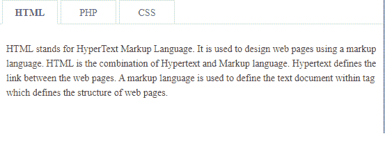
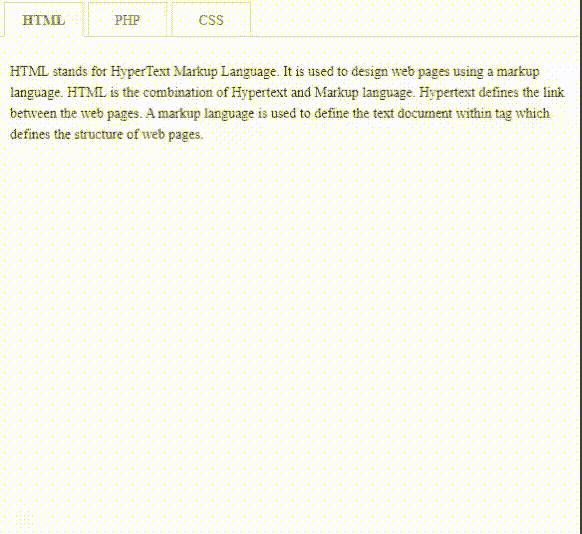
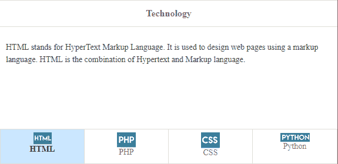
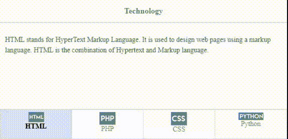
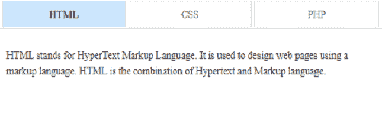
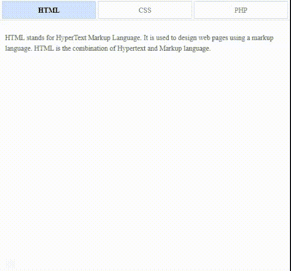

# 如何使用 jQuery 易 UI Mobile 设计标签和药丸？

> 原文:[https://www . geesforgeks . org/how-design-tabs-use-jquery-easy ui-mobile/](https://www.geeksforgeeks.org/how-to-design-tabs-and-pills-using-jquery-easyui-mobile/)

在本文中，我们将学习如何使用 jQuery 易用户移动插件设计标签和药丸。药丸基本上是下拉菜单形式的标签。

EasyUI 是一个 HTML5 框架，用于使用基于 jQuery、React、Angular 和 Vue 技术的用户界面组件。它有助于构建交互式 web 和移动应用程序的功能，为开发人员节省了大量时间。

**jQuery 易 UI 下载:**

```html
https://www.jeasyui.com/download/index.php
```

**示例 1:** 下面演示了使用 jQuery 易用户移动插件的基本选项卡。

## 超文本标记语言

```html
<!DOCTYPE html>
<html>

<head>
    <meta charset="UTF-8">
    <meta name="viewport" content=
        "initial-scale=1.0, maximum-scale=1.0,
        user-scalable=no">

    <!-- EasyUI specific stylesheets-->
    <link rel="stylesheet" type="text/css"
        href="themes/metro/easyui.css">

    <link rel="stylesheet" type="text/css"
        href="themes/mobile.css">

    <link rel="stylesheet" type="text/css"
        href="themes/icon.css">

    <!--jQuery library -->
    <script type="text/javascript"
        src="jquery.min.js">
    </script>

    <!--jQuery libraries of EasyUI  -->
    <script type="text/javascript"
        src="jquery.easyui.min.js">
    </script>

    <!--jQuery libraries of EasyUI Mobile-->
    <script type="text/javascript"
        src="jquery.easyui.mobile.js">
    </script>

    <style>
        p {
            line-height: 150%;
        }
    </style>
</head>

<body>
    <div class="easyui-tabs"
        data-options="fit:true, border:false,
                    tabWidth:80,tabHeight:35">
        <div title="HTML" style="padding:10px">

<p>H
                TML stands for HyperText Markup
                Language. It is used to design
                web pages using a markup language.
                HTML is the combination of Hypertext
                and Markup language. Hypertext
                defines the link between the web
                pages. A markup language is used
                to define the text document within
                tag which defines the structure of
                web pages.
            </p>

        </div>

        <div title="PHP" style="padding:10px">

<p>
                The term PHP is an acronym for PHP:
                Hypertext Preprocessor. PHP is a
                server-side scripting language
                designed specifically for web
                development. PHP can be easily
                embedded in HTML files and HTML
                codes can also be written in a
                PHP file. The thing that
                differentiates PHP with client-side
                language like HTML is, PHP codes
                are executed on the server whereas
                HTML codes are directly rendered
                on the browser.
            </p>

        </div>

        <div title="CSS" style="padding:10px">

<p>
                Cascading Style Sheets, fondly referred
                to as CSS, is a simply designed language
                intended to simplify the process of
                making web pages presentable. CSS allows
                you to apply styles to web pages. More
                importantly, CSS enables you to do this
                independent of the HTML that makes up
                each web page.
            </p>

        </div>
    </div>
</body>

</html>
```

**输出:**

*   **简单标签:**



*   **制表符执行:**



**示例 2:** 下面的代码演示了使用 jQuery 易用户移动插件的不同类来导航标签。

## 超文本标记语言

```html
<!doctype html>
<html>

<head>
    <meta charset="UTF-8">
    <meta name="viewport" content=
        "initial-scale=1.0, maximum-scale=1.0,
        user-scalable=no">

    <!-- EasyUI specific stylesheets-->
    <link rel="stylesheet" type="text/css"
        href="themes/metro/easyui.css">

    <link rel="stylesheet" type="text/css"
        href="themes/mobile.css">

    <link rel="stylesheet" type="text/css"
        href="themes/icon.css">

    <!--jQuery library -->
    <script type="text/javascript"
        src="jquery.min.js">
    </script>

    <!--jQuery library of EasyUI  -->
    <script type="text/javascript"
        src="jquery.easyui.min.js">
    </script>

    <!--jQuery library of EasyUI Mobile-->
    <script type="text/javascript"
        src="jquery.easyui.mobile.js">
    </script>
    <style>
        .tab-title {
            display: inline-block;
            line-height: 12px;
            padding-top: 5px;
        }

        p {
            line-height: 150%;
        }
    </style>
</head>

<body>
    <!--'easyui-navpanel' class is used-->
    <div class="easyui-navpanel">
        <header>
            <div class="m-toolbar">
                <div class="m-title">
                    Technology
                </div>
            </div>
        </header>

        <!--'easyui-tabs' class is used-->
        <div class="easyui-tabs"
            data-options="tabHeight:60,
                 fit:true,tabPosition:'bottom',
                 border:false,pill:true,
                 narrow:true,justified:true">

            <div style="padding:10px">
                <div class="panel-header tab-title">
                    
                    <br>HTML
                </div>

<p>
                    HTML stands for HyperText Markup
                    Language. It is used to design
                    web pages using a markup language.
                    HTML is the combination of
                    Hypertext and Markup language.
                </p>

            </div>

            <div style="padding:10px">
                <!--'panel-header' class is used-->
                <div class="panel-header tab-title">
                    
                    <br>PHP
                </div>

<p>
                    The term PHP is an acronym for
                    PHP: Hypertext Preprocessor. PHP
                    is a server-side scripting language
                    designed specifically for web
                    development. PHP can be easily
                    embedded in HTML files and HTML
                    codes can also be written in a
                    PHP file.
                </p>

            </div>

            <div style="padding:10px">
                <div class="panel-header tab-title">
                    
                    <br>CSS
                </div>

<p>
                    Cascading Style Sheets, fondly
                    referred to as CSS, is a simply
                    designed language intended to
                    simplify the process of making
                    web pages presentable. CSS allows
                    you to apply styles to web pages.
                </p>

            </div>

            <div style="padding:10px">
                <div class="panel-header tab-title">
                    
                    <br>Python
                </div>

<p>
                    Python is a high-level, general
                    -purpose and a very popular
                    programming language.
                </p>

<p>
                    Python programming language (latest
                    Python 3) is being used in web
                    development, Machine Learning
                    applications, along with all cutting
                    edge technology in Software Industry.
                </p>

            </div>
        </div>
    </div>
</body>

</html>
```

**输出:**





**示例 3:** 以下示例使用上述插件演示了类似下拉菜单的药丸。

## 超文本标记语言

```html
<!doctype html>
<html>

<head>
    <meta charset="UTF-8">
    <meta name="viewport" content=
        "initial-scale=1.0, maximum-scale=1.0,
        user-scalable=no">

    <!-- EasyUI specific stylesheets-->
    <link rel="stylesheet" type="text/css"
        href="themes/metro/easyui.css">

    <link rel="stylesheet" type="text/css"
        href="themes/mobile.css">

    <link rel="stylesheet" type="text/css"
        href="themes/icon.css">

    <!--jQuery library -->
    <script type="text/javascript"
        src="jquery.min.js">
    </script>

    <!--jQuery library of EasyUI  -->
    <script type="text/javascript"
        src="jquery.easyui.min.js">
    </script>

    <!--jQuery library of EasyUI Mobile-->
    <script type="text/javascript"
        src="jquery.easyui.mobile.js">
    </script>

    <style>
        p {
            line-height: 150%;
        }
    </style>
</head>

<body>
    <!--'easyui-tabs' class is used-->
    <div class="easyui-tabs"
        data-options="fit: true,
            border: false, pill: true,
            justified: true, tabWidth: 80,
            tabHeight: 35">
        <div title="HTML" style="padding:10px">

<p>
                HTML stands for HyperText Markup
                Language. It is used to design
                web pages using a markup language.
                HTML is the combination of
                Hypertext and Markup language.
            </p>

        </div>

        <div title="CSS" style="padding:10px">

<p>
                Cascading Style Sheets, fondly
                referred to as CSS, is a simply
                designed language intended to
                simplify the process of making
                web pages presentable. CSS allows
                you to apply styles to web pages.
            </p>

        </div>

        <div title="PHP" style="padding:10px">

<p>
                The term PHP is an acronym for PHP:
                Hypertext Preprocessor. PHP is a
                server-side scripting language
                designed specifically for web
                development. PHP can be easily
                embedded in HTML files and HTML
                codes can also be written in a PHP
                file.
            </p>

        </div>
    </div>
</body>

</html>
```

**输出:**

 