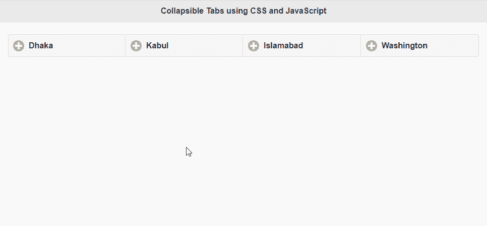
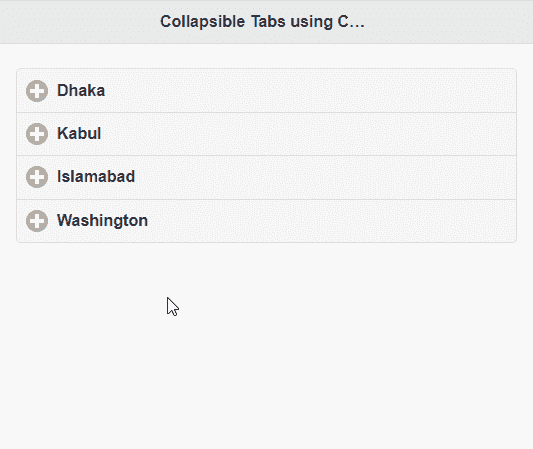

# 如何使用 tabview jQuery 插件为手机设计 tabview？

> 原文:[https://www . geeksforgeeks . org/如何使用-tabview-jquery-plugin/](https://www.geeksforgeeks.org/how-to-design-tabview-for-mobiles-using-the-tabview-jquery-plugin/) 为手机设计-tabview

在本文中，我们将学习如何使用基于 jQuery 的插件 jQuery **tabview** 为手机设计标签。

使用插件必须遵循以下步骤:

**第一步:**从[官方 Github](https://github.com/frequent/tabview) 下载所有需要的预编译文件，保存在你的工作文件夹中。

**第 2 步:**创建一个新的 HTML 文件，并导入用于使插件工作的文件。主脚本文件将出现在存储库的最新目录中。

**第三步:**使用数据-角色属性定义标签的标题、内容、标签数量和主题，定义网站的各个部分，如下图所示:

## 超文本标记语言

```html
<!DOCTYPE html>
<html>

<head>
    <!-- Include the jQuery Mobile CSS -->
    <link rel="stylesheet" href="
http://code.jquery.com/mobile/git/jquery.mobile-git.css">

    <!-- Include the tabview 
        mobile-collapsible CSS stylesheet -->
    <link rel="stylesheet" 
href="jquery.mobile.collapsible.css">

    <!-- Include jQuery -->
    <script src=
        "http://code.jquery.com/jquery-1.10.1.js">
    </script>

    <!-- Include the tabview script file -->
    <script src="example/latest.js"></script>
</head>

<body>
    <!-- Define a page -->
    <div data-role="page">

        <!-- Define a header -->
        <div data-role="header">
            <h2>
                Collapsible Tabs using CSS
                and JavaScript
            </h2>
        </div>

        <!-- Define the contert of the page -->
        <div data-role="content">

            <!-- Use a collapsible-set for
             defining the tabs -->
            <div data-role="collapsible-set" 
                data-type="tabs" data-tabs="4" 
                data-theme="a" data-content-theme="a">

                <!-- Define each of the tabs 
                    for the plugin -->
                <div data-role="collapsible" 
                    data-collapsed="true">
                    <h1>Dhaka</h1>

                    <p>
                        Dhaka is the capital 
                        of Bangladesh
                    </p>
                </div>

                <div data-role="collapsible">
                    <h1>Kabul</h1>

                    <p>
                        Kabul is the capital 
                        of Afganishtan
                    </p>
                </div>

                <div data-role="collapsible">
                    <h1>Islamabad</h1>

                    <p>
                        Islamabad is the capital 
                        of Pakistan
                    </p>
                </div>

                <div data-role="collapsible">
                    <h1>Washington</h1>

                    <p>
                        Washigton is the capital 
                        city of USA
                    </p>
                </div>
            </div>
        </div>
    </div>
</body>

</html>
```

**输出:**

*   **在非移动视图上使用插件**



*   **在移动视图上使用插件**

