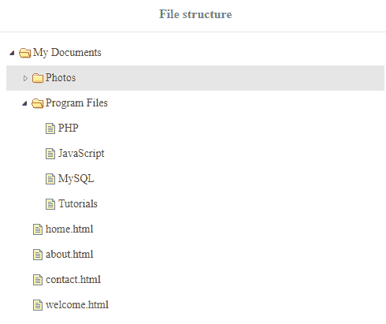
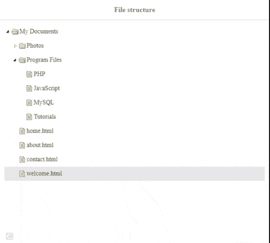
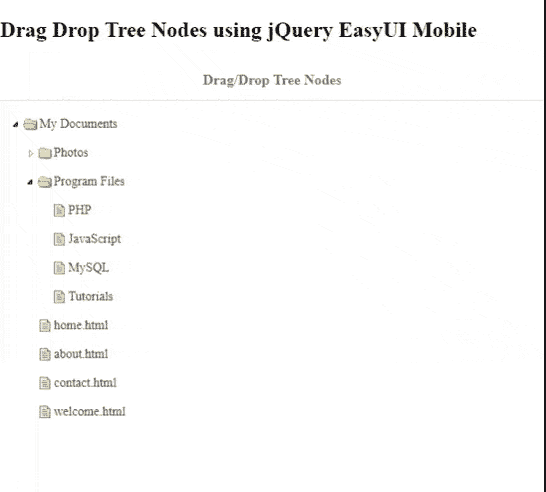

# 如何使用 jQuery 易 UI Mobile 为文件设计树形结构？

> 原文:[https://www . geesforgeks . org/how-design-tree-structure-for-file-use-jquery-easy ui-mobile/](https://www.geeksforgeeks.org/how-to-design-tree-structure-for-files-using-jquery-easyui-mobile/)

**EasyUI** 是一个 HTML5 框架，用于使用基于 jQuery、React、Angular 和 Vue 技术的用户界面组件。它有助于构建交互式 web 和移动应用程序的功能，为开发人员节省了大量时间。它有助于构建交互式 web 和移动应用程序的功能，为开发人员节省了大量时间。

从 [官网](https://www.jeasyui.com/download/index.php) 下载所有需要的预编译文件，保存在自己的工作文件夹中。在代码实现过程中，请注意文件路径。

**jQuery 易用户官方网站:**

```html
https://www.jeasyui.com/download/index.php

```

**示例 1:** 以下示例使用 **jQuery EasyUI** 框架演示了手机中文件或目录的基本树状结构。在“ul”标签中，使用的类是*易 ui-tree* 来给文件一种树状的感觉。

## 超文本标记语言

```html
<!DOCTYPE html>
<html>

<head>
    <meta charset="UTF-8">
    <meta name="viewport" content="initial-scale=1.0, 
        maximum-scale=1.0, user-scalable=no">

    <link rel="stylesheet" type="text/css" 
        href="themes/metro/easyui.css">
    <link rel="stylesheet" type="text/css" 
        href="themes/mobile.css">
    <link rel="stylesheet" type="text/css" 
        href="themes/icon.css">

    <!--jQuery library -->
    <script type="text/javascript" src="jquery.min.js">
    </script>
    <!--jQuery libraries of EasyUI and EasyUI Mobile -->
    <script type="text/javascript" src="jquery.easyui.min.js">
    </script>
    <script type="text/javascript" src="jquery.easyui.mobile.js">
    </script>
</head>

<body>
    <div class="easyui-navpanel" style="padding:10px">
        <header>
            <!--class styles are in mobile.css  -->
            <div class="m-toolbar">
                <div class="m-title">File structure</div>
            </div>
        </header>
        <ul class="easyui-tree" data-options="animate:true">
            <li>
                <span>My Documents</span>
                <ul>
                    <li data-options="state:'closed'">
                        <span>Photos</span>
                        <ul>
                            <li>
                                <span>Official</span>
                            </li>
                            <li>
                                <span>Trips</span>
                            </li>
                            <li>
                                <span>FamilynFriends</span>
                            </li>
                        </ul>
                        <span>Files</span>
                        <ul>
                            <li><span>Personal</span></li>
                            <li><span>Official</span></li>
                        </ul>
                    </li>
                    <li>
                        <span>Program Files</span>
                        <ul>
                            <li>PHP</li>
                            <li>JavaScript</li>
                            <li>MySQL</li>
                            <li>Tutorials</li>
                        </ul>
                    </li>
                    <li>home.html</li>
                    <li>about.html</li>
                    <li>contact.html</li>
                    <li>welcome.html</li>
                </ul>
            </li>
        </ul>
    </div>
</body>

</html>
```

**输出:**

 

**示例 2:** 以下示例使用 jQuery **易用户**框架演示了树中文件节点的“拖放”功能。

## 超文本标记语言

```html
<!DOCTYPE html>
<html>
<head>
    <meta charset="UTF-8">
    <meta name="viewport" 
        content="initial-scale=1.0, 
        maximum-scale=1.0, user-scalable=no">

    <link rel="stylesheet" type="text/css" 
          href="themes/metro/easyui.css">
    <link rel="stylesheet" type="text/css" 
          href="themes/mobile.css">    
    <link rel="stylesheet" type="text/css" 
           href="themes/icon.css">

    <script type="text/javascript" src="jquery.min.js">
    </script>
    <script type="text/javascript" 
       src="jquery.easyui.min.js">
    </script>
    <script type="text/javascript" 
         src="jquery.easyui.mobile.js">
    </script>
</head>
<body>
   <h2>
      Drag Drop Tree Nodes using jQuery EasyUI Mobile 
    </h2>
    <div class="easyui-navpanel" style="padding:10px">
        <header>
          <!--styles are in mobile.css -->
            <div class="m-toolbar">
                <div class="m-title">Drag/Drop Tree Nodes</div>
            </div>
        </header>
          <!--DragnDrop is enable to "true" in data-options -->
        <ul class="easyui-tree" 
            data-options="animate:true,dnd:true">
            <li>
                <span>My Documents</span>
                <ul>
                    <li data-options="state:'closed'">
                        <span>Photos</span>
                        <ul>
                            <li>
                                <span>Official</span>
                            </li>
                            <li>
                                <span>Trips</span>
                            </li>
                            <li>
                                <span>FamilynFriends</span>
                            </li>
                        </ul>
                        <span>Files</span>
                        <ul>
                          <li><span>Personal</span></li>
                          <li><span>Official</span></li>
                        </ul>
                    </li>
                    <li>
                        <span>Program Files</span>
                        <ul>
                            <li>PHP</li>
                            <li>JavaScript</li>
                            <li>MySQL</li>
                            <li>Tutorials</li>
                        </ul>
                    </li>
                    <li>home.html</li>
                    <li>about.html</li>
                    <li>contact.html</li>
                    <li>welcome.html</li>
                </ul>
            </li>
        </ul>
    </div>
</body>
</html>
```

**输出:**

