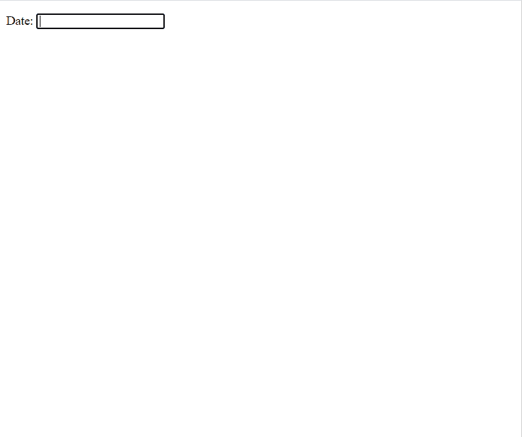

# 如何在 jQuery UI 中销毁一个日期选择器？

> 原文:[https://www . geesforgeks . org/how-to-destroy-a-date picker-in-jquery-ui/](https://www.geeksforgeeks.org/how-to-destroy-a-datepicker-in-jquery-ui/)

要销毁 jQuery UI 中的日期选择器，我们将使用 **destroy()** 方法。jQuery UI **destroy()** 方法用于移除**日期选择器()**的完整功能。

**语法:**

```html
$(".selector" ).datepicker( "destroy" )
```

**参数:**此方法不接受任何参数。

**返回值:**该方法只是将日期选择器返回到其初始前的状态。

**方法:**首先，添加项目所需的 jQuery 移动脚本。

> <src 脚本= " https://Ajax . Google APIs . com/Ajax/libs/jquery ui/1 . 8 . 16/jquery-ui . js "></script><link href = " http://Ajax . Google APIs . com/Ajax

**示例:**

## 超文本标记语言

```html
<!doctype html>
<html lang="en">

<head>
    <meta charset="utf-8">
    <meta name="viewport" content=
        "width=device-width, initial-scale=1">

    <script src=
"https://ajax.googleapis.com/ajax/libs/jquery/1.7.1/jquery.js">
    </script>

    <script src=
"https://ajax.googleapis.com/ajax/libs/jqueryui/1.8.16/jquery-ui.js">
    </script>

    <link href=
"http://ajax.googleapis.com/ajax/libs/jqueryui/1.8.16/themes/ui-lightness/jquery-ui.css"
        rel="stylesheet" type="text/css" />

    <script>
        $(function () {
            $("#datepicker").datepicker();
            $("#datepicker").datepicker("destroy");
        });
    </script>
</head>

<body>

    <p>Date: <input type="text" id="datepicker"></p>

</body>

</html>
```

**输出:**

