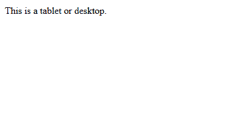
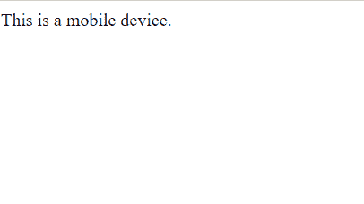

# 如何在 jQuery 中检测移动设备？

> 原文:[https://www . geeksforgeeks . org/如何在 jquery 中检测移动设备/](https://www.geeksforgeeks.org/how-to-detect-a-mobile-device-in-jquery/)

我们可以使用 JavaScript**window . matchmedia()**方法*基于 CSS 媒体查询*检测移动设备。这是检测移动设备的最佳且最简单的方法。

**语法:**

```html
window.matchMedia();
```

**示例-1:** 程序在桌面上运行。

```html
<!DOCTYPE html>
<html lang="en">

<head>
    <title>
      jQuery Detect Mobile Device
  </title>
</head>

<body>
    <script>
        if (window.matchMedia("(max-width: 767px)").matches) 
        {

            // The viewport is less than 768 pixels wide
            document.write("This is a mobile device.");
        } else {

            // The viewport is at least 768 pixels wide
            document.write("This is a tablet or desktop.");
        }
    </script>
</body>

</html>
```

**输出:**


**示例-2:** 程序在移动设备上运行。

```html
<!DOCTYPE html>
<html lang="en">

<head>
    <title>
      jQuery Detect Mobile Device
  </title>
</head>

<body>
    <script>
        if (window.matchMedia("(max-width: 767px)").matches)
        {

            // The viewport is less than 768 pixels wide
            document.write("This is a mobile device.");
        } else {

            // The viewport is at least 768 pixels wide
            document.write("This is a tablet or desktop.");
        }
    </script>
</body>

</html>
```

**输出:**


**支持的浏览器:**

*   谷歌 Chrome
*   Mozilla Firefox
*   歌剧
*   边缘
*   旅行队