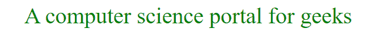
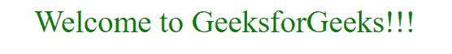

# 如何使用 jQuery 检测和更改 div 的内容/样式？

> 原文:[https://www . geeksforgeeks . org/如何使用-jquery/](https://www.geeksforgeeks.org/how-to-detect-and-change-the-content-style-of-a-div-using-jquery/) 检测和更改 div 的内容样式

使用 [jQuery on()方法](https://www.geeksforgeeks.org/jquery-on-with-examples/)可以检测到一个 div 的 html/文本的变化。on()用于为 DOM 树中的选定元素和子元素附加一个或多个事件处理程序。on()方法是 jQuery 版中 bind()，live()和 delegate()方法的替换。

**语法:**

```html
$(selector).on(event, childSelector, data, function, map)
```

**示例 1:** 本示例使用 [jQuery on()方法](https://www.geeksforgeeks.org/jquery-on-with-examples/)更改< div >元素的文本。

```html
<!DOCTYPE html>
<html>

<head>
    <title>
        How to detect and change the
        content of a div using JQuery ?
    </title>

    <script src=
"https://ajax.googleapis.com/ajax/libs/jquery/3.4.1/jquery.min.js">
    </script>

    <style>
        #div1 { 
            font-size: 35px; 
            color:green;
            text-align:center;
        } 
    </style>

    <script>
        $(document).ready(function(){
            $("div").on("click", function(){
                document.getElementById("div1").innerHTML
                    = "A computer science portal for geeks"; 
            });
        });
    </script>
</head>

<body>
    <div id="div1">GeeksforGeeks!</div>
</body>

</html>
```

**输出:**

*   **点击 div 元素前:**
    
*   **点击 div 元素后:**
    

**示例 2:** 本示例使用 [jQuery on()方法](https://www.geeksforgeeks.org/jquery-on-with-examples/)更改< div >元素的样式。

```html
<!DOCTYPE html>
<html>

<head>
    <title>
        How to detect and change the
        style of a div using JQuery?
    </title>

    <script src=
"https://ajax.googleapis.com/ajax/libs/jquery/3.4.1/jquery.min.js">
    </script>

    <style>
        #div1 { 
            font-size: 35px; 
            color:green;
            text-align:center;
        } 
    </style>

    <script>
        $(document).ready(function(){
            $("div").on("click", function(){
                document.getElementById("div1").style.color
                            = "white"; 

                document.getElementById("div1").style.backgroundColor
                            = "green"; 
            });
        });
    </script>
</head>

<body>
    <div id="div1">Welcome to GeeksforGeeks!!!</div>
 </body>

</html>
```

**输出:**

*   **点击 div 元素前:**
    
*   **点击 div 元素后:**
    