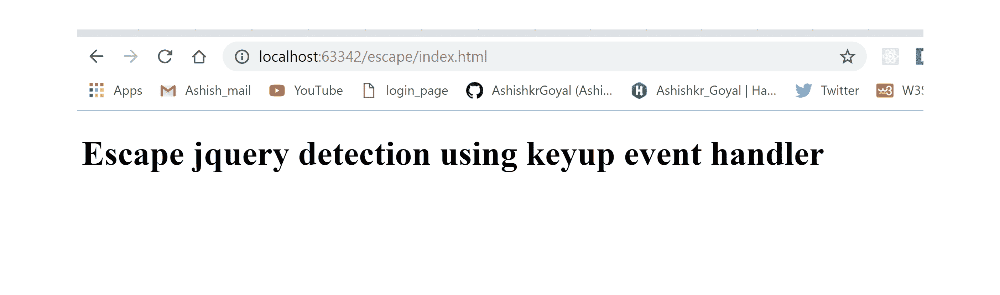

# 如何使用 jQuery 检测转义键的按下？

> 原文:[https://www . geesforgeks . org/how-detect-escape-key-press-using-jquery/](https://www.geeksforgeeks.org/how-to-detect-escape-key-press-using-jquery/)

要检测转义键的按下，jquery 中将使用**向上键**或**向下键**事件处理程序。当从键盘上按下退出键时，它将在文档上触发。

*   **按键事件:**从键盘释放按键时触发该事件。
*   **按键事件:**当从键盘按下按键时，触发该事件。

**语法:**

```
$(document).on('keydown', function(event) {
       if (event.key == "Escape") {
           alert('Esc key pressed.');
       }
   });

```

**说明:**
在整个文档中，我们在方法上调用**，我们将**键下**或**键上**事件作为第一个参数。作为第二个参数，附加了一个函数，当发生向下键或向上键事件时调用该函数，当从键盘上按下退出键时，该函数将显示一个警告。**

**示例-1:** 本示例检测按下退出键**(使用按键事件处理程序)**

```
<!DOCTYPE html>
<html lang="en">

<head>
    <meta charset="UTF-8">
    <title>
      escape-jquery-detection
  </title>
    <script src=
"https://code.jquery.com/jquery-3.3.1.min.js">
  </script>
</head>

<body>
    <h1>
      Escape jquery detection
      using keydown event handler
  </h1>
</body>

<script>
    $(document).on(
      'keydown', function(event) {
        if (event.key == "Escape") {
            alert('Esc key pressed.');
        }
    });
</script>

</html>
```

**按下逃跑前输出:**


**按下逃脱后输出:**


**示例-2:** 本示例检测按下退出键**(使用按键事件处理程序)**

```
<!DOCTYPE html>
<html lang="en">

<head>
    <meta charset="UTF-8">
    <title>
      escape-jquery-detection
  </title>
    <script src=
"https://code.jquery.com/jquery-3.3.1.min.js">
  </script>
</head>

<body>
    <h1>
Escape jquery detection using keyup event handler
  </h1>
</body>

<script>
    $(document).on('keyup', function(event) {
        if (event.key == "Escape") {
            alert('Esc key pressed.');
        }
    });
</script>

</html>
```

**按下逃跑前输出:**


**按下逃脱后输出:**
