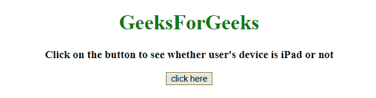
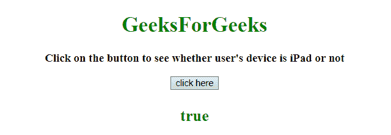

# 如何使用 jQuery 检测用户的设备？

> 原文:[https://www . geeksforgeeks . org/如何使用 jquery 检测用户设备/](https://www.geeksforgeeks.org/how-to-detect-the-users-device-using-jquery/)

任务是使用 JQuery 确定用户的设备，不管它是不是 iPad。以下是所需的方法:

*   **[Navigator userAgent Property](https://www.geeksforgeeks.org/html-navigator-useragent-property/):**
    This property returns the value of the header of user-agent which is sent by the browser to the server.
    Returned value, have information like name, version, and platform of the browser.

    **语法:**

    ```html
    navigator.userAgent

    ```

    **返回值:**
    返回一个字符串，代表当前浏览器的用户代理字符串。

**示例:**本示例使用 **navigator.userAgent 属性**来识别用户的设备。

```html
<!DOCTYPE HTML>
<html>

<head>
    <title>
        JQuery 
      | Detect iPad users.
    </title>
</head>
<script src=
"https://ajax.googleapis.com/ajax/libs/jquery/3.4.0/jquery.min.js">
</script>

<body style="text-align:center;" 
      id="body">
    <h1 style="color:green;">  
            GeeksForGeeks  
        </h1>
    <p id="GFG_UP" 
       style="font-size: 17px; 
              font-weight: bold;">
    </p>
    <button>
        click here
    </button>
    <p id="GFG_DOWN" 
       style="color: green; 
              font-size: 24px; 
              font-weight: bold;">
    </p>
    <script>
        $('#GFG_UP').text(
          "Click on the button to see "+
          "whether user's device is iPad or not");

        $('button').on('click', function() {
            var is_iPad = 
                navigator.userAgent.match(/iPad/i) != null;
            $('#GFG_DOWN').text(is_iPad);
        });
    </script>
</body>

</html>
```

**输出:**

*   **到达底部前:**
    
*   **到达底部后:**
    