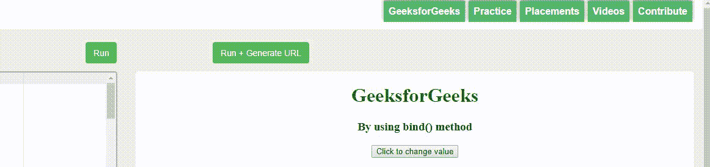
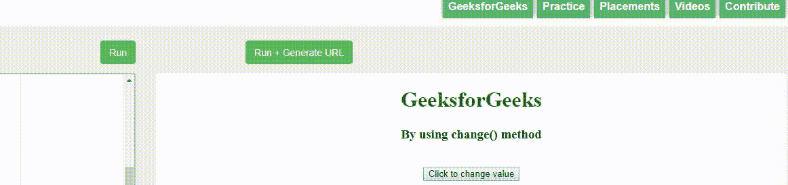

# 如何检测 JQuery 中隐藏输入字段上的值变化？

> 原文:[https://www . geesforgeks . org/如何在 jquery 中检测隐藏输入字段的值变化/](https://www.geeksforgeeks.org/how-to-detect-value-change-on-hidden-input-field-in-jquery/)

在 **<中输入>** 元素加上 **type="hidden"** ，jQuery 的 **change()** 方法不会自动触发。 **change()** 方法只在用户自己更改字段值时自动触发，而不是开发者。当开发人员更改隐藏字段内的值时，他也必须**触发更改**。

有两种方法可以检测隐藏输入字段的值变化:

*   **通过使用[绑定()方法](https://www.geeksforgeeks.org/jquery-bind-with-examples/)T3】**
*   **通过使用[变化()方法](https://www.geeksforgeeks.org/jquery-change-with-examples/)T3】**

以下示例将说明检测隐藏字段中值变化的两种方法。

**示例 1:** 以下示例使用 jQuery 的内置 **bind()** 方法。

```
<!DOCTYPE html>
<html>

<head>
    <title>
        By using bind() method detecting change
        of value in the hidden field
    </title>

    <script src="https://code.jquery.com/jquery-3.4.1.js"
integrity="sha256-WpOohJOqMqqyKL9FccASB9O0KwACQJpFTUBLTYOVvVU="
            crossorigin="anonymous">
    </script>
</head>

<body style="text-align:center;">

    <h1 style="color:green;">
        GeeksforGeeks
    </h1>

    <h3>By using bind() method</h3>

    <form>
        <input type="hidden" value="" id="hidField">

        <button type="button" id="changeValue"> 
            Click to change value 
        </button>
    </form>

    <script>
        $(document).ready(function() {

            alert("Value of hidden field before updating: "
                        + $("#hidField").val());

            $("#changeValue").click(function() {
                $("#hidField").val(10).trigger("change");
            });

            $("input[type='hidden']").bind("change", function() {
                alert("Value of hidden field after updating: "
                            + $(this).val());
            });
        })
    </script>
</body>

</html>
```

**输出:**


**示例 2:** 以下示例使用 jQuery 的内置 **change()** 方法。

```
<!DOCTYPE html>
<html>

<head>
    <title>
        By using change() method detecting change
        of value in the hidden field
    </title>

    <script src="https://code.jquery.com/jquery-3.4.1.js"
integrity="sha256-WpOohJOqMqqyKL9FccASB9O0KwACQJpFTUBLTYOVvVU="
            crossorigin="anonymous"></script>
</head>

<body style="text-align:center;">

    <h1 style="color:green;">
        GeeksforGeeks
    </h1>

    <h3>By using change() method</h3>

    <form>
        <input type="hidden" value="" id="hidField">
        <br>

        <button type="button" id="changeValue"> 
            Click to change value 
        </button>
    </form>

    <script>
        $(document).ready(function() {

            alert("Value of hidden field before updating: "
                        + $("#hidField").val());

            $("#changeValue").click(function() {
                $("#hidField").val(101).trigger("change");
            });

            $("#hidField").change(function() {
                alert("Value of hidden field after updating: "
                        + $("#hidField").val());
            });
        })
    </script>
</body>

</html>
```

**输出:**


jQuery 是一个开源的 JavaScript 库，它简化了 HTML/CSS 文档之间的交互，它以其“少写多做”的理念而闻名。
跟随本 [jQuery 教程](https://www.geeksforgeeks.org/jquery-tutorials/)和 [jQuery 示例](https://www.geeksforgeeks.org/jquery-examples/)可以从头开始学习 jQuery。