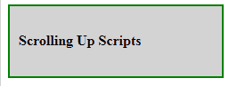
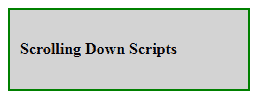

# 如何确定 jQuery 滚动事件的方向？

> 原文:[https://www . geeksforgeeks . org/如何确定 jquery 滚动事件的方向/](https://www.geeksforgeeks.org/how-to-determine-the-direction-of-a-jquery-scroll-event/)

jQuery 中的 [scrollTop()方法](https://www.geeksforgeeks.org/jquery-scrolltop-with-examples/)用于设置或返回所选元素的垂直滚动条位置。用这个方法的 hep，我们可以找到鼠标滚动的方向。

**语法:**

```html
$(selector).scrollTop(position)
```

**参数:**该方法接受单参数位置，可选。它用于以像素为单位指定垂直滚动条的位置。

**返回值:**返回所选元素滚动条的垂直位置。

**示例:**

```html
<!DOCTYPE html>
<html>

<head>
    <title>
        Determine the direction of scroll event
    </title>

    <script src=
"https://ajax.googleapis.com/ajax/libs/jquery/3.3.1/jquery.min.js">
    </script>

    <style>
        html, body {
            height: 300%
        }

        div {
            position: fixed;
            padding-left: 10px;
            padding-top: 30px;
            height: 10%;
            width: 35%;
            background: lightgrey;
            font-weight: bold;
            border: 2px solid green;
        }
    </style>
</head>

<body>

    <div></div>

    <!-- Script to determine the direction
    of a jQuery scroll event -->
    <script>
        var position = $(window).scrollTop();

        $(window).scroll(function() {
            var scroll = $(window).scrollTop();
            if (scroll > position) {
                console.log('scrollDown');
                $('div').text('Scrolling Down Scripts');
            } else {
                console.log('scrollUp');
                $('div').text('Scrolling Up Scripts');
            }
            position = scroll;
        });
    </script>
</body>

</html>                    
```

**输出:**

*   **向上滚动:**
    
*   **向下滚动:**
    